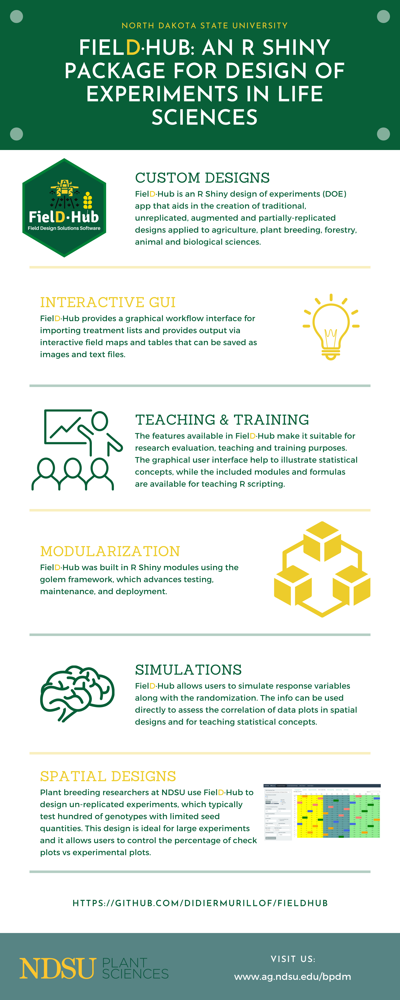

## FielDHub: A Shiny App for Design of Experiments in Life Sciences


[](https://lifecycle.r-lib.org/articles/stages.html)

[](https://cran.r-project.org/web//packages/FielDHub/)

[](https://cranlogs.r-pkg.org/badges/FielDHub)

[](https://cranlogs.r-pkg.org/badges/grand-total/FielDHub)

## Installation

### Development version from GitHub

``` r
devtools::install_github("DidierMurilloF/FielDHub")
```

### Stable version from R CRAN

``` r
install.packages("FielDHub")
```

## FielDHub Paper

[](https://doi.org/10.21105/joss.03122)

## Overview

A shiny design of experiments (DOE) app that aids in the creation of traditional, un-replicated, augmented and partially-replicated designs applied to agriculture, plant breeding, forestry, animal and biological sciences. 

For more details and examples of all functions present in the FielDHub package. Please, go to <https://didiermurillof.github.io/FielDHub/reference/index.html>.




## Usage

This is a basic example which shows you how to launch the app:

``` r
library(FielDHub)
run_app()
```
### Diagonal Arrangement Example

A project needs to test 270 genotypes in a field containing 20 rows and 15 columns of plots. In this example, these 270 genotypes are divided among three different experiments. In addition, four checks are included in a systematic diagonal arrangement across experiments to fill 30 plots representing 10% of the total number of experimental plots. An option to include filler plots is also available for fields where the number of experimental plots does not equal the number of available field plots.


The figure above shows a map of an experiment randomized as a Decision Block Unreplicated Design with Checks on Diagonals. Yellow, gray, and green shade the blocks of unreplicated experiments, while distinctively colored check plots are replicated throughout the field in a systematic diagonal arrangement.

To illustrate using FielDHub to build experimental designs through R code, the design produced in the R Shiny interface described above can also be created using the function `diagonal_arrangement()` in the R script below. Note, that to obtain identical results, users must include the same seed number in the script as was used in the Shiny app. In this case, the seed number is 1249. 

``` r
diagonalExample <- diagonal_arrangement(nrows = 20, 
                                        ncols = 15, 
                                        lines = 270, 
                                        checks = 4, 
                                        plotNumber = 101, 
                                        splitBy = "row", 
                                        seed = 1249, 
                                        kindExpt = "DBUDC", 
                                        blocks = c(100, 100, 70))
```

Users can access the returned values from `diagonal_arrangement()` as follow,

``` r
> diagonalExample$infoDesign
$Lines
[1] 100 100  70

$checks
[1] 4

$RepChecks
1 2 3 4 
7 7 8 8 

$percentChecks
[1] "10%"

$Fillers
[1] 0

$seed
[1] 1249

> diagonalExample$layoutRandom
      Col1 Col2 Col3 Col4 Col5 Col6 Col7 Col8 Col9 Col10 Col11 Col12 Col13 Col14 Col15
Row20  248    2  268  225  258  223  255  226  264   239   274     1   232   235   256
Row19  214  273  244  220    3  269  247  207  243   215   245   221   208   229     4
Row18  240  252  251  272  238  212  250    3  206   242   259   253   222   213   227
Row17    2  261  210  230  254  262  266  237  236   231     4   218   219   257   265
Row16  224  263  211    1  216  209  217  270  271   205   233   260   234     2   246
Row15  166  135  201  127  194  203    1  171  190   116   156   228   241   249   267
Row14  126  191  193  162  204  137  114  178  173     1   115   130   167   155   199
Row13  111  143    4  182  150  154  117  160  136   192   122   119     3   177   131
Row12  105  197  159  157  181    1  147  107  153   158   170   152   141   148   187
Row11  161  186  112  175  183  124  200  195    2   129   120   144   146   188   118
Row10  128    3  138  165  142  184  196  121  169   132   168     4   113   172   133
Row9   145  198  139  179    2  109  180  140  125   134   149   164   176   106     3
Row8   202  189  174  163  108  185  110    4  151   123    84    70    43    57   101
Row7     4   24   15   93   22   78   87   96   18    47     3    44   100    99    53
Row6    92   19    8    1   62   49   36   85   38     5    59    33     7     2    39
Row5    66   82  104   26   34   14    4   97   73    16    65    41    77   103    42
Row4    54   86   46   75   13   69   98   10   63     2    37    71    29    45    40
Row3    89   28    3   88   17   20   72   31   35    25    56    74     3    68    55
Row2    91   23   11   51   30    1   83   64   50    90    79    21    12     6    95
Row1    48  102    9   94   52   80   76   60    4    61    32    58    67    27    81

> head(diagonalExample$fieldBook, 12)
   ID  EXPT LOCATION YEAR PLOT ROW COLUMN CHECKS ENTRY TREATMENT
1   1 Expt1        1 2021  101   1      1      0    48    gen 48
2   2 Expt1        1 2021  102   1      2      0   102   gen 102
3   3 Expt1        1 2021  103   1      3      0     9     gen 9
4   4 Expt1        1 2021  104   1      4      0    94    gen 94
5   5 Expt1        1 2021  105   1      5      0    52    gen 52
6   6 Expt1        1 2021  106   1      6      0    80    gen 80
7   7 Expt1        1 2021  107   1      7      0    76    gen 76
8   8 Expt1        1 2021  108   1      8      0    60    gen 60
9   9 Expt1        1 2021  109   1      9      4     4   Check 4
10 10 Expt1        1 2021  110   1     10      0    61    gen 61
11 11 Expt1        1 2021  111   1     11      0    32    gen 32
12 12 Expt1        1 2021  112   1     12      0    58    gen 58
```

The main difference between using the FielDHub Shiny app and using the standalone function `diagonal_arrangement()` is that the standalone function will allocate filler only if it is necessary, while in R Shiny, filler plots are generated automatically. In cases where users include fillers, either between or after experiments, the Shiny app is preferable for filling and visualizing all field plots.

### Partially Replicated Design Example

Partially replicated designs are commonly employed in early generation field trials. This type of design is characterized by replication of a portion of the entries, with the remaining entries only appearing once in the experiment. As an example, considered a field trial with 288 plots containing 75 entries appearing two times each, and 138 entries only appearing once. This field trials is arranged in a field of 16 rows by 18 columns.


In the figure above, green plots contain replicated entries, and yellow plots contain entries that only appear once.

Instead of using the Shiny FielDHub app, users can use the standalone FielDHub function `partially_replicated()`. The partially replicated layout described above can be produced through scripting as follows. As noted in the previous example, to obtain identical results between the script and the Shiny app, users need to use the same seed number, which, in this case, is 77.

``` r
pREPexample <- partially_replicated(nrows = 16, 
                                    ncols = 18,  
                                    repGens = c(138,75),
                                    repUnits = c(1,2),
                                    planter = "serpentine", 
                                    plotNumber = 1,
                                    exptName = "ExptA",
                                    locationNames = "FARGO",
                                    seed = 77)

```
Users can access returned values from `partially_replicated()` as follows,

``` r
> pREPexample$layoutRandom
      Col1 Col2 Col3 Col4 Col5 Col6 Col7 Col8 Col9 Col10 Col11 Col12 Col13 Col14 Col15 Col16 Col17 Col18
Row16  176   45  192  127   71   62  102  120   95    79    61   158   141    32    21    25    14    71
Row15   18  121    9  123  171   60   11  204    2   182   119    65   198    63   188    34   124    55
Row14   68  108  200   16    3    5  136  183   78    43   149    89    23    47   160   168   152    10
Row13  187   66  153   24   21   23   65  199   34    64    11   191    94    96   131   181   186   103
Row12  211   15    8  174   56  169   28   84   90    46   156    57    51    42   128   170    27   114
Row11   19    7   87    7   93   86   26   22  151    67    30     5    92    48    51   150    59    41
Row10  144  101  104  134  213  167   73   33    6    74    25   122    32   107    18    40   139    59
Row9    70   38   70   12   88   99  179  210   37    22   155   142   116   161   137    10    19    30
Row8     1  173   57   20  157   69   13  110  195   147    38   163     1    83    40   162     4   209
Row7    97   82   36   29   56   35   50    6   75    85    58    17    66   172   145    63    44     3
Row6    24    8   43  177   31  143   91   64   98   194    74    55   126   115   117   159   100    45
Row5    77  205   37   62  106   29  138   53  118    35   132    54   166    81    47    41   109    76
Row4    73  129  125  135   60  164   14   39   13   165   112   105   140    12    72   212    46   203
Row3    69   28  196  154  146   75  189   36   54    72    31    33    53    67   175    27     2   130
Row2    16   68  206   49   52  208   26  184  180   193   178    61    48   197    52    50   201   111
Row1    80   49   15   44  185    9  133   58    4   113   190   148    39    17    20   207   202    42

> head(pREPexample$fieldBook, 12)
   ID  EXPT LOCATION YEAR PLOT ROW COLUMN CHECKS ENTRY TREATMENT
1   1 ExptA    FARGO 2021    1   1      1      0    80       G80
2   2 ExptA    FARGO 2021    2   1      2      1    49       G49
4   3 ExptA    FARGO 2021    3   1      3      1    15       G15
6   4 ExptA    FARGO 2021    4   1      4      1    44       G44
8   5 ExptA    FARGO 2021    5   1      5      0   185      G185
10  6 ExptA    FARGO 2021    6   1      6      1     9        G9
11  7 ExptA    FARGO 2021    7   1      7      0   133      G133
13  8 ExptA    FARGO 2021    8   1      8      1    58       G58
15  9 ExptA    FARGO 2021    9   1      9      1     4        G4
16 10 ExptA    FARGO 2021   10   1     10      0   113      G113
17 11 ExptA    FARGO 2021   11   1     11      0   190      G190
18 12 ExptA    FARGO 2021   12   1     12      0   148      G148
```

To see more examples, please go to <https://didiermurillof.github.io/FielDHub/reference/index.html>.


