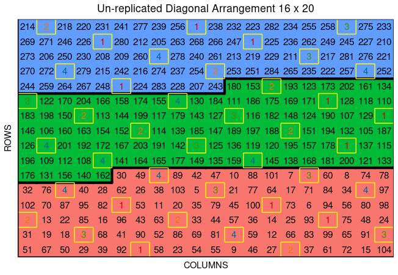
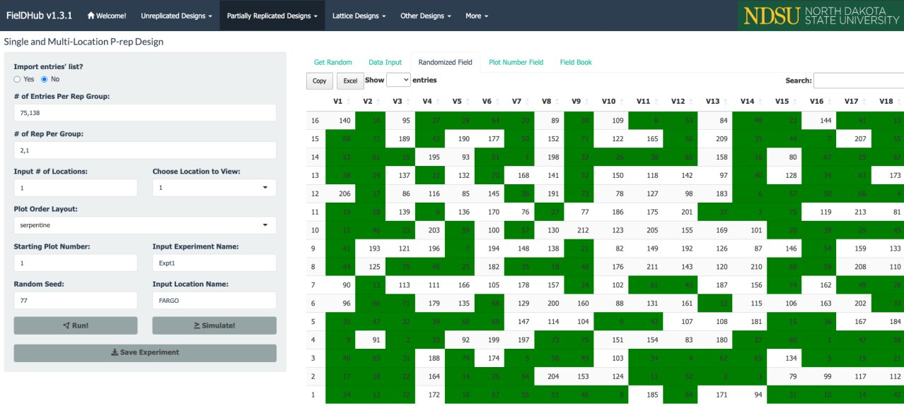

<!-- README.md is generated from README.Rmd. Please edit that file -->

<br>

# FielDHub 

<!-- badges: start -->

[](https://cran.r-project.org/web//packages/FielDHub/)
[](https://github.com/DidierMurilloF/FielDHub/actions/workflows/R-CMD-check.yaml)
[](https://lifecycle.r-lib.org/articles/stages.html)
[](https://cranlogs.r-pkg.org/badges/FielDHub)
[](https://cranlogs.r-pkg.org/badges/grand-total/FielDHub)
<!-- badges: end -->

## A Shiny App for Design of Experiments in Life Sciences

## Installation

### From CRAN

``` r
install.packages("FielDHub")
```

### From GitHub

``` r
remotes::install_github("DidierMurilloF/FielDHub")
```

## FielDHub Paper

[](https://doi.org/10.21105/joss.03122)

## Overview

A shiny design of experiments (DOE) app that aids in the creation of
traditional, un-replicated, augmented and partially-replicated designs
applied to agriculture, plant breeding, forestry, animal and biological
sciences.

For more details and examples of all functions present in the FielDHub
package. Please, go to
<https://didiermurillof.github.io/FielDHub/articles/diagonal_arrangement.html>.


## Usage

This is a basic example which shows you how to launch the app:

``` r
library(FielDHub)
run_app()
```

### Diagonal Arrangement Example

A project needs to test 280 genotypes in a field containing 16 rows and
20 columns of plots. In this example, these 280 genotypes are divided
among three different experiments. In addition, four checks are included
in a systematic diagonal arrangement across experiments to fill 40 plots
representing 12.5% of the total number of experimental plots. An option
to include filler plots is also available for fields where the number of
experimental plots does not equal the number of available field plots.


The figure above shows a map of an experiment randomized along with
multiple experiments (three) and checks on diagonals. Distinctively
colored check plots are replicated throughout the field in a systematic
diagonal arrangement.


The figure above shows the layout for the three experiments in the
field.

### Using the FielDHub function `diagonal_arrangement()`

To illustrate using FielDHub to build experimental designs through R
code, the design produced in the R Shiny interface described above can
also be created using the function `diagonal_arrangement()` in the R
script below. Note, that to obtain identical results, users must include
the same random seed in the script as was used in the Shiny app. In this
case, the random seed is 1249.

``` r
diagonal <- diagonal_arrangement(
  nrows = 16, 
  ncols = 20, 
  lines = 280, 
  checks = 4, 
  plotNumber = 101, 
  splitBy = "row", 
  seed = 1249, 
  kindExpt = "DBUDC", 
  blocks = c(100, 100, 80), 
  exptName = c("Expt1", "Expt2", "Expt3")
)
```

Users can print the returned values from `diagonal_arrangement()` as
follow,

``` r
print(diagonal)
Un-replicated Diagonal Arrangement Design 

Information on the design parameters: 
List of 11
 $ rows          : num 16
 $ columns       : num 20
 $ treatments    : num [1:3] 100 100 80
 $ checks        : int 4
 $ entry_checks  : int [1:4] 1 2 3 4
 $ rep_checks    : num [1:4] 11 9 9 11
 $ locations     : num 1
 $ planter       : chr "serpentine"
 $ percent_checks: chr "12.5%"
 $ fillers       : num 0
 $ seed          : num 1249

 10 First observations of the data frame with the diagonal_arrangement field book: 
   ID  EXPT LOCATION YEAR PLOT ROW COLUMN CHECKS ENTRY TREATMENT
1   1 Expt1        1 2023  101   1      1      0    51    Gen-51
2   2 Expt1        1 2023  102   1      2      0    67    Gen-67
3   3 Expt1        1 2023  103   1      3      0    50    Gen-50
4   4 Expt1        1 2023  104   1      4      0    29    Gen-29
5   5 Expt1        1 2023  105   1      5      0    39    Gen-39
6   6 Expt1        1 2023  106   1      6      0    92    Gen-92
7   7 Expt1        1 2023  107   1      7      1     1   Check-1
8   8 Expt1        1 2023  108   1      8      0    58    Gen-58
9   9 Expt1        1 2023  109   1      9      0    23    Gen-23
10 10 Expt1        1 2023  110   1     10      0    54    Gen-54
```

First 12 rows of the field book,

``` r
head(diagonal$fieldBook, 12)
   ID  EXPT LOCATION YEAR PLOT ROW COLUMN CHECKS ENTRY TREATMENT
1   1 Expt1        1 2023  101   1      1      0    51    Gen-51
2   2 Expt1        1 2023  102   1      2      0    67    Gen-67
3   3 Expt1        1 2023  103   1      3      0    50    Gen-50
4   4 Expt1        1 2023  104   1      4      0    29    Gen-29
5   5 Expt1        1 2023  105   1      5      0    39    Gen-39
6   6 Expt1        1 2023  106   1      6      0    92    Gen-92
7   7 Expt1        1 2023  107   1      7      1     1   Check-1
8   8 Expt1        1 2023  108   1      8      0    58    Gen-58
9   9 Expt1        1 2023  109   1      9      0    23    Gen-23
10 10 Expt1        1 2023  110   1     10      0    54    Gen-54
11 11 Expt1        1 2023  111   1     11      0    55    Gen-55
12 12 Expt1        1 2023  112   1     12      0     9     Gen-9
```

Users can plot the layout design from `diagonal_arrangement()` using the
function `plot()` as follows,

``` r
plot(diagonal)
```



In the figure, salmon, green, and blue shade the blocks of unreplicated
experiments, while distinctively colored check plots are replicated
throughout the field in a systematic diagonal arrangement.

The main difference between using the FielDHub Shiny app and using the
standalone function `diagonal_arrangement()` is that the standalone
function will allocate filler only if it is necessary, while in Shiny
App, users can customize the number of fillers if it is needed. In cases
where users include fillers, either between or after experiments, the
Shiny app is preferable for filling and visualizing all field plots.

To see more examples, go to
<https://didiermurillof.github.io/FielDHub/articles/diagonal_arrangement.html>

### Partially Replicated Design Example

Partially replicated designs are commonly employed in early generation
field trials. This type of design is characterized by replication of a
portion of the entries, with the remaining entries only appearing once
in the experiment. As an example, considered a field trial with 288
plots containing 75 entries appearing two times each, and 138 entries
only appearing once. This field trials is arranged in a field of 16 rows
by 18 columns.



In the figure above, green plots contain replicated entries, and the
other plots contain entries that only appear once.

### Using the FielDHub function `partially_replicated()`

Instead of using the Shiny FielDHub app, users can use the standalone
FielDHub function `partially_replicated()`. The partially replicated
layout described above can be produced through scripting as follows. As
noted in the previous example, to obtain identical results between the
script and the Shiny app, users need to use the same random seed, which,
in this case, is 77.

``` r
pREP <- partially_replicated(
  nrows = 16, 
  ncols = 18,  
  repGens = c(138,75),
  repUnits = c(1,2),
  planter = "serpentine", 
  plotNumber = 1,
  exptName = "ExptA",
  locationNames = "FARGO",
  seed = 77
)
```

Users can print returned values from `partially_replicated()` as
follows,

``` r
print(pREP)
Partially Replicated Design 

Information on the design parameters: 
List of 7
 $ rows                   : num 16
 $ columns                : num 18
 $ treatments_with_reps   : int 75
 $ treatments_with_no_reps: int 138
 $ locations              : num 1
 $ planter                : chr "serpentine"
 $ seed                   : num 77

 10 First observations of the data frame with the partially_replicated field book: 
   ID  EXPT LOCATION YEAR PLOT ROW COLUMN CHECKS ENTRY TREATMENT
1   1 ExptA    FARGO 2023    1   1      1      0    80       G80
2   2 ExptA    FARGO 2023    2   1      2     49    49       G49
3   3 ExptA    FARGO 2023    3   1      3     15    15       G15
4   4 ExptA    FARGO 2023    4   1      4     44    44       G44
5   5 ExptA    FARGO 2023    5   1      5      0   185      G185
6   6 ExptA    FARGO 2023    6   1      6      9     9        G9
7   7 ExptA    FARGO 2023    7   1      7      0   133      G133
8   8 ExptA    FARGO 2023    8   1      8     58    58       G58
9   9 ExptA    FARGO 2023    9   1      9      4     4        G4
10 10 ExptA    FARGO 2023   10   1     10      0   113      G113
```

First 12 rows of the fieldbook,

``` r
head(pREP$fieldBook, 12)
   ID  EXPT LOCATION YEAR PLOT ROW COLUMN CHECKS ENTRY TREATMENT
1   1 ExptA    FARGO 2023    1   1      1      0    80       G80
2   2 ExptA    FARGO 2023    2   1      2     49    49       G49
3   3 ExptA    FARGO 2023    3   1      3     15    15       G15
4   4 ExptA    FARGO 2023    4   1      4     44    44       G44
5   5 ExptA    FARGO 2023    5   1      5      0   185      G185
6   6 ExptA    FARGO 2023    6   1      6      9     9        G9
7   7 ExptA    FARGO 2023    7   1      7      0   133      G133
8   8 ExptA    FARGO 2023    8   1      8     58    58       G58
9   9 ExptA    FARGO 2023    9   1      9      4     4        G4
10 10 ExptA    FARGO 2023   10   1     10      0   113      G113
11 11 ExptA    FARGO 2023   11   1     11      0   190      G190
12 12 ExptA    FARGO 2023   12   1     12      0   148      G148
```

Users can plot the layout design from `partially_replicated()` using the
function `plot()` as follows,

``` r
plot(pREP)
```


To see more examples, please go to
<https://didiermurillof.github.io/FielDHub/articles/partially_replicated.html>

<br> <br>
