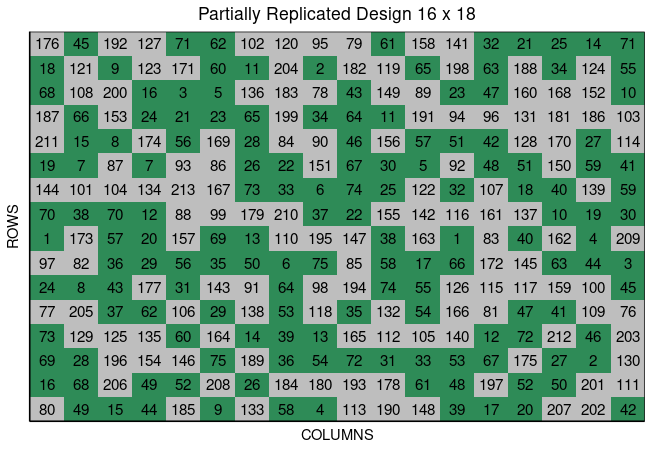

<!-- README.md is generated from README.Rmd. Please edit that file -->

<br>

# FielDHub <a href=''></a>

[](https://cran.r-project.org/web//packages/FielDHub/)
[](https://github.com/DidierMurilloF/FielDHub/actions/workflows/R-CMD-check.yaml)
[](https://lifecycle.r-lib.org/articles/stages.html)
[](https://cranlogs.r-pkg.org/badges/FielDHub)
[](https://cranlogs.r-pkg.org/badges/grand-total/FielDHub)

## A Shiny App for Design of Experiments in Life Sciences

## Installation

### Stable version from CRAN

``` r
install.packages("FielDHub")
```

### Development version from GitHub

``` r
remotes::install_github("DidierMurilloF/FielDHub")
```

## FielDHub Paper

[](https://doi.org/10.21105/joss.03122)

## Overview

A shiny design of experiments (DOE) app that aids in the creation of
traditional, un-replicated, augmented and partially-replicated designs
applied to agriculture, plant breeding, forestry, animal and biological
sciences.

For more details and examples of all functions present in the FielDHub
package. Please, go to
<https://didiermurillof.github.io/FielDHub/reference/index.html>.


## Usage

This is a basic example which shows you how to launch the app:

``` r
library(FielDHub)
run_app()
```

### Diagonal Arrangement Example

A project needs to test 280 genotypes in a field containing 16 rows and
20 columns of plots. In this example, these 280 genotypes are divided
among three different experiments. In addition, four checks are included
in a systematic diagonal arrangement across experiments to fill 40 plots
representing 12.5% of the total number of experimental plots. An option
to include filler plots is also available for fields where the number of
experimental plots does not equal the number of available field plots.


The figure above shows a map of an experiment randomized as a Decision
Block Unreplicated Design with Checks on Diagonals. Yellow, gray, and
green shade the blocks of unreplicated experiments, while distinctively
colored check plots are replicated throughout the field in a systematic
diagonal arrangement.

To illustrate using FielDHub to build experimental designs through R
code, the design produced in the R Shiny interface described above can
also be created using the function `diagonal_arrangement()` in the R
script below. Note, that to obtain identical results, users must include
the same seed number in the script as was used in the Shiny app. In this
case, the seed number is 1249.

``` r
diagonal <- diagonal_arrangement(
  nrows = 16, 
  ncols = 20, 
  lines = 280, 
  checks = 4, 
  plotNumber = 101, 
  splitBy = "row", 
  seed = 1249, 
  kindExpt = "DBUDC", 
  blocks = c(100, 100, 80)
)
```

Users can access the returned values from `diagonal_arrangement()` as
follow,

``` r
diagonal$infoDesign
$rows
[1] 16

$columns
[1] 20

$treatments
[1] 100 100  80

$checks
[1] 4

$entry_checks
[1] 1 2 3 4

$rep_checks
[1] 11  9  9 11

$locations
[1] 1

$planter
[1] "serpentine"

$percent_checks
[1] "12.5%"

$fillers
[1] 0

$seed
[1] 1249

$id_design
[1] 15
```

``` r
head(diagonal$fieldBook, 12)
   ID   EXPT LOCATION YEAR PLOT ROW COLUMN CHECKS ENTRY TREATMENT
1   1 Block1        1 2022  101   1      1      0    51    Gen-51
2   2 Block1        1 2022  102   1      2      0    67    Gen-67
3   3 Block1        1 2022  103   1      3      0    50    Gen-50
4   4 Block1        1 2022  104   1      4      0    29    Gen-29
5   5 Block1        1 2022  105   1      5      0    39    Gen-39
6   6 Block1        1 2022  106   1      6      0    92    Gen-92
7   7 Block1        1 2022  107   1      7      1     1   Check-1
8   8 Block1        1 2022  108   1      8      0    58    Gen-58
9   9 Block1        1 2022  109   1      9      0    23    Gen-23
10 10 Block1        1 2022  110   1     10      0    54    Gen-54
11 11 Block1        1 2022  111   1     11      0    55    Gen-55
12 12 Block1        1 2022  112   1     12      0     9     Gen-9
```

Users can plot the layout design from `diagonal_arrangement()` using the
function `plot()` as follows,

``` r
plot(diagonal)
```


The main difference between using the FielDHub Shiny app and using the
standalone function `diagonal_arrangement()` is that the standalone
function will allocate filler only if it is necessary, while in R Shiny,
filler plots are generated automatically. In cases where users include
fillers, either between or after experiments, the Shiny app is
preferable for filling and visualizing all field plots.

### Partially Replicated Design Example

Partially replicated designs are commonly employed in early generation
field trials. This type of design is characterized by replication of a
portion of the entries, with the remaining entries only appearing once
in the experiment. As an example, considered a field trial with 288
plots containing 75 entries appearing two times each, and 138 entries
only appearing once. This field trials is arranged in a field of 16 rows
by 18 columns.


In the figure above, green plots contain replicated entries, and yellow
plots contain entries that only appear once.

Instead of using the Shiny FielDHub app, users can use the standalone
FielDHub function `partially_replicated()`. The partially replicated
layout described above can be produced through scripting as follows. As
noted in the previous example, to obtain identical results between the
script and the Shiny app, users need to use the same seed number, which,
in this case, is 77.

``` r
pREP <- partially_replicated(
  nrows = 16, 
  ncols = 18,  
  repGens = c(138,75),
  repUnits = c(1,2),
  planter = "serpentine", 
  plotNumber = 1,
  exptName = "ExptA",
  locationNames = "FARGO",
  seed = 77
)
```

Users can access returned values from `partially_replicated()` as
follows,

``` r
pREP$infoDesign
$rows
[1] 16

$columns
[1] 18

$treatments_with_reps
[1] 75

$treatments_with_no_reps
[1] 138

$locations
[1] 1

$planter
[1] "serpentine"

$seed
[1] 77

$id_design
[1] 13
```

``` r
 head(pREP$fieldBook, 12)
   ID  EXPT LOCATION YEAR PLOT ROW COLUMN CHECKS ENTRY TREATMENT
1   1 ExptA    FARGO 2022    1   1      1      0    80       G80
2   2 ExptA    FARGO 2022    2   1      2     49    49       G49
3   3 ExptA    FARGO 2022    3   1      3     15    15       G15
4   4 ExptA    FARGO 2022    4   1      4     44    44       G44
5   5 ExptA    FARGO 2022    5   1      5      0   185      G185
6   6 ExptA    FARGO 2022    6   1      6      9     9        G9
7   7 ExptA    FARGO 2022    7   1      7      0   133      G133
8   8 ExptA    FARGO 2022    8   1      8     58    58       G58
9   9 ExptA    FARGO 2022    9   1      9      4     4        G4
10 10 ExptA    FARGO 2022   10   1     10      0   113      G113
11 11 ExptA    FARGO 2022   11   1     11      0   190      G190
12 12 ExptA    FARGO 2022   12   1     12      0   148      G148
```

Users can plot the layout design from `partially_replicated()` using the
function `plot()` as follows,

``` r
plot(pREP)
```



To see more examples, please go to
<https://didiermurillof.github.io/FielDHub/reference/index.html>.
