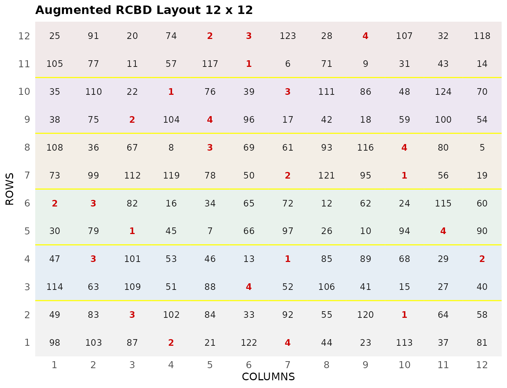
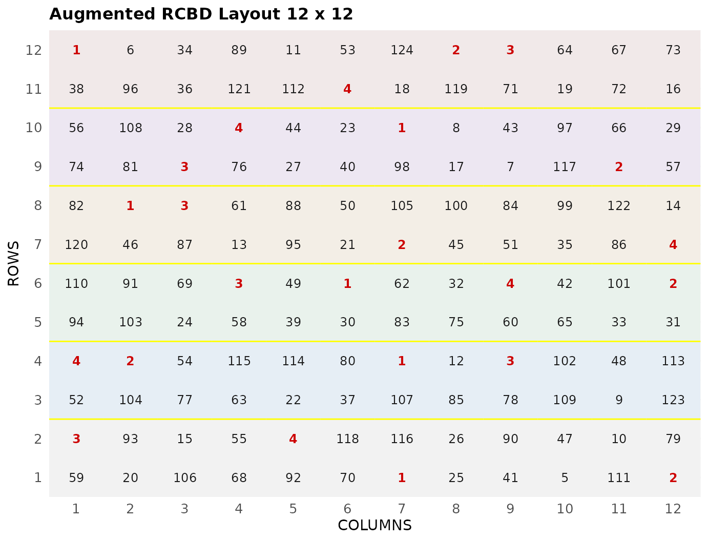

# Augmented Randomized Complete Block Design

This vignette shows how to generate an **augmented randomized complete
block design** using both the FielDHub Shiny App and the scripting
function
[`RCBD_augmented()`](https://didiermurillof.github.io/FielDHub/reference/RCBD_augmented.md)
from the `FielDHub` package.

## Overview

The augmented randomized complete block design is another option to
overcome the problem of limited facilities or lack of seed when
researchers want to test many treatments. In this kind of design, the
approach is to build augmented blocks and allocate the same amount of
controls in every block along with the treatments.

FielDHub includes a function to run such experimental designs, features
include options to set the number of entries and the number of checks
and augmented blocks for the experiment. Users can also choose to run
the same experiment over multiple locations.

## Use case

For example, we say a project needs to test 120 genotypes of cassava
over two locations. In addition, the research includes four checks and
six augmented blocks to carry out this experiment. This design setup
comes out with 6 blocks of size 24 plots for a total of 144 plots that
will be distributed in a field of 12 rows and 12 columns.

## Running the Shiny App

To launch the app you need to run either

``` r
FielDHub::run_app()
```

or

``` r
library(FielDHub)
run_app()
```

## 1. Using the FielDHub Shiny App

Once the app is running, go to **Unreplicated Designs** \> **RCBD
Augmented**

Then, follow the following steps where we will show how to generate an
RCBD Augmented.

## Inputs

1.  **Import entries’ list?** Choose whether to import a list with entry
    numbers and names for genotypes or treatments.
    - If the selection is `No`, that means the app is going to generate
      synthetic data for entries and names of the treatment/genotypes
      based on the user inputs.

    - If the selection is `Yes`, the entries list must fulfill a
      specific format and must be a `.csv` file. The file must have the
      columns `ENTRY` and `NAME`. The `ENTRY` column must have a unique
      entry integer number for each treatment/genotype. The column
      `NAME` must have a unique name that identifies each
      treatment/genotype. Both `ENTRY` and `NAME` must be unique,
      duplicates are not allowed. In the following table, we show an
      example of the entries list format. This example has an entry list
      with four checks and 8 treatments/genotypes. It is crucial to
      allocate the checks in the top part of the file.

| ENTRY | NAME   |
|------:|:-------|
|     1 | CHECK1 |
|     2 | CHECK2 |
|     3 | CHECK3 |
|     4 | G-4    |
|     5 | G-5    |
|     6 | G-6    |
|     7 | G-7    |
|     8 | G-8    |
|     9 | G-9    |
|    10 | G-10   |
|    11 | G-11   |
|    12 | G-12   |

1.  Enter the number of stacked experiments in the **Input \# of Stacked
    Expts** box. This means the number of times the experiment will be
    replicated. In our case we will perform just `1` experiment.

2.  On the augmented RCBD we have the option to choose whether we
    randomize the entries or not, with the **Randomize Entries** toggle
    button. It is recommended always randomized the treatments/entries
    but some researchers choose not to randomize treatments, this is
    often due to logistical issues.

3.  Enter the number of entries/treatments in the **Input \# of
    Entries** box, which is `120` in our example experiment.

4.  Set the number of checks per block with the **Checks per Block**
    box. In our case, it is `5` checks.

5.  Set the number of blocks with **Input \# of Blocks** box, which is
    `6` in our example.

The total number of plots in our field will be **Input \# of Stacked
Expts**(**Input \# of Entries** + **Input \# of Blocks** \* **Checks per
Block**), per location.

6.  Enter the number of locations in **Input \# of Locations**. Set it
    as `2`.

7.  Select `serpentine` or `cartesian` in the **Plot Order Layout**. For
    this example we will set the `serpentine` layout.

8.  To ensure that randomizations are consistent across sessions, we can
    set a random seed in the box labeled **random seed**. In this
    example, we will set it to `1987`.

9.  Enter the starting plot number in the **Starting Plot Number** box.
    If the experiment has multiple locations, you must enter a comma
    separated list of numbers the length of the number of locations for
    the input to be valid.

10. Once we have entered the information for our experiment on the left
    side panel, click the **Run!** button to run the design.

11. You will then be prompted to select the dimensions of the field from
    the list of options in the drop down in the middle of the screen
    with the box labeled **Select dimensions of field**. In our case, we
    will select `12 x 12`.

12. Click the **Randomize!** button to randomize the experiment with the
    set field dimensions and to see the output plots. If you change the
    dimensions again, you must re-randomize.

If you change any of the inputs on the left side panel after running an
experiment initially, you have to click the Run and Randomize buttons
again, to re-run with the new inputs.

## Outputs

After you run the augmented RCBD in FielDHub and set the dimensions of
the field, there are several ways to display the information contained
in the field book. The first tab, **Get Random**, shows the option to
change the dimensions of the field and re-randomize, as well as a
reference guide for experiment design.

### Input Data

On the second tab, **Input Data**, you can see all the entries in the
randomization in a list, as well as a table of the checks with the
number of times they appear in the field. In the list of entries, the
reps for each check is included as well.

### Randomized Field

The **Randomized Field** tab displays a graphical representation of the
randomization of the entries in a field of the specified dimensions. The
checks are all colored uniquely, showing the number of times they are
distributed throughout the field. The display includes numbered labels
for the rows and columns. You can copy the field as a table or save it
directly as an Excel file with the *Copy* and *Excel* buttons at the
top.

### Plot Number Field

On the **Plot Number Field** tab, there is a table display of the field
with the plots numbered according to the Plot Order Layout specified,
either *serpentine* or *cartesian*. You can see the corresponding
entries for each plot number in the field book. Like the Randomized
Field tab, you can copy the table or save it as an Excel file with the
*Copy* and *Excel* buttons.

### Field Book

The **Field Book** displays all the information on the experimental
design in a table format. It contains the specific plot number and the
row and column address of each entry, as well as the corresponding
treatment on that plot. This table is searchable, and we can filter the
data in relevant columns.

  

## 2. Using the `FielDHub` function: `RCBD_augmented()`

You can run the same design with the function
[`RCBD_augmented()`](https://didiermurillof.github.io/FielDHub/reference/RCBD_augmented.md)
in the `FielDHub` package.

First, you need to load the `FielDHub` package typing,

``` r
library(FielDHub)
```

Then, you can enter the information describing the above design like
this:

``` r
aug_RCBD <- RCBD_augmented(
  lines = 120,
  checks = 4,
  b = 6, 
  repsExpt = 1, 
  l = 2,
  random = TRUE,
  exptName = "Cassava_2022", 
  plotNumber = c(1001, 2001),
  locationNames = c("FARGO", "CASSELTON"),
  nrows = 12,
  ncols = 12,
  seed = 1987
)
```

#### Details on the inputs entered in `RCBD_augmented()` above

The description for the inputs that we used to generate the design,

- `lines = 120` is the number of entries
- `checks = 4` is the number of checks in each augmented block.
- `b = 6` is the number of augmented blocks.
- `repsExpt = 1` is the number of reps for the experiment.
- `l = 2` is the number of locations.
- `random = TRUE` it means both treatment/entries and checks will be
  randomized.
- `exptName = "Cassava_2022"` is an optional name for the experiment.
- `plotNumber = c(1001,2001)` are the starting plot number for each
  location respectively, or a single number for 1 location.
- `locationNames = c("FARGO", "CASSELTON")` are the values for
  representing respective name for each location.
- `nrows = 12` is the number of rows in the field. It is optional
- `ncols = 12` is the number of columns in the field. It is optional.
- `seed = 1987` is the random seed to replicate identical
  randomizations.

### Print `aug_RCBD` output

To print a summary of the information that is in the object `aug_RCBD`,
we can use the generic function
[`print()`](https://rdrr.io/r/base/print.html).

``` r
print(aug_RCBD)
```

    Augmented Randomized Complete Block Design: 

    Information on the design parameters: 
    List of 11
     $ rows                 : num 12
     $ columns              : num 12
     $ rows_within_blocks   : num 2
     $ columns_within_blocks: num 12
     $ treatments           : num 120
     $ checks               : num 4
     $ blocks               : num 6
     $ plots_per_block      : num [1:6] 24 24 24 24 24 24
     $ locations            : num 2
     $ fillers              : num 0
     $ seed                 : num 1987

     10 First observations of the data frame with the RCBD_augmented field book: 
       ID         EXPT LOCATION YEAR PLOT ROW COLUMN CHECKS BLOCK ENTRY TREATMENT
    1   1 Cassava_2022    FARGO 2026 1001   1      1      0     1    98       G98
    2   2 Cassava_2022    FARGO 2026 1002   1      2      0     1   103      G103
    3   3 Cassava_2022    FARGO 2026 1003   1      3      0     1    87       G87
    4   4 Cassava_2022    FARGO 2026 1004   1      4      1     1     2       CH2
    5   5 Cassava_2022    FARGO 2026 1005   1      5      0     1    21       G21
    6   6 Cassava_2022    FARGO 2026 1006   1      6      0     1   122      G122
    7   7 Cassava_2022    FARGO 2026 1007   1      7      1     1     4       CH4
    8   8 Cassava_2022    FARGO 2026 1008   1      8      0     1    44       G44
    9   9 Cassava_2022    FARGO 2026 1009   1      9      0     1    23       G23
    10 10 Cassava_2022    FARGO 2026 1010   1     10      0     1   113      G113

### Access to `aug_RCBD` output

The function
[`RCBD_augmented()`](https://didiermurillof.github.io/FielDHub/reference/RCBD_augmented.md)
returns a list consisting of all the information displayed in the output
tabs in the FielDHub app: design information, plot layout, plot
numbering, entries list, and field book. These are accessible by the `$`
operator, i.e. `aug_RCBD$layoutRandom` or `aug_RCBD$fieldBook`.

`aug_RCBD$fieldBook` is a list containing information about every plot
in the field, with information about the location of the plot and the
treatment in each plot. As seen in the output below, the field book has
columns for `ID`, `EXPT`, `LOCATION`, `YEAR`, `PLOT`, `ROW`, `COLUMN`,
`CHECKS`, `ENTRY`, and `TREATMENT`.

Let us see the first 10 rows of the field book for this experiment.

``` r
field_book <- aug_RCBD$fieldBook
head(field_book, 10)
```

       ID         EXPT LOCATION YEAR PLOT ROW COLUMN CHECKS BLOCK ENTRY TREATMENT
    1   1 Cassava_2022    FARGO 2026 1001   1      1      0     1    98       G98
    2   2 Cassava_2022    FARGO 2026 1002   1      2      0     1   103      G103
    3   3 Cassava_2022    FARGO 2026 1003   1      3      0     1    87       G87
    4   4 Cassava_2022    FARGO 2026 1004   1      4      1     1     2       CH2
    5   5 Cassava_2022    FARGO 2026 1005   1      5      0     1    21       G21
    6   6 Cassava_2022    FARGO 2026 1006   1      6      0     1   122      G122
    7   7 Cassava_2022    FARGO 2026 1007   1      7      1     1     4       CH4
    8   8 Cassava_2022    FARGO 2026 1008   1      8      0     1    44       G44
    9   9 Cassava_2022    FARGO 2026 1009   1      9      0     1    23       G23
    10 10 Cassava_2022    FARGO 2026 1010   1     10      0     1   113      G113

### Plot field layout

For plotting the layout in function of the coordinates `ROW` and
`COLUMN` in the field book object we can use the generic function
[`plot()`](https://rdrr.io/r/graphics/plot.default.html) as follow,

#### Plot layout for location 1

``` r
plot(aug_RCBD)
```



It is possible to pass more arguments to
[`plot()`](https://rdrr.io/r/graphics/plot.default.html) such as the
specific location. For example, you can plot the layout for location 2.

#### Plot layout for location 2

``` r
plot(aug_RCBD, l = 2)
```



  
  
