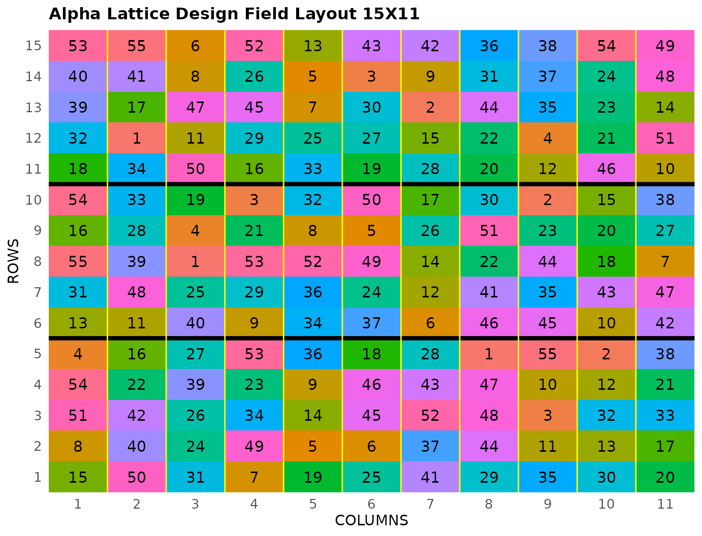

# Alpha Lattice Design

This vignette shows how to generate a **Alpha Lattice Design** using
both the FielDHub Shiny App and the scripting function
[`alpha_lattice()`](https://didiermurillof.github.io/FielDHub/reference/alpha_lattice.md)
from the `FielDHub` package.

## 1. Using the FielDHub Shiny App

To launch the app you need to run either

``` r

FielDHub::run_app()
```

or

``` r

library(FielDHub)
run_app()
```

Once the app is running, go to **Lattice Designs** \> **Alpha Lattice**

Then, follow the following steps where we will show how to generate this
kind of design with 55 treatments and 3 reps.

## Inputs

1.  **Import entries’ list?** Choose whether to import a list with entry
    numbers and names for genotypes or treatments.
    - If the selection is `No`, that means the app is going to generate
      synthetic data for entries and names of the treatment/genotypes
      based on the user inputs.

    - If the selection is `Yes`, the entries list must fulfill a
      specific format and must be a `.csv` file. The file must have the
      columns `ENTRY` and `NAME`. The `ENTRY` column must have a unique
      entry integer number for each treatment. The column `NAME` must
      have a unique name that identifies each treatment. Both ENTRY and
      NAME must be unique, duplicates are not allowed. In the following
      table, we show an example of the entries list format. This example
      has an entry list with 12 treatments.

| ENTRY | NAME      |
|------:|:----------|
|     1 | GenotypeA |
|     2 | GenotypeB |
|     3 | GenotypeC |
|     4 | GenotypeD |
|     5 | GenotypeE |
|     6 | GenotypeF |
|     7 | GenotypeG |
|     8 | GenotypeH |
|     9 | GenotypeI |
|    10 | GenotypeJ |
|    11 | GenotypeK |
|    12 | GenotypeL |

2.  Input the number of treatments in the **Input \# of Treatments**
    box. In the alpha lattice design, the number of treatments must be a
    composite number. In this case, set it to `55`.

3.  Select the number of replications of these treatments with the
    **Input \# of Full Reps** box. Set it to `3`.

4.  Set the number of plots in each incomplete block in the **Input \#
    of Plots per IBlock** box. Set it to `5`.

5.  Enter the number of locations in **Input \# of Locations**. We will
    run this experiment over a single location, so set it to `1`.

6.  Select `serpentine` or `cartesian` in the **Plot Order Layout**. For
    this example we will use the default `cartesian` layout.

7.  Enter the starting plot number in the **Starting Plot Number** box.
    If the experiment has multiple locations, you must enter a comma
    separated list of numbers the length of the number of locations for
    the input to be valid. Set it to `101`.

8.  Enter a name for the location of the experiment in the **Input
    Location** box. If there are multiple locations, each name must be
    in a comma separated list. For this example, set it to `"FARGO"`.

9.  To ensure that randomizations are consistent across sessions, we can
    set a random seed in the box labeled **random seed**. In this
    example, we will set it to `1235`.

10. Once we have entered the information for our experiment on the left
    side panel, click the **Run!** button to run the design.

## Outputs

After you run an alpha lattice design in FielDHub, there are several
ways to display the information contained in the field book.

### Field Layout

When you first click the run button on an alpha lattice design, FielDHub
displays the Field Layout tab, which shows the entries and their
arrangement in the field. In the box below the display, you can change
the layout of the field or change the location displayed. You can also
display a heatmap over the field by changing **Type of Plot** to
`Heatmap`. To view a heatmap, you must first simulate an experiment over
the described field with the **Simulate!** button. A pop-up window will
appear where you can enter what variable you want to simulate along with
minimum and maximum values.

### Field Book

The **Field Book** displays all the information on the experimental
design in a table format. It contains the specific plot number and the
row and column address of each entry, as well as the corresponding
treatment on that plot. This table is searchable, and we can filter the
data in relevant columns. If we have simulated data for a heatmap, an
additional column for that variable appears in the Field Book.

## 2. Using the `FielDHub` function: `alpha_lattice()`

You can run the same design with a function in the FielDHub package,
[`alpha_lattice()`](https://didiermurillof.github.io/FielDHub/reference/alpha_lattice.md).

First, you need to load the `FielDHub` package typing,

``` r

library(FielDHub)
```

Then, you can enter the information describing the above design like
this:

``` r

alpha <- alpha_lattice(
  t = 55,
  r = 3,  
  k = 5, 
  l = 1,      
  plotNumber = 101, 
  locationNames = "FARGO", 
  seed = 1235
)
```

#### Details on the inputs entered in `alpha_lattice()` above

The description for the inputs that we used to generate the design,

- `t = 55` is the number of treatments.
- `r=3` is the number of replicates.
- `k = 5` is the number of plots per incomplete block.
- `l = 1` is the number of locations.
- `plotNumber = 101` is the starting plot number.
- `locationNames = "FARGO"` is an optional name for each location.
- `seed = 1235` is the random seed to replicate identical
  randomizations.

### Print `alpha` object

To print a summary of the information that is in the object `alpha`, we
can use the generic function
[`print()`](https://rdrr.io/r/base/print.html).

``` r

print(alpha)
```

    Alpha Lattice Design 

    Efficiency of design: 
      Level Blocks D-Efficiency A-Efficiency   A-Bound
    1     1      3    1.0000000    1.0000000 1.0000000
    2     2     33    0.7857467    0.7545589 0.7574115

    Information on the design parameters: 
    List of 7
     $ Reps            : num 3
     $ iBlocks         : num 11
     $ NumberTreatments: num 55
     $ NumberLocations : num 1
     $ Locations       : chr "FARGO"
     $ seed            : num 1235
     $ lambda          : num 0.222

     10 First observations of the data frame with the alpha_lattice field book: 
       ID LOCATION PLOT REP IBLOCK UNIT ENTRY TREATMENT
    1   1    FARGO  101   1      1    1    15      G-15
    2   2    FARGO  102   1      1    2     8       G-8
    3   3    FARGO  103   1      1    3    51      G-51
    4   4    FARGO  104   1      1    4    54      G-54
    5   5    FARGO  105   1      1    5     4       G-4
    6   6    FARGO  106   1      2    1    50      G-50
    7   7    FARGO  107   1      2    2    40      G-40
    8   8    FARGO  108   1      2    3    42      G-42
    9   9    FARGO  109   1      2    4    22      G-22
    10 10    FARGO  110   1      2    5    16      G-16

### Access to `alpha` object

The function
[`alpha_lattice()`](https://didiermurillof.github.io/FielDHub/reference/alpha_lattice.md)
returns a list consisting of all the information displayed in the output
tabs in the FielDHub app: design information, plot layout, plot
numbering, entries list, and field book. These are accessible by the `$`
operator, i.e. `alpha$layoutRandom` or `alpha$fieldBook`.

`alpha$fieldBook` is a list containing information about every plot in
the field, with information about the location of the plot and the
treatment in each plot. As seen in the output below, the field book has
columns for `ID`, `LOCATION`, `PLOT`, `REP`, `IBLOCK`, `UNIT`, `ENTRY`,
and `TREATMENT`.

``` r

field_book <- alpha$fieldBook
head(alpha$fieldBook, 10)
```

       ID LOCATION PLOT REP IBLOCK UNIT ENTRY TREATMENT
    1   1    FARGO  101   1      1    1    15      G-15
    2   2    FARGO  102   1      1    2     8       G-8
    3   3    FARGO  103   1      1    3    51      G-51
    4   4    FARGO  104   1      1    4    54      G-54
    5   5    FARGO  105   1      1    5     4       G-4
    6   6    FARGO  106   1      2    1    50      G-50
    7   7    FARGO  107   1      2    2    40      G-40
    8   8    FARGO  108   1      2    3    42      G-42
    9   9    FARGO  109   1      2    4    22      G-22
    10 10    FARGO  110   1      2    5    16      G-16

### Plot the field layout

For plotting the layout in function of the coordinates `ROW` and
`COLUMN`, you can use the the generic function
[`plot()`](https://rdrr.io/r/graphics/plot.default.html) as follows,

``` r

plot(alpha)
```



  
  
  
