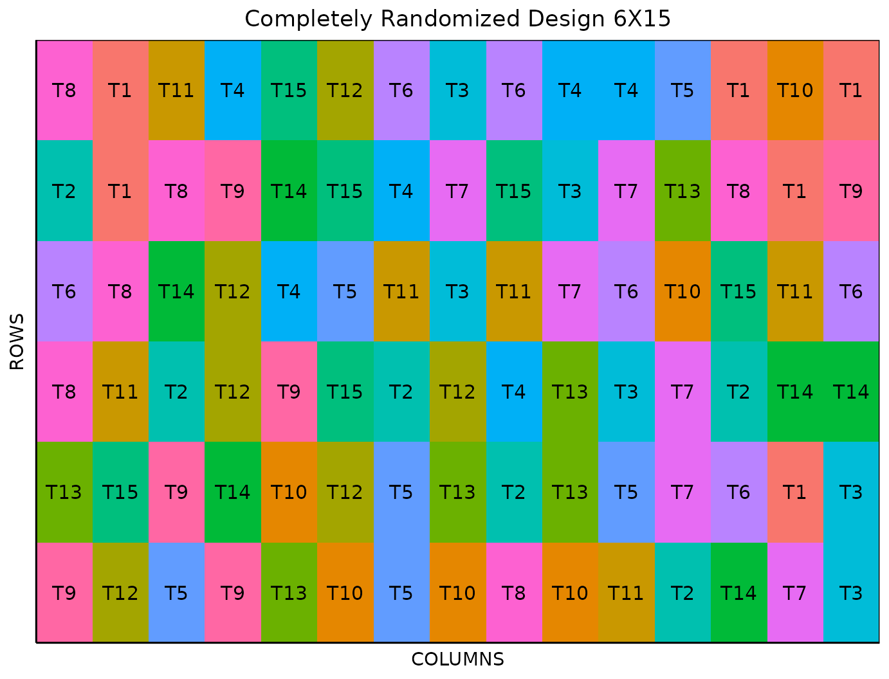

# Completely Randomized Design

This vignette shows how to generate a **completely randomized design**
using both the FielDHub Shiny App and the scripting function
[`CRD()`](https://didiermurillof.github.io/FielDHub/reference/CRD.md)
from the `FielDHub` package.

## 1. Using the FielDHub Shiny App

To launch the app you need to run either

``` r

FielDHub::run_app()
```

or

``` r

library(FielDHub)
run_app()
```

Once the app is running, go to **Other Designs** \> **Completely
Randomized Design (CRD)**

Then, follow the following steps where we show how to generate this kind
of design by an example with 15 treatments and 6 reps each.

## Inputs

1.  **Import entries’ list?** Choose whether to import a list with entry
    numbers and names for genotypes or treatments.
    - If the selection is `No`, that means the app is going to generate
      synthetic data for entries and names of the treatment/genotypes
      based on the user inputs.

    - If the selection is `Yes`, the entries list must fulfill a
      specific format and must be a `.csv` file. The file must have the
      single column `TREATMENT`, containing a list of unique names that
      identify each treatment. Duplicate values are not allowed, all
      entries must be unique. In the following table, we show an example
      of the entries list format. This example has an entry list with
      ten treatments.

| TREATMENT |
|:----------|
| TRT_A     |
| TRT_B     |
| TRT_C     |
| TRT_D     |
| TRT_E     |
| TRT_F     |
| TRT_G     |
| TRT_H     |
| TRT_I     |
| TRT_J     |

2.  Input the number of treatments in the **Input \# of Treatments**
    box, which is `15` in this case.

3.  Select the number of replications of these treatments with the
    **Input \# of Full Reps** box. Set it as `6`.

4.  Select `serpentine` or `cartesian` in the **Plot Order Layout**. For
    this example we will use the default `cartesian` layout.

5.  Enter the starting plot number in the **Starting Plot Number** box.
    Set it to `101`.

6.  Enter a name for the location of the experiment in the **Input
    Location** box. A completely randomized design can only be run in a
    single location at a time. Set it to `FARGO`.

7.  To ensure that randomizations are consistent across sessions, we can
    set a random seed in the box labeled **random seed**. In this
    example, we will set it to `1236`.

8.  Once we have entered the information for our experiment on the left
    side panel, click the **Run!** button to run the design.

## Outputs

After you run a completely randomized design in FielDHub, there are
several ways to display the information contained in the field book.

### Field Layout

When you first click the run button on a completely randomized design,
FielDHub displays the Field Layout tab, which shows the entries and
their arrangement in the field. In the box below the display, you can
change the layout of the field. You can also display a heatmap over the
field by changing **Type of Plot** to `Heatmap`. To view a heatmap, you
must first simulate an experiment over the described field with the
**Simulate!** button. A pop-up window will appear where you can enter
what variable you want to simulate along with minimum and maximum
values.

### Field Book

The **Field Book** displays all the information on the experimental
design in a table format. It contains the specific plot number and the
row and column address of each entry, as well as the corresponding
treatment on that plot. This table is searchable, and we can filter the
data in relevant columns. If we have simulated data for a heatmap, an
additional column for that variable appears in the Field Book.

## 2. Using the `FielDHub` function: `CRD()`

You can run the same design with a function in the FielDHub package,
[`CRD()`](https://didiermurillof.github.io/FielDHub/reference/CRD.md).
We can enter the information describing the above design like this:

``` r

crd <- CRD(
  t = 15,
  reps = 6,
  plotNumber = 101, 
  locationName = "FARGO",
  seed = 1236
)
```

#### Details on the inputs entered in `CRD()` above

The description for the inputs that we used to generate the design,

- `t = 15` is the number of treatments.
- `reps = 6` is the number of replications for each treatment.
- `plotNumber = 101` is the starting plot number.
- `locationNames = "FARGO"` is an optional name for the location.
- `seed = 1234` is the random seed to replicate identical
  randomizations.

### Print `crd` output

To print a summary of the information that is in the object `crd`, we
can use the generic function
[`print()`](https://rdrr.io/r/base/print.html).

``` r

print(crd)
```

    Completely Randomized Design (CRD) 

    Information on the design parameters: 
    List of 5
     $ numberofTreatments: num 15
     $ treatments        : chr [1:15] "T1" "T2" "T3" "T4" ...
     $ Reps              : num 6
     $ locationName      : chr "FARGO"
     $ seed              : num 1236

     10 First observations of the data frame with the CRD field book: 
       ID LOCATION PLOT REP TREATMENT
    1   1    FARGO  101   4        T9
    2   2    FARGO  102   4       T12
    3   3    FARGO  103   2        T5
    4   4    FARGO  104   3        T9
    5   5    FARGO  105   6       T13
    6   6    FARGO  106   5       T10
    7   7    FARGO  107   5        T5
    8   8    FARGO  108   2       T10
    9   9    FARGO  109   2        T8
    10 10    FARGO  110   3       T10

### Access to `crd` output

The
[`CRD()`](https://didiermurillof.github.io/FielDHub/reference/CRD.md)
function returns a list consisting of all the information displayed in
the output tabs in the FielDHub app: design information, plot layout,
plot numbering, entries list, and field book. These are accessible by
the `$` operator, i.e. `crd$layoutRandom` or `crd$fieldBook`.

`crd$fieldBook` is a list containing information about every plot in the
field, with information about the location of the plot and the treatment
in each plot. As seen in the output below, the field book has columns
for `ID`, `LOCATION`, `PLOT`, `REP`, `IBLOCK`, `UNIT`, `ENTRY`, and
`TREATMENT`.

``` r

field_book <- crd$fieldBook
head(crd$fieldBook, 10)
```

       ID LOCATION PLOT REP TREATMENT
    1   1    FARGO  101   4        T9
    2   2    FARGO  102   4       T12
    3   3    FARGO  103   2        T5
    4   4    FARGO  104   3        T9
    5   5    FARGO  105   6       T13
    6   6    FARGO  106   5       T10
    7   7    FARGO  107   5        T5
    8   8    FARGO  108   2       T10
    9   9    FARGO  109   2        T8
    10 10    FARGO  110   3       T10

### Plot the field layout

For plotting the layout in function of the coordinates `ROW` and
`COLUMN`, you can use the the generic function
[`plot()`](https://rdrr.io/r/graphics/plot.default.html) as follow,

``` r

plot(crd)
```



  
  
