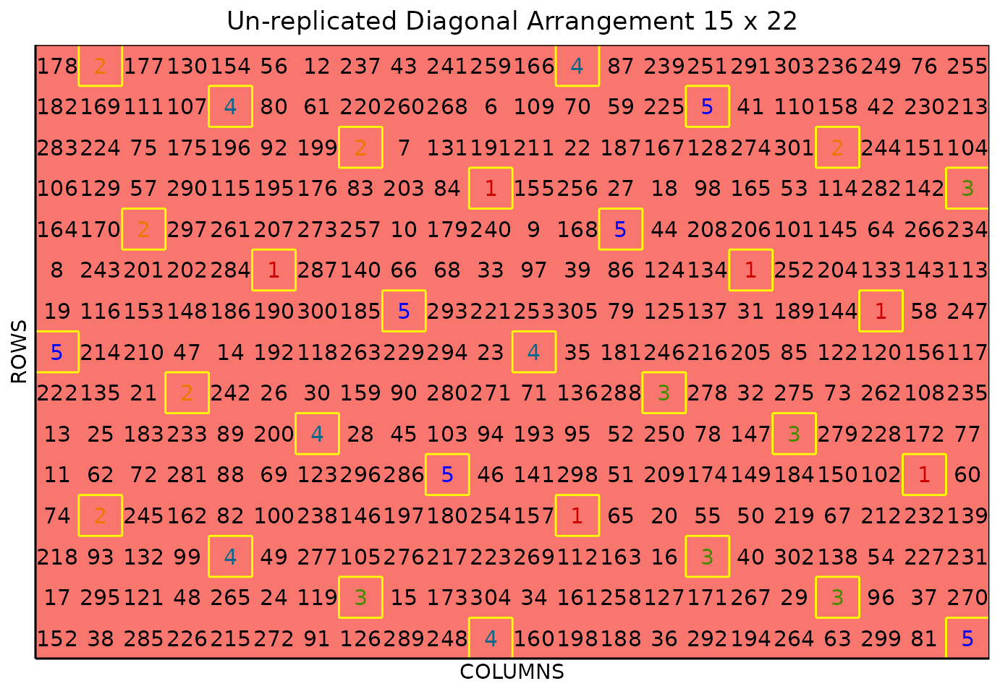
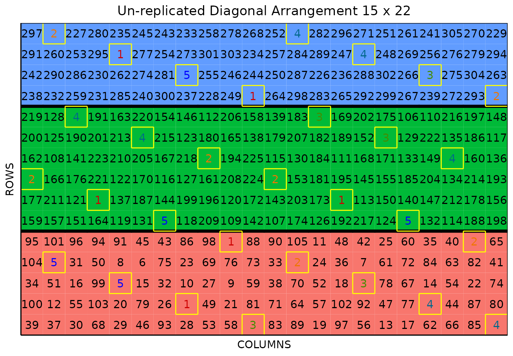

# Unreplicated Diagonal Arrangement Design

### Single Unreplicated Diagonal Arrangement Design

This vignette shows how to generate **single and multiple unreplicated
diagonal arrangement designs** using both the FielDHub Shiny App and the
scripting function
[`diagonal_arrangement()`](https://didiermurillof.github.io/FielDHub/reference/diagonal_arrangement.md)
from the `FielDHub` R package.

### Overview

In some experiments, there is insufficient seed quantity or field space
to conduct trials with large numbers of genotypes, so plant breeders
must use unreplicated or partially replicated experimental designs, like
unreplicated designs with checks allocated in a systematic diagonal
distribution(Clarke and Stefanova 2011). In some cases, the experiment
is split into blocks of specified size. This allows breeders to design a
field that contains multiple different experiments, for example, plants
at various stages of maturity.

FielDHub includes a function to run such experimental designs, as well
as tabs for single and multiple diagonal arrangement on the FielDHub
app.

### Use Case

Suppose a plant breeding project needs to identify superior entries of
barley. In this project, a preliminary yield trial (PYT) is carried out
with 300 genotypes tested in one experiment and over one location by an
unreplicated design. The experiment is lying in a field containing 15
rows and 22 columns of plots. In addition, 5 checks are included in a
systematic diagonal arrangement across the field to fill 30 plots
representing 9.1% of the total number of experimental plots.

### Running the Shiny App

To launch the app you need to run either

``` r
FielDHub::run_app()
```

or

``` r
library(FielDHub)
run_app()
```

### 1. Using the FielDHub Shiny App

Once the app is running, go to **Unreplicated Designs** \> **Single
Diagonal Arrangement**

Then, follow the following steps where we will show how to generate a
single unreplicated diagonal arrangement design.

### Inputs

1.  **Import entries’ list?** Choose whether to import a list with entry
    numbers and names for genotypes or treatments.
    - If the selection is `No`, that means the app is going to generate
      synthetic data for entries and names of the treatment/genotypes
      based on the user inputs.

    - If the selection is `Yes`, the entries list must fulfill a
      specific format and must be a `.csv` file. The file must have the
      columns `ENTRY` and `NAME`. The `ENTRY` column must have a unique
      integer number entry for each treatment/genotype. The column
      `NAME` must have a unique name that identifies each
      treatment/genotype. Both ENTRY and NAME must be unique, duplicates
      are not allowed. In the following table, we show an example of the
      entries list format. This example has an entry list with 4 checks
      and 8 treatments/genotypes. It is crucial to allocate the checks
      in the top part of the file.

| ENTRY | NAME  |
|------:|:------|
|     1 | CH1   |
|     2 | CH2   |
|     3 | CH3   |
|     4 | CH4   |
|     5 | ND-5  |
|     6 | ND-6  |
|     7 | ND-7  |
|     8 | ND-8  |
|     9 | ND-9  |
|    10 | ND-10 |
|    11 | ND-11 |
|    12 | ND-12 |

2.  Enter the number of entries/treatments in the **Input \# of
    Entries** box, which is 300 in our case.

3.  Select 5 from the drop-down on the **Input \# of Checks** box.

4.  Since we want to run this experiment over 1 location, set **Input \#
    of Locations** to 1.

5.  Select `serpentine` or `cartesian` in the **Plot Order Layout**. For
    this example we will use the `serpentine` layout.

6.  To ensure that randomizations are consistent across sessions, we can
    set a random seed in the box labeled **random seed**. For instance,
    we will set it to `16`.

7.  Enter the name for the experiment in the **Input Experiment Name**
    box. For example, `PYT_BARLEY_2022`.

8.  Enter the starting plot number in the **Starting Plot Number** box.
    In this experiment we want the plot start at `1001`.

9.  Enter the name of the site/location in the **Input the Location**
    box. For this experiment we will set the site as `FARGO`. In the
    case of users will run the experiment in multiple locations, the
    name for each location must be enter separate by comma, for example:
    `FARGO, CASSELTON, MINOT`.

10. Once we have entered all the information for our experiment on the
    left side panel, click the **Run!** button to run the design.

11. You will then be prompted to select the dimensions of the field from
    the list of options in the drop-down in the middle of the screen
    with the box labeled **Select dimensions of field**. In our case, we
    will select `15 x 22`.

12. Click the **Randomize!** button to randomize the experiment with the
    set field dimensions and to see the output plots.

If you change any of the inputs on the left side panel after running an
experiment initially, you have to click the Run and Randomize buttons
again, to re-run with the new inputs.

### Outputs

After you run a single diagonal arrangement in FielDHub and set the
dimensions of the field, there are several ways to display the
information contained in the field book. The first tab, **Expt Design
Info**, shows the option to change the dimensions of the field and
re-randomize, as well as a reference guide for experiment design.

#### Input Data

On the second tab, **Input Data**, you can see all the entries in the
randomization in a list that was generated with the inputs, as well as a
table of the checks with the number of times they appear in the field.

#### Randomized Field

The **Randomized Field** tab displays a graphical representation of the
randomization of the entries in a field of the specified dimensions. The
checks are each colored uniquely, showing the number of times they are
distributed throughout the field. The display includes numbered labels
for the rows and columns. You can copy the field as a table or save it
directly as an Excel file with the *Copy* and *Excel* buttons at the
top.

In the **Choose % of Checks:** drop-down box, users can play with
different options for the total amount of checks in the field.

#### Plot Number Field

On the **Plot Number Field** tab, there is a table display of the field
with the plots numbered according to the Plot Order Layout specified,
either *serpentine* or *cartesian*. You can see the corresponding
entries for each plot number in the field book. Like the Randomized
Field tab, you can copy the table or save it as an Excel file with the
*Copy* and *Excel* buttons.

#### Field Book

The **Field Book** displays all the information on the experimental
design in a table format. It contains the specific plot number and the
row and column address of each entry, as well as the corresponding
treatment on that plot. This table is searchable, and we can filter the
data in relevant columns.

  

### 2. Using the `FielDHub` function: `diagonal_arrangement()`

You can run the same design with a function in the FielDHub package,
[`diagonal_arrangement()`](https://didiermurillof.github.io/FielDHub/reference/diagonal_arrangement.md).

First, you need to load the `FielDHub` package typing,

``` r
library(FielDHub)
```

Then, you can enter the information describing the above design like
this:

``` r
single_diag <- diagonal_arrangement(
  nrows = 15,
  ncols = 22,
  lines = 300,
  checks = 5,
  l = 1,
  plotNumber = 1,
  exptName = "PYT_BARLEY_2022",
  locationNames = "FARGO",
  seed = 16,
)
```

##### Details on the inputs entered in `diagonal_arrangement()` above:

- `nrows = 15` is the number of columns in the field.
- `ncols = 22` is the number of rows in the field.
- `lines = 300` is the number of genotypes.
- `checks = 5` is the number of checks.
- `l = 1` is the number of locations.
- `plotNumber = 1` is the starting plot number.
- `exptName = "PYT_BARLEY_2022"` optional name for the experiment
- `locationNames = "FARGO"` optional name for each location.
- `seed = 16` is the random seed to replicate identical randomizations.

#### Print `single_diag` object

To print a summary of the information that is in the object
`single_diag`, we can use the generic function
[`print()`](https://rdrr.io/r/base/print.html).

``` r
print(single_diag)
```

    Un-replicated Diagonal Arrangement Design 

    Information on the design parameters: 
    List of 11
     $ rows          : num 15
     $ columns       : num 22
     $ treatments    : int 300
     $ checks        : int 5
     $ entry_checks  :List of 1
      ..$ : int [1:5] 1 2 3 4 5
     $ rep_checks    :List of 1
      ..$ : num [1:5] 6 6 6 6 6
     $ locations     : num 1
     $ planter       : chr "serpentine"
     $ percent_checks: chr "9.1%"
     $ fillers       : num 0
     $ seed          : num 16

     10 First observations of the data frame with the diagonal_arrangement field book: 
       ID            EXPT LOCATION YEAR PLOT ROW COLUMN CHECKS ENTRY TREATMENT
    1   1 PYT_BARLEY_2022    FARGO 2026    1   1      1      0   152   Gen-152
    2   2 PYT_BARLEY_2022    FARGO 2026    2   1      2      0    38    Gen-38
    3   3 PYT_BARLEY_2022    FARGO 2026    3   1      3      0   285   Gen-285
    4   4 PYT_BARLEY_2022    FARGO 2026    4   1      4      0   226   Gen-226
    5   5 PYT_BARLEY_2022    FARGO 2026    5   1      5      0   215   Gen-215
    6   6 PYT_BARLEY_2022    FARGO 2026    6   1      6      0   272   Gen-272
    7   7 PYT_BARLEY_2022    FARGO 2026    7   1      7      0    91    Gen-91
    8   8 PYT_BARLEY_2022    FARGO 2026    8   1      8      0   126   Gen-126
    9   9 PYT_BARLEY_2022    FARGO 2026    9   1      9      0   289   Gen-289
    10 10 PYT_BARLEY_2022    FARGO 2026   10   1     10      0   248   Gen-248

#### Access to `single_diag` object

The function
[`diagonal_arrangement()`](https://didiermurillof.github.io/FielDHub/reference/diagonal_arrangement.md)
returns a list consisting of all the information displayed in the output
tabs in the FielDHub app: design information, plot layout, plot
numbering, entries list, and field book. These are accessible by the `$`
operator, i.e. `single_diag$layoutRandom` or `single_diag$fieldBook`.

`single_diag$fieldBook` is a data frame containing information about
every plot in the field, with information about the location of the plot
and the treatment in each plot. As seen in the output below, the field
book has columns for `ID`, `EXPT`, `LOCATION`, `YEAR`, `PLOT`, `ROW`,
`COLUMN`, `CHECKS`, `ENTRY`, and `TREATMENT`.

Let us see the first 10 rows of the field book for this experiment.

``` r
field_book <- single_diag$fieldBook
head(field_book, 10)
```

       ID            EXPT LOCATION YEAR PLOT ROW COLUMN CHECKS ENTRY TREATMENT
    1   1 PYT_BARLEY_2022    FARGO 2026    1   1      1      0   152   Gen-152
    2   2 PYT_BARLEY_2022    FARGO 2026    2   1      2      0    38    Gen-38
    3   3 PYT_BARLEY_2022    FARGO 2026    3   1      3      0   285   Gen-285
    4   4 PYT_BARLEY_2022    FARGO 2026    4   1      4      0   226   Gen-226
    5   5 PYT_BARLEY_2022    FARGO 2026    5   1      5      0   215   Gen-215
    6   6 PYT_BARLEY_2022    FARGO 2026    6   1      6      0   272   Gen-272
    7   7 PYT_BARLEY_2022    FARGO 2026    7   1      7      0    91    Gen-91
    8   8 PYT_BARLEY_2022    FARGO 2026    8   1      8      0   126   Gen-126
    9   9 PYT_BARLEY_2022    FARGO 2026    9   1      9      0   289   Gen-289
    10 10 PYT_BARLEY_2022    FARGO 2026   10   1     10      0   248   Gen-248

#### Plot field layout

For plotting the layout in function of the coordinates `ROW` and
`COLUMN` in the field book object we can use the generic function
[`plot()`](https://rdrr.io/r/graphics/plot.default.html) as follow,

``` r
plot(single_diag)
```



The figure above shows a map of an experiment randomized as a single
unreplicated diagonal arrangement design. Gray plots represent the
unreplicated treatments, while distinctively colored check plots are
replicated throughout the field in a systematic diagonal arrangement.

  

### Multiple Unreplicated Diagonal Arrangement Design

Now, we show how to generate the same kind of unreplicated design with
multiple experiments in the same field.

### Use Case

A plant breeding project needs to test 300 genotypes divided among three
different experiments in amounts of 100, 120, and 80 respectively. Each
experiment represents different stages of maturity. The 3 experiments
are lying in a field containing 15 rows and 22 columns of plots. In
addition, 5 checks are included in a systematic diagonal arrangement
across experiments to fill 30 plots representing 9.1% of the total
number of experimental plots.

`FielDHub` can perform the randomization for the design in the problem
explained above. This can be solved either through the app or the
[`diagonal_arrangement()`](https://didiermurillof.github.io/FielDHub/reference/diagonal_arrangement.md)
function.

### 1. Using the FielDHub Shiny App

To generate a multiple unreplicated diagonal arrangement design using
the FielDHub app:

First, go to **Unreplicated Designs** \> **Multiple Diagonal
Arrangement**

Then, follow the following steps where we will show how to generate this
kind of design.

### Inputs

1.  **Import entries’ list?** Choose whether to import a list with entry
    numbers and names for genotypes or treatments.
    - If the selection is `No`, that means the app is going to generate
      synthetic data for entries and names of the treatment/genotypes
      based on the user inputs.

    - If the selection is `Yes`, the entries list must fulfill a
      specific format and must be a `.csv` file. The file must have the
      columns `ENTRY` and `NAME`. The `ENTRY` column must have a unique
      entry integer number for each treatment/genotype. The column
      `NAME` must have a unique name that identifies each
      treatment/genotype. Both ENTRY and NAME must be unique, duplicates
      are not allowed. In the following table, we show an example of the
      entries list format. This example has an entry list with four
      checks and 8 treatments/genotypes. It is crucial to allocate the
      checks in the top part of the file.

    - **Note:** If you wish to create multiple blocks of different sizes
      from an imported entries list, for example, a block of size 80,
      90, and 100 plots, FielDHub will read the imported entries list as
      checks, then the 80 entries for the first block, then the 90
      entries for the second block, then the 100 entries for the last
      block.

| ENTRY | NAME  |
|------:|:------|
|     1 | CH1   |
|     2 | CH2   |
|     3 | CH3   |
|     4 | CH4   |
|     5 | ND-5  |
|     6 | ND-6  |
|     7 | ND-7  |
|     8 | ND-8  |
|     9 | ND-9  |
|    10 | ND-10 |
|    11 | ND-11 |
|    12 | ND-12 |

2.  Select the checkbox option **Use the same entries across
    experiments** if the purpose is to make replications instead of
    testing different experiments. Checking this option requires the
    same size for all blocks. For example, testing 100 treatments across
    3 blocks require to set `300` in **Input \# of Entries** and
    `100, 100, 100` as input in **Input \# Entries per Expt**. In our
    case we will keep unchecked this option.

3.  Enter the total number of entries/treatments in the **Input \# of
    Entries** box, which is `300` in our case.

4.  Enter the number of entries/treatments by experiment separate by
    comma in the **Input \# Entries per Expt** box, which are
    `100, 120, 80` in our case.

5.  Select 5 from the drop-down on the **Input \# of Checks** box.

6.  Since we want to run this experiment over 1 location, set **Input \#
    of Locations** to `1`.

7.  Select `By Row` or `By Column` in the **Blocks Layout:**. For this
    example we will set the `By Row` experiments/blocks layout.

8.  Select `serpentine` or `cartesian` in the **Plot Order Layout**. For
    this example we will set the `serpentine` layout.

9.  Enter the starting plot number for each experiment in the **Starting
    Plot Number** box. In this experiment we want the plot start at
    `1, 1001, 2001` for each experiment. The app also allows setting
    only one number for all experiments. For example, the plot number
    could start at `10`.

10. Enter the name for each experiment in the **Input Experiment Name**
    box. For example, `MATURITY1, MATURITY2, MATURITY3`.

11. To ensure that randomization are consistent across sessions, we can
    set a random seed in the box labeled **random seed**. For instance,
    we will set it to `17`.

12. Enter the name of the site/location in the **Input the Location**
    box. For this experiment we will set the site as `FARGO`. In the
    case of users will run the experiment in multiple locations, the
    name for each location must be enter separate by comma, for example:
    `FARGO, CASSELTON, MINOT`.

13. Once we have entered all the information for our experiment on the
    left side panel, click the **Run!** button to run the design.

14. You will then be prompted to select the dimensions of the field from
    the list of options in the drop-down in the middle of the screen
    with the box labeled **Select dimensions of field**. In our case, we
    will select `15 x 22`.

15. Click the **Randomize!** button to randomize the experiment with the
    set field dimensions and to see the output plots.

If you change any of the inputs on the left side panel after running an
experiment initially, you have to click the Run and Randomize buttons
again, to re-run with the new inputs.

### Outputs

After you run a single diagonal arrangement in FielDHub and set the
dimensions of the field, there are several ways to display the
information contained in the field book. The first tab, **Expt Design
Info**, shows the option to change the dimensions of the field and
re-randomize, as well as a reference guide for experiment design.

#### Input Data

On the second tab, **Input Data**, you can see all the entries in the
randomization in a list that was generated with the inputs, as well as a
table of the checks with the number of times they appear in the field.

#### Randomized Field

The **Randomized Field** tab displays a graphical representation of the
randomization of the entries in a field of the specified dimensions. The
checks are all colored uniquely, showing the number of times they are
distributed throughout the field. The display includes numbered labels
for the rows and columns. You can copy the field as a table or save it
directly as an Excel file with the *Copy* and *Excel* buttons at the
top.

In this tab by the **Choose % of Checks:** box users can play with
different options for the total amount of checks in the field.

#### Plot Number Field

On the **Plot Number Field** tab, there is a table display of the field
with the plots numbered according to the Plot Order Layout specified,
either *serpentine* or *cartesian*. You can see the corresponding
entries for each plot number in the field book. Like the Randomized
field tab, you can copy the table or save it as an Excel file with the
*Copy* and *Excel* buttons.

#### Field Book

The **Field Book** displays all the information on the experimental
design in a table format. It contains the specific plot number and the
row and column address of each entry, as well as the corresponding
treatment on that plot. This table is searchable, and we can filter the
data in relevant columns.

  

### 2. Using the `FielDHub` function: `diagonal_arrangement()`

A variation on the single diagonal arrangement included in the
[`diagonal_arrangement()`](https://didiermurillof.github.io/FielDHub/reference/diagonal_arrangement.md)
function is the multiple diagonal arrangement, where the experiment is
split into blocks of specified size.

``` r
multi_diag <- diagonal_arrangement(
  nrows = 15,
  ncols = 22,
  lines = 300,
  kindExpt = "DBUDC", 
  blocks = c(100,120,80),
  checks = 5,
  l = 1,
  plotNumber = c(1, 1001, 2001),
  exptName = c("MATURITY1", "MATURITY2", "MATURITY3"),
  locationNames = "FARGO",
  seed = 17
)
```

##### Details on the inputs entered in `diagonal_arrangement()` above:

The description for the inputs that we used to generate the design,

- `nrows = 15` is the number of columns in the field.
- `ncols = 22` is the number of rows in the field.
- `lines = 300` is the number of genotypes.
- `kindExpt = "DBUDC"` is an option to randomize multiple experiments
- `blocks = c(100,120,80)` are the blocks in multiple arrangement.
- `checks = 5` is the number of checks.
- `l = 1` is the number of locations.
- `plotNumber = c(1, 1001, 2001)` is the starting plot number for each
  experiment. It could be just one number as well.
- `exptName = c("MATURITY1", "MATURITY2", "MATURITY3")` is an optional
  name for each experiment.
- `locationNames = "FARGO"` optional name for each location.
- `seed = 17` is the random seed to replicate identical randomizations.

#### Print `multi_diag` object

For printing a summary of the information that is in the object
`multi_diag` we can use the generic function
[`print()`](https://rdrr.io/r/base/print.html)

``` r
print(multi_diag)
```

    Un-replicated Diagonal Arrangement Design 

    Information on the design parameters: 
    List of 11
     $ rows          : num 15
     $ columns       : num 22
     $ treatments    : num [1:3] 100 120 80
     $ checks        : int 5
     $ entry_checks  :List of 1
      ..$ : int [1:5] 1 2 3 4 5
     $ rep_checks    :List of 1
      ..$ : num [1:5] 7 5 7 5 6
     $ locations     : num 1
     $ planter       : chr "serpentine"
     $ percent_checks: chr "9.1%"
     $ fillers       : num 0
     $ seed          : num 17

     10 First observations of the data frame with the diagonal_arrangement field book: 
       ID      EXPT LOCATION YEAR PLOT ROW COLUMN CHECKS ENTRY TREATMENT
    1   1 MATURITY1    FARGO 2026    1   1      1      0   104   Gen-104
    2   2 MATURITY1    FARGO 2026    2   1      2      0    65    Gen-65
    3   3 MATURITY1    FARGO 2026    3   1      3      0    70    Gen-70
    4   4 MATURITY1    FARGO 2026    4   1      4      0     8     Gen-8
    5   5 MATURITY1    FARGO 2026    5   1      5      0    51    Gen-51
    6   6 MATURITY1    FARGO 2026    6   1      6      0    17    Gen-17
    7   7 MATURITY1    FARGO 2026    7   1      7      0    11    Gen-11
    8   8 MATURITY1    FARGO 2026    8   1      8      0     6     Gen-6
    9   9 MATURITY1    FARGO 2026    9   1      9      0    53    Gen-53
    10 10 MATURITY1    FARGO 2026   10   1     10      0    50    Gen-50

#### Access to `multi_diag` object

The function
[`diagonal_arrangement()`](https://didiermurillof.github.io/FielDHub/reference/diagonal_arrangement.md)
returns a list consisting of all the information displayed in the output
tabs in the FielDHub app: design information, plot layout, plot
numbering, entries list, and field book. These are accessible by the `$`
operator, i.e. `multi_diag$layoutRandom` or `multi_diag$fieldBook`.

`multi_diag$fieldBook` is a data frame containing information about
every plot in the field, with information about the location of the plot
and the treatment in each plot. As seen in the output below, the field
book has columns for `ID`, `EXPT`, `LOCATION`, `YEAR`, `PLOT`, `ROW`,
`COLUMN`, `CHECKS`, `ENTRY`, and `TREATMENT`.

Let us see the first 10 rows of the field book for this experiment.

``` r
field_book <- multi_diag$fieldBook
head(field_book, 10)
```

       ID      EXPT LOCATION YEAR PLOT ROW COLUMN CHECKS ENTRY TREATMENT
    1   1 MATURITY1    FARGO 2026    1   1      1      0   104   Gen-104
    2   2 MATURITY1    FARGO 2026    2   1      2      0    65    Gen-65
    3   3 MATURITY1    FARGO 2026    3   1      3      0    70    Gen-70
    4   4 MATURITY1    FARGO 2026    4   1      4      0     8     Gen-8
    5   5 MATURITY1    FARGO 2026    5   1      5      0    51    Gen-51
    6   6 MATURITY1    FARGO 2026    6   1      6      0    17    Gen-17
    7   7 MATURITY1    FARGO 2026    7   1      7      0    11    Gen-11
    8   8 MATURITY1    FARGO 2026    8   1      8      0     6     Gen-6
    9   9 MATURITY1    FARGO 2026    9   1      9      0    53    Gen-53
    10 10 MATURITY1    FARGO 2026   10   1     10      0    50    Gen-50

#### Plot field layout

For plotting the layout in function of the coordinates `ROW` and
`COLUMN` in the field book object we can use the generic function
[`plot()`](https://rdrr.io/r/graphics/plot.default.html) as follow,

``` r
plot(multi_diag)
```



The figure above shows a map of an experiment randomized as a multiple
unreplicated diagonal arrangement design. Gray, salmon, and pink shade
the blocks of unreplicated experiments, while distinctively colored
check plots are replicated throughout the field in a systematic diagonal
arrangement.

## References

Clarke, G. Peter Y., and Katia T. Stefanova. 2011. “Optimal Design for
Early-Generation Plant-Breeding Trials with Unreplicated or Partially
Replicated Test Lines.” *Australian & New Zealand Journal of Statistics*
53 (4): 461–80. <https://doi.org/10.1111/j.1467-842X.2011.00642.x>.
