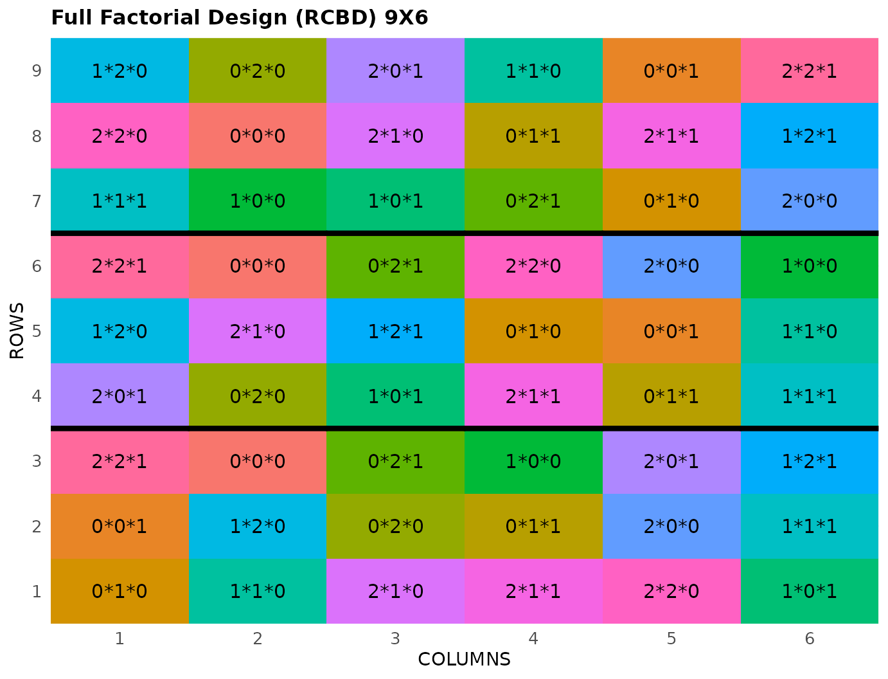

# Full Factorial Design

This vignette shows how to generate a **Full Factorial Design** using
both the FielDHub Shiny App and the scripting function
[`full_factorial()`](https://didiermurillof.github.io/FielDHub/reference/full_factorial.md)
from the `FielDHub` package.

## 1. Using the FielDHub Shiny App

To launch the app you need to run either

``` r
FielDHub::run_app()
```

or

``` r
library(FielDHub)
run_app()
```

Once the app is running, go to **Other Designs** \> **Full Factorial
Designs**

Then, follow the following steps where we show how to generate this kind
of design by an example with a set of 3 treatments with levels `3, 3, 2`
each. We will run this experiment 3 times.

## Inputs

1.  **Import entries’ list?** Choose whether to import a list with entry
    numbers and names for genotypes or treatments.
    - If the selection is `No`, that means the app is going to generate
      synthetic data for entries and names of the treatment based on the
      user inputs.

    - If the selection is `Yes`, the entries list must fulfill a
      specific format and must be a `.csv` file. The file must have two
      columns: `FACTORS` and `LEVEL`. Containing a list of unique names
      that identify each treatment and level. Duplicate values are not
      allowed, all entries must be unique. In the following table, we
      show an example of the entries list format. This example has an
      entry list with three treatments/factors, and 3, 3 and 2 levels
      each.

| FACTOR | LEVEL |
|:-------|:------|
| A      | a0    |
| A      | a1    |
| A      | a2    |
| B      | b0    |
| B      | b1    |
| B      | b2    |
| C      | c0    |
| C      | c1    |

2.  Choose whether to use the factorial design in a RCBD or CRD with the
    **Select a Factorial Design Type** box. Set it to `RCBD`.

3.  Set the number of entries for each factor in a comma separated list
    in the **Input \# of Entries for Each Factor** box. We want our
    example experiment to have 3 factors with 3, 3, and 2 levels
    respectively, so enter `3, 3, 2` in the box.

4.  Set the number of replications of the squares with the **Input \# of
    Full Reps** box. Set it to `3`.

5.  Enter the number of locations in **Input \# of Locations**. Set it
    to `1`.

6.  Enter the starting plot number in the **Starting Plot Number** box.
    If the experiment has multiple locations, you must enter a comma
    separated list of numbers the length of the number of locations for
    the input to be valid. In this case, set it to `101`.

7.  Optionally, you may enter a name for the location of the experiment
    in the **Input Location** box.

8.  Select `serpentine` or `cartesian` in the **Plot Order Layout**. For
    this example we will use the default `serpentine` layout.

9.  As with all the designs, we can set a random seed in the box labeled
    **random seed**. In this example, we will set it to `1239`.

10. Once we have entered the information for our experiment on the left
    side panel, click the **Run!** button to run the design.

## Outputs

After you run a full factorial design in FielDHub, there are several
ways to display the information contained in the field book.

### Field Layout

When you first click the run button on a full factorial design, FielDHub
displays the Field Layout tab, which shows the entries and their
arrangement in the field. In the box below the display, you can change
the layout of the field or change the location displayed. You can also
display a heatmap over the field by changing **Type of Plot** to
`Heatmap`. To view a heatmap, you must first simulate an experiment over
the described field with the **Simulate!** button. A pop-up window will
appear where you can enter what variable you want to simulate along with
minimum and maximum values.

### Field Book

The **Field Book** displays all the information on the experimental
design in a table format. It contains the specific plot number and the
row and column address of each entry, as well as the corresponding
treatment on that plot. This table is searchable, and we can filter the
data in relevant columns. If we have simulated data for a heatmap, an
additional column for that variable appears in the Field Book.

## 2. Using the `FielDHub` function: `full_factorial()`

You can run the same design with a function in the FielDHub package,
[`full_factorial()`](https://didiermurillof.github.io/FielDHub/reference/full_factorial.md).

First, you need to load the `FielDHub` package typing,

``` r
library(FielDHub)
```

Then, you can enter the information describing the above design like
this:

``` r
factorial <- full_factorial(
  setfactors = c(3,3,2), 
  reps = 3, 
  l = 1, 
  type = 2, 
  plotNumber = 101,
  planter = "serpentine",
  locationNames = "FARGO",
  seed = 1239
)
```

#### Details on the inputs entered in `full_factorial()` above

The description for the inputs that we used to generate the design,

- `setfactors = c(3,3,2)` are the levels of each factor.
- `reps = 3` is the number of replications for each treatment.
- `l = 1` is the number of locations.
- `type = 2` means CRD or RCBD, 1 or 2 respectively.
- `plotNumber = 101` is the starting plot number.
- `planter = "serpentine"` is the order layout.
- `locationNames = "FARGO"` is an optional name for each location.
- `seed = 1239` is the random seed to replicate identical
  randomizations.

### Print `factorial` object

``` r
print(factorial)
```

    Full Factorial Design 

    Information on the design parameters: 
    List of 9
     $ factors           : chr [1:3] "A" "B" "C"
     $ levels            : int [1:8] 0 1 2 0 1 2 0 1
     $ runs              : int 18
     $ all_treatments    :'data.frame': 18 obs. of  3 variables:
      ..$ A: int [1:18] 0 1 2 0 1 2 0 1 2 0 ...
      ..$ B: int [1:18] 0 0 0 1 1 1 2 2 2 0 ...
      ..$ C: int [1:18] 0 0 0 0 0 0 0 0 0 1 ...
     $ reps              : num 3
     $ locations         : num 1
     $ location_names    : chr "FARGO"
     $ kind              : chr "RCBD"
     $ levels_each_factor: num [1:3] 3 3 2

     10 First observations of the data frame with the full_factorial field book: 
       ID LOCATION PLOT REP FACTOR_A FACTOR_B FACTOR_C TRT_COMB
    1   1    FARGO  101   1        0        1        0    0*1*0
    2   2    FARGO  102   1        1        1        0    1*1*0
    3   3    FARGO  103   1        2        1        0    2*1*0
    4   4    FARGO  104   1        2        1        1    2*1*1
    5   5    FARGO  105   1        2        2        0    2*2*0
    6   6    FARGO  106   1        1        0        1    1*0*1
    7   7    FARGO  107   1        0        0        1    0*0*1
    8   8    FARGO  108   1        1        2        0    1*2*0
    9   9    FARGO  109   1        0        2        0    0*2*0
    10 10    FARGO  110   1        0        1        1    0*1*1

### Access to `factorial` object

The
[`full_factorial()`](https://didiermurillof.github.io/FielDHub/reference/full_factorial.md)
function returns a list consisting of all the information displayed in
the output tabs in the FielDHub app: design information, plot layout,
plot numbering, entries list, and field book. These are accessible by
the `$` operator, i.e. `factorial$layoutRandom` or
`factorial$fieldBook`.

`factorial$fieldBook` is a list containing information about every plot
in the field, with information about the location of the plot and the
treatment in each plot. As seen in the output below, the field book has
columns for `ID`, `LOCATION`, `PLOT`, `REP`, and `TRT_COMB`, and columns
for each factor individually.

``` r
field_book <- factorial$fieldBook
head(factorial$fieldBook, 10)
```

       ID LOCATION PLOT REP FACTOR_A FACTOR_B FACTOR_C TRT_COMB
    1   1    FARGO  101   1        0        1        0    0*1*0
    2   2    FARGO  102   1        1        1        0    1*1*0
    3   3    FARGO  103   1        2        1        0    2*1*0
    4   4    FARGO  104   1        2        1        1    2*1*1
    5   5    FARGO  105   1        2        2        0    2*2*0
    6   6    FARGO  106   1        1        0        1    1*0*1
    7   7    FARGO  107   1        0        0        1    0*0*1
    8   8    FARGO  108   1        1        2        0    1*2*0
    9   9    FARGO  109   1        0        2        0    0*2*0
    10 10    FARGO  110   1        0        1        1    0*1*1

### Plot the field layout

For plotting the layout in function of the coordinates `ROW` and
`COLUMN`, you can use the the generic function
[`plot()`](https://rdrr.io/r/graphics/plot.default.html) as follow,

``` r
plot(factorial)
```



  
  
  
