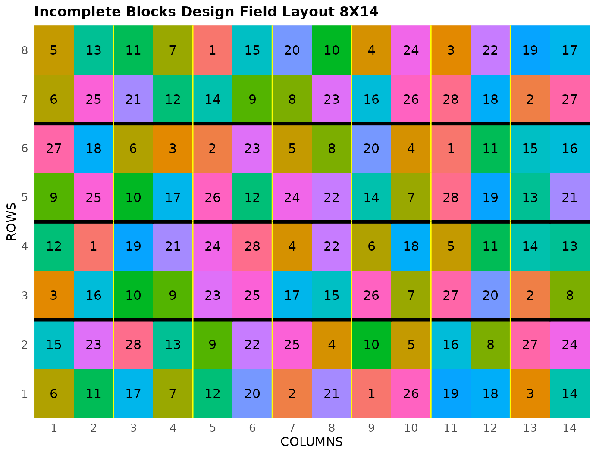

# Incomplete Block Design

This vignette shows how to generate a **incomplete block design** using
both the FielDHub Shiny App and the scripting function
[`incomplete_blocks()`](https://didiermurillof.github.io/FielDHub/reference/incomplete_blocks.md)
from the `FielDHub` package.

## 1. Using the FielDHub Shiny App

To launch the app you need to run either

``` r

FielDHub::run_app()
```

or

``` r

library(FielDHub)
run_app()
```

Once the app is running, go to **Other Designs** \> **Incomplete Block
Design (IBD)**

Then, follow the following steps where we show how to generate this kind
of design by an example with 28 treatments and 4 reps. We will run this
experiment in just one location.

## Inputs

1.  **Import entries’ list?** Choose whether to import a list with entry
    numbers and names for genotypes or treatments.
    - If the selection is `No`, that means the app is going to generate
      synthetic data for entries and names of the treatment/genotypes
      based on the user inputs.

    - If the selection is `Yes`, the entries list must fulfill a
      specific format and must be a `.csv` file. The file must have the
      columns `ENTRY` and `NAME`. The `ENTRY` column must have a unique
      entry integer number for each treatment/genotype. The column
      `NAME` must have a unique name that identifies each
      treatment/genotype. Both ENTRY and NAME must be unique, duplicates
      are not allowed. In the following table, we show an example of the
      entries list format. This example has an entry list with 12
      treatments.

| ENTRY | NAME      |
|------:|:----------|
|     1 | GenotypeA |
|     2 | GenotypeB |
|     3 | GenotypeC |
|     4 | GenotypeD |
|     5 | GenotypeE |
|     6 | GenotypeF |
|     7 | GenotypeG |
|     8 | GenotypeH |
|     9 | GenotypeI |
|    10 | GenotypeJ |
|    11 | GenotypeK |
|    12 | GenotypeL |

2.  Input the number of treatments in the **Input \# of Treatments**
    box. In the alpha lattice design, the number of treatments must be a
    composite number. In this case, Set it to `28`.

3.  Select the number of replications of these treatments with the
    **Input \# of Full Reps** box. Set it to `4`.

4.  Set the number of plots in each incomplete block in the **Input \#
    of Plots per IBlock** box. Set it to `4`.

5.  Enter the number of locations in **Input \# of Locations**. We will
    run this experiment over a single location, so set it to `1`.

6.  Select `serpentine` or `cartesian` in the **Plot Order Layout**. For
    this example we will use the default `cartesian` layout.

7.  Enter the starting plot number in the **Starting Plot Number** box.
    If the experiment has multiple locations, you must enter a comma
    separated list of numbers the length of the number of locations for
    the input to be valid. Set it to `101`.

8.  Enter a name for the location of the experiment in the **Input
    Location** box. If there are multiple locations, each name must be
    in a comma separated list. Set it to `"FARGO"`.

9.  To ensure that randomizations are consistent across sessions, we can
    set a random seed in the box labeled **random seed**. In this
    example, we will set it to `1243`.

10. Once we have entered the information for our experiment on the left
    side panel, click the **Run!** button to run the design.

## Outputs

After you run an incomplete block design in FielDHub, there are several
ways to display the information contained in the field book.

### Field Layout

When you first click the run button on an incomplete block design,
FielDHub displays the Field Layout tab, which shows the entries and
their arrangement in the field. In the box below the display, you can
change the layout of the field. You can also display a heatmap over the
field by changing **Type of Plot** to `Heatmap`. To view a heatmap, you
must first simulate an experiment over the described field with the
**Simulate!** button. A pop-up window will appear where you can enter
what variable you want to simulate along with minimum and maximum
values.

### Field Book

The **Field Book** displays all the information on the experimental
design in a table format. It contains the specific plot number and the
row and column address of each entry, as well as the corresponding
treatment on that plot. This table is searchable, and we can filter the
data in relevant columns. If we have simulated data for a heatmap, an
additional column for that variable appears in the Field Book.

## 2. Using the `FielDHub` function: `incomplete_blocks()`

You can run the same design with a function in the FielDHub package,
[`incomplete_blocks()`](https://didiermurillof.github.io/FielDHub/reference/incomplete_blocks.md).

First, you need to load the `FielDHub` package typing,

``` r

library(FielDHub)
```

Then, you can enter the information describing the above design like
this:

``` r

ibd <- incomplete_blocks(
  t = 28,
  r = 4,
  k = 4, 
  l = 1,
  seed = 1243
)
```

#### Details on the inputs entered in `incomplete_blocks()` above

The description for the inputs that we used to generate the design,

- `t = 28` is the number of treatments.
- `r=4` is the number of replicates.
- `k = 4` is the number of plots per incomplete block.
- `l = 1` is the number of locations
- `plotNumber = 101` is the starting plot number.
- `locationNames = "FARGO"` is an optional name for each location.
- `seed = 1243` is the random seed to replicate identical
  randomizations.

### Print `ibd` object

``` r

print(ibd)
```

    Incomplete Blocks Design 

    Efficiency of design: 
      Level Blocks D-Efficiency A-Efficiency   A-Bound
    1     1      4    1.0000000    1.0000000 1.0000000
    2     2     28    0.7603326    0.7431887 0.7470356

    Information on the design parameters: 
    List of 7
     $ Reps            : num 4
     $ iBlocks         : num 7
     $ NumberTreatments: num 28
     $ NumberLocations : num 1
     $ Locations       : int 1
     $ seed            : num 1243
     $ lambda          : num 0.444

     10 First observations of the data frame with the incomplete_blocks field book: 
       ID LOCATION PLOT REP IBLOCK UNIT ENTRY TREATMENT
    1   1        1  101   1      1    1     6       G-6
    2   2        1  102   1      1    2    11      G-11
    3   3        1  103   1      1    3    15      G-15
    4   4        1  104   1      1    4    23      G-23
    5   5        1  105   1      2    1    17      G-17
    6   6        1  106   1      2    2     7       G-7
    7   7        1  107   1      2    3    28      G-28
    8   8        1  108   1      2    4    13      G-13
    9   9        1  109   1      3    1    12      G-12
    10 10        1  110   1      3    2    20      G-20

### Access to `ibd` object

The
[`incomplete_blocks()`](https://didiermurillof.github.io/FielDHub/reference/incomplete_blocks.md)
function returns a list consisting of all the information displayed in
the output tabs in the FielDHub app: design information, plot layout,
plot numbering, entries list, and field book. These are accessible by
the `$` operator, i.e. `ibd$layoutRandom` or `ibd$fieldBook`.

`ibd$fieldBook` is a list containing information about every plot in the
field, with information about the location of the plot and the treatment
in each plot. As seen in the output below, the field book has columns
for `ID`, `LOCATION`, `PLOT`, `REP`, `IBLOCK`, `UNIT`, `ENTRY`, and
`TREATMENT`.

``` r

field_book <- ibd$fieldBook
head(ibd$fieldBook, 10)
```

       ID LOCATION PLOT REP IBLOCK UNIT ENTRY TREATMENT
    1   1        1  101   1      1    1     6       G-6
    2   2        1  102   1      1    2    11      G-11
    3   3        1  103   1      1    3    15      G-15
    4   4        1  104   1      1    4    23      G-23
    5   5        1  105   1      2    1    17      G-17
    6   6        1  106   1      2    2     7       G-7
    7   7        1  107   1      2    3    28      G-28
    8   8        1  108   1      2    4    13      G-13
    9   9        1  109   1      3    1    12      G-12
    10 10        1  110   1      3    2    20      G-20

### Plot the field layout

For plotting the layout in function of the coordinates `ROW` and
`COLUMN`, you can use the the generic function
[`plot()`](https://rdrr.io/r/graphics/plot.default.html) as follow,

``` r

plot(ibd)
```



  
  
