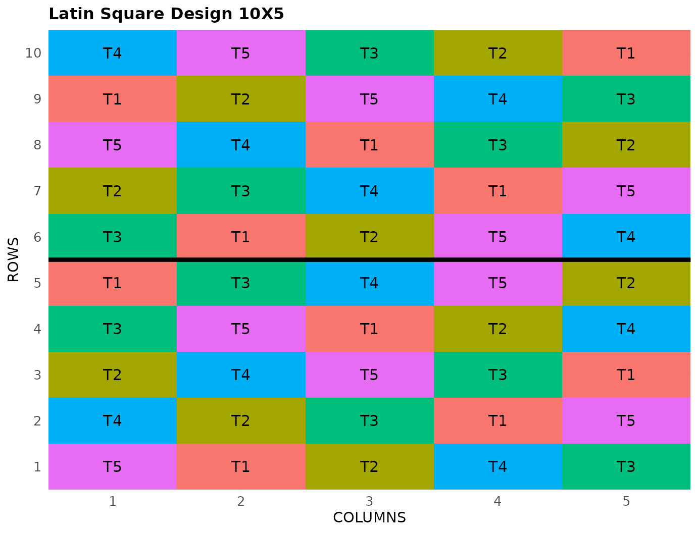

# Latin Square Design

This vignette shows how to generate a **Latin square design** using both
the FielDHub Shiny App and the scripting function
[`latin_square()`](https://didiermurillof.github.io/FielDHub/reference/latin_square.md)
from the `FielDHub` package.

## 1. Using the FielDHub Shiny App

To launch the app you need to run either

``` r

FielDHub::run_app()
```

or

``` r

library(FielDHub)
run_app()
```

Once the app is running, go to **Other Designs** \> **Latin Square
Design**

Then, follow the following steps where we show how to generate this kind
of design by an example with 5 treatments and 2 reps.

## Inputs

1.  **Import entries’ list?** Choose whether to import a list with entry
    numbers and names for genotypes or treatments.
    - If the selection is `No`, that means the app is going to generate
      synthetic data for entries and names of the treatment based on the
      user inputs.

    - If the selection is `Yes`, the entries list must fulfill a
      specific format and must be a `.csv` file. The file must have the
      three columns: `ROW`, `COLUMN` and `TREATMENT`. All of those
      columns contain a list of unique names that identify each
      treatment. Duplicate values are not allowed, all entries must be
      unique. In the following table, we show an example of the entries
      list format. This example has an entry list with 5 treatments.

| ROW     | COLUMN | TREATMENT |
|:--------|:-------|:----------|
| Period1 | Cow1   | Diet1     |
| Period2 | Cow2   | Diet2     |
| Period3 | Cow3   | Diet3     |
| Period4 | Cow4   | Diet4     |
| Period5 | Cow5   | Diet5     |

2.  Input the number of treatments in the **Input \# of Treatments**
    box. In the alpha lattice design, the number of treatments must be a
    composite number.

3.  Select the number of replications of these treatments with the
    **Input \# of Full Reps** box. The number of treatments and the
    number of full reps set the dimensions of the field.

4.  Select `serpentine` or `cartesian` in the **Plot Order Layout**. For
    this example we will use the default `serpentine` layout.

5.  Enter the starting plot number in the **Starting Plot Number** box.
    If the experiment has multiple locations, you must enter a comma
    separated list of numbers the length of the number of locations for
    the input to be valid.

6.  Enter a name for the location of the experiment in the **Input
    Location** box. A completely randomized design can only be run in a
    single location at a time.

7.  To ensure that randomizations are consistent across sessions, we can
    set a random seed in the box labeled **random seed**. In this
    example, we will set it to `123`.

8.  Once we have entered the information for our experiment on the left
    side panel, click the **Run!** button to run the design.

## Outputs

After you run a Latin square design in FielDHub, there are several ways
to display the information contained in the field book.

### Field Layout

When you first click the run button on a Latin square design, FielDHub
displays the Field Layout tab, which shows the entries and their
arrangement in the field. In the box below the display, you can change
the layout of the field. You can also display a heatmap over the field
by changing **Type of Plot** to `Heatmap`. To view a heatmap, you must
first simulate an experiment over the described field with the
**Simulate!** button. A pop-up window will appear where you can enter
what variable you want to simulate along with minimum and maximum
values.

### Field Book

The **Field Book** displays all the information on the experimental
design in a table format. It contains the specific plot number and the
row and column address of each entry, as well as the corresponding
treatment on that plot. This table is searchable, and we can filter the
data in relevant columns. If we have simulated data for a heatmap, an
additional column for that variable appears in the field book.

## 2. Using the `FielDHub` function: `latin_square()`

You can run the same design with a function in the FielDHub package,
[`latin_square()`](https://didiermurillof.github.io/FielDHub/reference/latin_square.md).

First, you need to load the `FielDHub` package typing,

``` r

library(FielDHub)
```

Then, you can enter the information describing the above design like
this:

``` r

lsd <- latin_square(
  t = 5,
  reps = 2,
  plotNumber = 101,
  planter = "serpentine",
  seed = 1238
)
```

#### Details on the inputs entered in `latin_square()` above

- `t = 5` is the number of treatments.
- `reps = 2` is the number of replications (squares).
- `plotNumber = 101` is the starting plot number.
- `planter = "cartesian"` is the plot order layout.
- `locationNames = "FARGO"` is an optional name for the location.
- `seed = 1238` is the random seed to replicate identical
  randomizations.

### Print `lsd` object

``` r

print(lsd)
```

    Latin Square Design: 

    Information on the design parameters: 
    List of 4
     $ treatments  : int 5
     $ squares     : num 2
     $ locationName: NULL
     $ seed        : num 1238

     10 First observations of the data frame with the latin_square field book: 
       ID LOCATION PLOT SQUARE   ROW   COLUMN TREATMENT
    1   1        1  101      1 Row 1 Column 1        T5
    2   2        1  102      1 Row 1 Column 2        T1
    3   3        1  103      1 Row 1 Column 3        T2
    4   4        1  104      1 Row 1 Column 4        T4
    5   5        1  105      1 Row 1 Column 5        T3
    6   6        1  110      1 Row 2 Column 1        T4
    7   7        1  109      1 Row 2 Column 2        T2
    8   8        1  108      1 Row 2 Column 3        T3
    9   9        1  107      1 Row 2 Column 4        T1
    10 10        1  106      1 Row 2 Column 5        T5

### Access to `lsd` object

The
[`latin_square()`](https://didiermurillof.github.io/FielDHub/reference/latin_square.md)
function returns a list consisting of all the information displayed in
the output tabs in the FielDHub app: design information, plot layout,
plot numbering, entries list, and field book. These are accessible by
the `$` operator, i.e. `lsd$layoutRandom` or `lsd$fieldBook`.

`lsd$fieldBook` is a list containing information about every plot in the
field, with information about the location of the plot and the treatment
in each plot. As seen in the output below, the field book has columns
for `ID`, `LOCATION`, `PLOT`, `SQUARE`, `ROW`, `COLUMN`, and
`TREATMENT`.

``` r

field_book <- lsd$fieldBook
head(lsd$fieldBook, 10)
```

       ID LOCATION PLOT SQUARE   ROW   COLUMN TREATMENT
    1   1        1  101      1 Row 1 Column 1        T5
    2   2        1  102      1 Row 1 Column 2        T1
    3   3        1  103      1 Row 1 Column 3        T2
    4   4        1  104      1 Row 1 Column 4        T4
    5   5        1  105      1 Row 1 Column 5        T3
    6   6        1  110      1 Row 2 Column 1        T4
    7   7        1  109      1 Row 2 Column 2        T2
    8   8        1  108      1 Row 2 Column 3        T3
    9   9        1  107      1 Row 2 Column 4        T1
    10 10        1  106      1 Row 2 Column 5        T5

### Plot the field layout

For plotting the layout in function of the coordinates `ROW` and
`COLUMN`, you can use the the generic function
[`plot()`](https://rdrr.io/r/graphics/plot.default.html) as follow,

``` r

plot(lsd)
```



  
  
