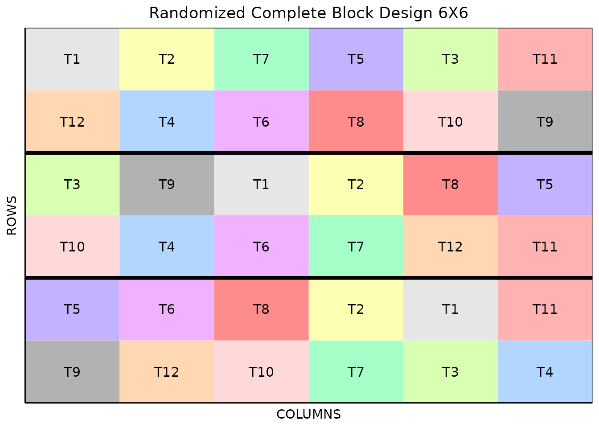

# Methods in FielDHub

There are three primitive functions included in FielDHub:
[`print()`](https://rdrr.io/r/base/print.html),
[`summary()`](https://rdrr.io/r/base/summary.html), and
[`plot()`](https://rdrr.io/r/graphics/plot.default.html).

Given an experiment simulation from FielDHub, we can use these functions
to display different kinds of information about the experiment. In this
example, we will use the following randomized complete block design:

``` r
experiment <- RCBD(
  t = 12,
  reps = 3,
  l = 2, 
  plotNumber = c(1001, 2001),
  locationNames = c("A", "B"),
  seed = 123
)
```

## `print()`

The [`print()`](https://rdrr.io/r/base/print.html) function prints the
design parameters of the experiment and the first 10 rows of the field
book. The first 10 rows of the field book are saved if the output of
this function is assigned to a variable.

``` r
print(experiment)
Randomized Complete Block Design (RCBD): 

Information on the design parameters: 
List of 7
 $ blocks              : num 3
 $ number.of.treatments: num 12
 $ treatments          : chr [1:12] "T1" "T2" "T3" "T4" ...
 $ locations           : num 2
 $ plotNumber          : num [1:6] 1001 1101 1201 2001 2101 ...
 $ locationNames       : chr [1:2] "A" "B"
 $ seed                : num 123

 10 First observations of the data frame with the RCBD field book: 
   ID LOCATION PLOT REP TREATMENT
1   1        A 1001   1        T3
2   2        A 1002   1       T12
3   3        A 1003   1       T10
4   4        A 1004   1        T2
5   5        A 1005   1        T6
6   6        A 1006   1       T11
7   7        A 1007   1        T5
8   8        A 1008   1        T4
9   9        A 1009   1        T9
10 10        A 1010   1        T8
```

## `summary()`

The [`summary()`](https://rdrr.io/r/base/summary.html) function outputs
a list of the design parameters and the layout randomization with plot
numbers.

``` r
summary(experiment)
Randomized Complete Block Design (RCBD): 

1. Information on the design parameters: 
List of 8
 $ blocks              : num 3
 $ number.of.treatments: num 12
 $ treatments          : chr [1:12] "T1" "T2" "T3" "T4" ...
 $ locations           : num 2
 $ plotNumber          : num [1:6] 1001 1101 1201 2001 2101 ...
 $ locationNames       : chr [1:2] "A" "B"
 $ seed                : num 123
 $ id_design           : num 2

2. Layout randomization for each location: 
$Loc_A
     Block --Treatments--                          
[1,] "1"   "T3 T12 T10 T2 T6 T11 T5 T4 T9 T8 T1 T7"
[2,] "2"   "T11 T5 T3 T9 T4 T1 T7 T12 T10 T2 T6 T8"
[3,] "3"   "T9 T3 T4 T1 T11 T7 T5 T10 T8 T2 T12 T6"

$Loc_B
     Block --Treatments--                          
[1,] "1"   "T9 T12 T10 T7 T3 T4 T5 T6 T8 T2 T1 T11"
[2,] "2"   "T5 T8 T2 T1 T9 T3 T11 T12 T7 T6 T4 T10"
[3,] "3"   "T12 T4 T6 T8 T10 T9 T1 T2 T7 T5 T3 T11"


3. Plot numbers layout: 
$Loc_A
     [,1] [,2] [,3] [,4] [,5] [,6] [,7] [,8] [,9] [,10] [,11] [,12]
[1,] 1001 1002 1003 1004 1005 1006 1007 1008 1009  1010  1011  1012
[2,] 1112 1111 1110 1109 1108 1107 1106 1105 1104  1103  1102  1101
[3,] 1201 1202 1203 1204 1205 1206 1207 1208 1209  1210  1211  1212

$Loc_B
     [,1] [,2] [,3] [,4] [,5] [,6] [,7] [,8] [,9] [,10] [,11] [,12]
[1,] 2001 2002 2003 2004 2005 2006 2007 2008 2009  2010  2011  2012
[2,] 2112 2111 2110 2109 2108 2107 2106 2105 2104  2103  2102  2101
[3,] 2201 2202 2203 2204 2205 2206 2207 2208 2209  2210  2211  2212


4. Structure of the data frame with the RCBD field book: 

'data.frame':   72 obs. of  5 variables:
 $ ID       : int  1 2 3 4 5 6 7 8 9 10 ...
 $ LOCATION : Factor w/ 2 levels "A","B": 1 1 1 1 1 1 1 1 1 1 ...
 $ PLOT     : int  1001 1002 1003 1004 1005 1006 1007 1008 1009 1010 ...
 $ REP      : int  1 1 1 1 1 1 1 1 1 1 ...
 $ TREATMENT: chr  "T3" "T12" "T10" "T2" ...
```

## `plot()`

The [`plot()`](https://rdrr.io/r/graphics/plot.default.html) function
plots the field for the input design, as it would be displayed in
FielDHub. This can also be saved to a variable. This function has
parameters for location and layout, if applicable.

``` r
plot(experiment, l = 2, layout = 2)
```



  
  
  
