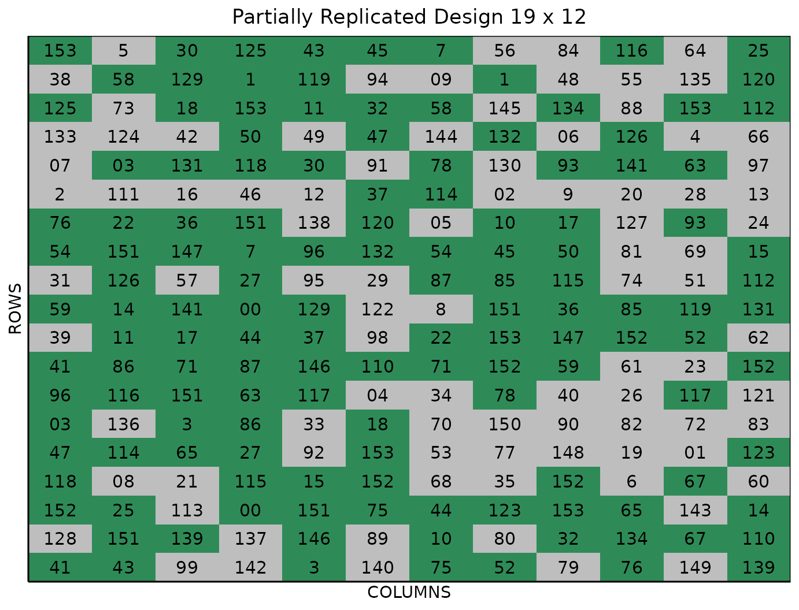
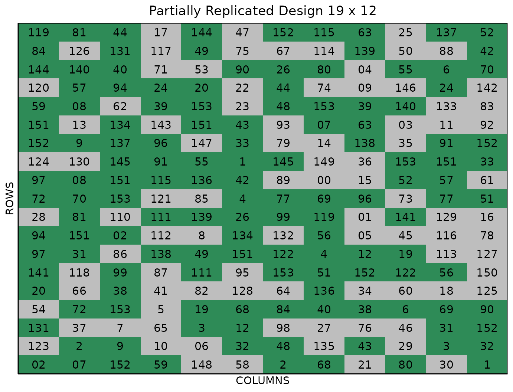

# Optimized Multi-Location P-rep Design

This vignette shows how to generate an **optimized multi-location
partially replicated (p-rep) design** using both the FielDHub Shiny App
and the scripting function
[`multi_location_prep()`](https://didiermurillof.github.io/FielDHub/reference/multi_location_prep.md)
from the `FielDHub` R package.

### Overview

Partially replicated (p-rep) designs are commonly employed in early
generation field trials. This type of design is characterized by
replication of a portion of the entries, with the remaining entries only
appearing once in the experiment. Commonly, the part of treatments with
reps is due to an arbitrary decision by the research, also in some
cases, it is due to technical reasons. The replication ratio is
typically 1:4 (Cullis 2006), which means that the portion of treatment
repeated twice is p = 25%. However, the design can be adapted to meet
specific needs by adjusting the values of $`p`$ and the level of
replication. For example, standard varieties (checks) may be included
with higher levels of replication than test lines.

In `FielDHub`, the optimized multi-location p-rep design employs the
principles of incomplete block designs (IBD) to determine the
distribution of replicated and non-replicated treatments across multiple
locations.

### Optimization

#### Across Location

The function
[`multi_location_prep()`](https://didiermurillof.github.io/FielDHub/reference/multi_location_prep.md)
uses the incomplete blocks design approach (Edmondson 2020) to optimize
the allocation of replicated and un-replicated treatments across the
environments.

#### Within Location

Each partially replicated (p-rep) design location undergoes an
optimization process that involves the following procedure:

Given a matrix $`X`$ of integers (p-rep design within location), we want
to ensure that the distance between any two occurrences of the same
treatment is at least a distance $`d`$. More specifically, we want to
modify $`X`$ to ensure that no treatments appear twice within a distance
less than $`d`$ in the resulting matrix.

The goal of the optimization process is to find a modified matrix that
satisfies this constraint while maximizing some measure of deviation
from the original matrix $`X`$. In this case, the measure of deviation
is the pairwise Euclidean distance between occurrences of the same
treatment. The process is done by the function
[`swap_pairs()`](https://didiermurillof.github.io/FielDHub/reference/swap_pairs.md)
that uses a heuristic algorithm that starts with a distance of $`d = 3`$
between pairs of occurrences of the same treatment, and increases this
distance by $`1`$ and repeats the process until either the algorithm no
longer converges or the maximum number of iterations is reached.

The algorithm works by first identifying all pairs of occurrences of the
same treatment that are closer than $`d`$. For each such pair, the
function selects a random occurrence of a different integer that is at
least $`d`$ away, and swaps the two occurrences. This process is
repeated until no further swaps can be made that increase the pairwise
Euclidean distances between occurrences of the same treatment.

##### Toy Example

Consider a p-rep design where ten treatments are replicated twice and 40
only once. The matrix (field layout) for this experiment has 6 rows and
10 columns.

$`X =`$

         [,1] [,2] [,3] [,4] [,5] [,6] [,7] [,8] [,9] [,10]
    [1,]   21   40   17   25   26    3   11   31   36     6
    [2,]    5    5   33    8   48   29   43   23    1    45
    [3,]   41   27   38   39    7   28   14   22   24     4
    [4,]    4   47   18    7    2   35    6   20   12    46
    [5,]    3   15    9   34   49   50    2   10   42     8
    [6,]   32   16   19    9   10   13   37    1   44    30

In this initial p-rep design, we notice that the two instances of
treatment **5** are positioned next to each other. Additionally,
treatments **7** and **9** are also situated in adjacent cells. These
suboptimal allocations could lead to issues or inaccurate results when
analyzing the data from this experiment due to the short distance
between replicated treatments and the likely spatial correlation between
them.

The following table shows the pairwise distances for the replicated
treatments

       geno Pos1 Pos2     DIST rA cA rB cB
    1     5    2    8 1.000000  2  1  2  2
    2     7   22   27 1.414214  4  4  3  5
    3     9   17   24 1.414214  5  3  6  4
    4     2   28   41 2.236068  4  5  5  7
    5    10   30   47 3.162278  6  5  5  8
    6     1   48   50 4.123106  6  8  2  9
    7     6   40   55 4.242641  4  7  1 10
    8     3    5   31 6.403124  5  1  1  6
    9     8   20   59 6.708204  2  4  5 10
    10    4    4   57 9.055385  4  1  3 10

##### Swap pairs

We can improve the efficiency of the design by swapping the treatments
that are close and next to each other by using the function
[`swap_pairs()`](https://didiermurillof.github.io/FielDHub/reference/swap_pairs.md)
from `FielDHub` R package.

``` r

library(FielDHub)
B <- swap_pairs(X, starting_dist = 3)
```

The new matrix or the optimized p-rep design is,

``` r
print(B$optim_design)
     [,1] [,2] [,3] [,4] [,5] [,6] [,7] [,8] [,9] [,10]
[1,]   21   40   17    2    5    3   11   31   36     6
[2,]    8   43   33   34   48   29    7   23    1    45
[3,]   41   27    9   39   10   28   14    9   24     4
[4,]    4   47   18   26   25   35    6   20   12    46
[5,]    3   15   22    2   49   50    5    7   42     8
[6,]   32   16   19   38   10   13   37    1   44    30
```

The distances for each pairwise of treatments are,

``` r
print(B$pairwise_distance)
   geno Pos1 Pos2     DIST rA cA rB cB
1    10   27   30 3.000000  3  5  6  5
2     7   38   47 3.162278  2  7  5  8
3     2   19   23 4.000000  1  4  5  4
4     1   48   50 4.123106  6  8  2  9
5     6   40   55 4.242641  4  7  1 10
6     5   25   41 4.472136  1  5  5  7
7     9   15   45 5.000000  3  3  3  8
8     3    5   31 6.403124  5  1  1  6
9     4    4   57 9.055385  4  1  3 10
10    8    2   59 9.486833  2  1  5 10
```

As we can see, the minimum distance that the algorithm reached is 3.
This means no treatments appear twice within a distance less than 3 in
the resulting prep design. It is a considerable improvement from the
first version of the p-rep design

The `FielDHub` function
[`multi_location_prep()`](https://didiermurillof.github.io/FielDHub/reference/multi_location_prep.md)
does internally all the optimization process and uses the function
[`swap_pairs()`](https://didiermurillof.github.io/FielDHub/reference/swap_pairs.md)
to maximize the distance between replicated treatments.

### Use case (Multi-Location P-rep Design)

Suppose there is a plant breeding field trial with 150 entries to be
tested across five environments, where up to seven replications of each
entry are allowed. Additionally, the project includes three checks; each
replicated six times. We can generate an optimized multi-location
partially replicated design using these parameters. This strategy
guarantees that all treatments are present in all environments but in
different amounts of replications.

We can generate this design using the FielDHub Shiny app and the
`FielDHub`
[`multi_location_prep()`](https://didiermurillof.github.io/FielDHub/reference/multi_location_prep.md)
standalone function in R.

### Running the Shiny App

To launch the app you need to run either

``` r

FielDHub::run_app()
```

or

``` r

library(FielDHub)
run_app()
```

### 1. Using the FielDHub Shiny App

Once the app is running, click the tab **Partially Replicated Design**
and select **Optimized Multi-Location p-rep** from the dropdown.

Then, follow the following steps where we will show how to generate an
optimized partially replicated design.

### Inputs

1.  **Import entries’ list?** Choose whether to import a list with entry
    numbers and names for genotypes or treatments.

    - If the selection is `No`, that means the app is going to generate
      synthetic data for entries and names of the treatment/genotypes
      based on the user inputs.

    - If the selection is `Yes`, the entries list must fulfill a
      specific format and must be a `.csv` file. The file must have the
      columns `ENTRY` and `NAME`. The `ENTRY` column must have a unique
      entry integer number for each treatment/genotype. The column
      `NAME` must have a unique name that identifies each
      treatment/genotype. Both `ENTRY` and `NAME` must be unique,
      duplicates are not allowed. In the following table, we show an
      example of the entries list format.

| ENTRY | NAME       |
|------:|:-----------|
|     1 | Genotype1  |
|     2 | Genotype2  |
|     3 | Genotype3  |
|     4 | Genotype4  |
|     5 | Genotype5  |
|     6 | Genotype6  |
|     7 | Genotype7  |
|     8 | Genotype8  |
|     9 | Genotype9  |
|    10 | Genotype10 |

2.  Enter the number of entries in the **Input \# of Entries** box as a
    comma separated list. In our example we will have 150 entries, so we
    enter 150 in the box for our sample experiment.

3.  Select whether or not the experiment will contain checks under the
    **Include checks?** option. The example experiment does, so set this
    to `Yes`.

4.  Once we select `Yes` on the above option, two more boxes appear, the
    first being **Input \# of Checks** where we set how many checks to
    include in the experiment. In our case this is 3.

5.  Next to this option we have **Input \# Check’s Reps**, where we set
    the number of replications for each check respectively in a comma
    separated list. We are replicating each of the 3 checks 6 times, so
    enter `6,6,6` in this box.

6.  Enter the number of locations in **Input \# of Locations**. We will
    run this experiment over 5 locations, so set **Input \# of
    Locations** to 5.

7.  Set the total number of replications of the entries over all
    locations in the `# of Copies Per Entry` dropdown box. For this
    example experiment, set this to 7.

8.  Select `serpentine` or `cartesian` in the **Plot Order Layout**. For
    this example we will use the default `serpentine` layout.

9.  To ensure that randomizations are consistent across sessions, we can
    set a random seed in the box labeled **Random Seed**. In this
    example, we will set it to `2456`.

10. (Optional) Enter the starting plot number in the **Starting Plot
    Number** box. Since the experiment has multiple locations, you must
    enter a comma separated list of numbers the length of the number of
    locations for the input to be valid. In this example, we will set it
    as `1,1001,2001,3001,4001`.

11. (Optional) Enter the location names in the **Input Location Name**
    box. Since the experiment has six locations, you must enter a comma
    separated list of strings for the names of the environments. In this
    example, we will set it as `LOC1,LOC2,LOC3,LOC4,LOC5`.

Once we have entered the information for our experiment on the left side
panel, click the **Run!** button to run the design. You will then be
prompted to select the dimensions of the field from the list of options
in the dropdown in the middle of the screen with the box labeled
**Select dimensions of field**. In our case, we will select `12 x 19`.
Click the **Randomize!** button to randomize the experiment with the set
field dimensions and to see the output plots. If you change the
dimensions again, you must re-randomize.

If you change any of the inputs on the left side panel after running an
experiment initially, you have to click the Run and Randomize buttons
again, to re-run with the new inputs.

### Outputs

After you run a `Optimized Multi-Location P-rep Design` in FielDHub and
set the dimensions of the field, there are several ways to display the
information contained in the field book. The first tab, **Get Random**,
shows the option to change the dimensions of the field and re-randomize,
as well as the genotype allocation matrix generated for the optimized
p-rep design, which displays the replications of each genotype over each
location, much like the matrix generated in sparse allocation.

#### Randomized Field

The **Randomized Field** tab displays a graphical representation of the
randomization of the entries in a field of the specified dimensions. The
replicated entries are the green colored cells, with the which cells
appearing only once in the location. The display includes numbered
labels for the rows and columns. You can copy the field as a table or
save it directly as an Excel file with the *Copy* and *Excel* buttons at
the top.

#### Plot Number Field

On the **Plot Number Field** tab, there is a table display of the field
with the plots numbered according to the Plot Order Layout specified,
either *serpentine* or *cartesian*. You can see the corresponding
entries for each plot number in the field book. Like the Randomized
Field tab, you can copy the table or save it as an Excel file with the
*Copy* and *Excel* buttons.

#### Field Book

The **Field Book** displays all the information on the experimental
design in a table format. It contains the specific plot number and the
row and column address of each entry, as well as the corresponding
treatment/genotype on that plot. This table is searchable, and we can
filter the data in relevant columns.

### 2. Using the `FielDHub` function: `multi_location_prep()`.

You can run the same design with the function
[`multi_location_prep()`](https://didiermurillof.github.io/FielDHub/reference/multi_location_prep.md)
in the `FielDHub` package.

First, you need to load the `FielDHub` package typing,

``` r

library(FielDHub)
```

Then, you can enter the information describing the above design like
this:

``` r

optim_multi_prep <- multi_location_prep(
  lines = 150, 
  l = 5, 
  copies_per_entry = 7, 
  checks = 3,
  rep_checks = c(6,6,6),
  plotNumber = c(1,1001,2001,3001,4001),
  locationNames = c("LOC1", "LOC2", "LOC3", "LOC4", "LOC5"),
  seed = 2456
)
```

##### Details on the inputs entered in `multi_location_prep()` above

The description for the inputs that we used to generate the design,

- `lines = 150` is the number of entries in the field.
- `l = 5` is the number of locations.
- `copies_per_entry = 7` is the number of copies of each entry.
- `checks = 3` is the (optional) number of checks.
- `rep_checks = c(6,6,6)` is the (optional) number of replications of
  each check, in a vector the length of the number of checks.
- `locationNames = c("LOC1", "LOC2", "LOC3", "LOC4", "LOC5")` are
  optional names for the locations.
- `seed = 2456` is the random seed to replicate identical
  randomizations.

#### Print `optim_multi_prep` object

To print a summary of the information that is in the object
`optim_multi_prep`, we can use the generic function
[`print()`](https://rdrr.io/r/base/print.html).

The
[`multi_location_prep()`](https://didiermurillof.github.io/FielDHub/reference/multi_location_prep.md)
function returns all the same objects as in
[`partially_replicated()`](https://didiermurillof.github.io/FielDHub/reference/partially_replicated.md)
and in addition `list_locs`, `allocation`, and `size_locations`. The
object `list_locs` is a list of data frames. Each data frame has three
columns; `ENTRY`, `NAME` and `REPS` with the information to randomize to
each environment. The object `allocation` is the binary allocation
matrix of genotypes to locations, and `size_locations` is a data frame
with a column for each location and a row indicating the size of the
location (number of field plots).

For example, we can display the `allocation` object. Let us print the
first ten genotypes allocation.

``` r

print(head(optim_multi_prep$allocation, 10))
```

       LOC1 LOC2 LOC3 LOC4 LOC5
    1     2    1    1    1    2
    2     1    2    1    1    2
    3     2    1    1    1    2
    4     1    1    2    1    2
    5     1    1    2    2    1
    6     1    2    1    1    2
    7     2    1    2    1    1
    8     1    2    2    1    1
    9     1    1    2    1    2
    10    2    2    1    1    1

Let us add two new columns to the allocation table. We can add the
number of copies by genotype; it should be 7 for all of them. We can
also add the average allocation by genotype. Each treatment will appear
1.4 times in average.

|        | LOC1 | LOC2 | LOC3 | LOC4 | LOC5 | Copies | Avg |
|:-------|-----:|-----:|-----:|-----:|-----:|-------:|----:|
| Gen-1  |    2 |    1 |    1 |    1 |    2 |      7 | 1.4 |
| Gen-2  |    1 |    2 |    1 |    1 |    2 |      7 | 1.4 |
| Gen-3  |    2 |    1 |    1 |    1 |    2 |      7 | 1.4 |
| Gen-4  |    1 |    1 |    2 |    1 |    2 |      7 | 1.4 |
| Gen-5  |    1 |    1 |    2 |    2 |    1 |      7 | 1.4 |
| Gen-6  |    1 |    2 |    1 |    1 |    2 |      7 | 1.4 |
| Gen-7  |    2 |    1 |    2 |    1 |    1 |      7 | 1.4 |
| Gen-8  |    1 |    2 |    2 |    1 |    1 |      7 | 1.4 |
| Gen-9  |    1 |    1 |    2 |    1 |    2 |      7 | 1.4 |
| Gen-10 |    2 |    2 |    1 |    1 |    1 |      7 | 1.4 |

We can manipulate the `optim_multi_prep` object as any other list in R.
We can first display the design parameters for the randomizations with
the following code:

``` r

print(optim_multi_prep)
```

which outputs:

    Multi-Location Partially Replicated Design 

     Replications within location: 
      LOCATION Replicated Unreplicated
    1     LOC1         63           90
    2     LOC2         63           90
    3     LOC3         63           90
    4     LOC4         63           90
    5     LOC5         63           90

     Information on the design parameters: 
    List of 7
     $ rows             : num [1:5] 19 19 19 19 19
     $ columns          : num [1:5] 12 12 12 12 12
     $ min_distance     : num [1:5] 2 2 1 2 3
     $ incidence_in_rows: num [1:5] 6 4 3 4 7
     $ locations        : num 5
     $ planter          : chr "serpentine"
     $ seed             : num 2456

     10 First observations of the data frame with the partially_replicated field book: 
    
[38;5;246m# A tibble: 10 × 11
[39m
          ID EXPT     LOCATION YEAR   PLOT   ROW COLUMN   REP CHECKS ENTRY TREATMENT
       
[3m
[38;5;246m<int>
[39m
[23m 
[3m
[38;5;246m<chr>
[39m
[23m    
[3m
[38;5;246m<chr>
[39m
[23m    
[3m
[38;5;246m<chr>
[39m
[23m 
[3m
[38;5;246m<dbl>
[39m
[23m 
[3m
[38;5;246m<int>
[39m
[23m  
[3m
[38;5;246m<int>
[39m
[23m 
[3m
[38;5;246m<int>
[39m
[23m  
[3m
[38;5;246m<dbl>
[39m
[23m 
[3m
[38;5;246m<dbl>
[39m
[23m 
[3m
[38;5;246m<chr>
[39m
[23m    
    
[38;5;250m 1
[39m     1 PrepExpt LOC1     2026      1     1      1     1     41    41 G-41     
    
[38;5;250m 2
[39m     2 PrepExpt LOC1     2026      2     1      2     1     43    43 G-43     
    
[38;5;250m 3
[39m     3 PrepExpt LOC1     2026      3     1      3     1      0    99 G-99     
    
[38;5;250m 4
[39m     4 PrepExpt LOC1     2026      4     1      4     1      0   142 G-142    
    
[38;5;250m 5
[39m     5 PrepExpt LOC1     2026      5     1      5     1      3     3 G-3      
    
[38;5;250m 6
[39m     6 PrepExpt LOC1     2026      6     1      6     1      0   140 G-140    
    
[38;5;250m 7
[39m     7 PrepExpt LOC1     2026      7     1      7     1     75    75 G-75     
    
[38;5;250m 8
[39m     8 PrepExpt LOC1     2026      8     1      8     1     52    52 G-52     
    
[38;5;250m 9
[39m     9 PrepExpt LOC1     2026      9     1      9     1      0    79 G-79     
    
[38;5;250m10
[39m    10 PrepExpt LOC1     2026     10     1     10     1     76    76 G-76     

#### Access to `optim_multi_prep` output

All objects are accessible by the `$` operator,
i.e. `optim_multi_prep$layoutRandom[[1]]` for `LOC1`,
`optim_multi_prep$fieldBook` for the `fieldBook` with all locations.

`optim_multi_prep$fieldBook` is a data frame containing information
about every plot in the field, with information about the location of
the plot and the treatment in each plot. As seen in the output below,
the field book has columns for `ID`, `EXPT`, `LOCATION`, `YEAR`, `PLOT`,
`ROW`, `COLUMN`, `CHECKS`, `ENTRY`, and `TREATMENT`.

Let us see the first 10 rows of the field book for this experiment.

``` r

field_book <- optim_multi_prep$fieldBook
head(field_book, 10)
```

    
[38;5;246m# A tibble: 10 × 11
[39m
          ID EXPT     LOCATION YEAR   PLOT   ROW COLUMN   REP CHECKS ENTRY TREATMENT
       
[3m
[38;5;246m<int>
[39m
[23m 
[3m
[38;5;246m<chr>
[39m
[23m    
[3m
[38;5;246m<chr>
[39m
[23m    
[3m
[38;5;246m<chr>
[39m
[23m 
[3m
[38;5;246m<dbl>
[39m
[23m 
[3m
[38;5;246m<int>
[39m
[23m  
[3m
[38;5;246m<int>
[39m
[23m 
[3m
[38;5;246m<int>
[39m
[23m  
[3m
[38;5;246m<dbl>
[39m
[23m 
[3m
[38;5;246m<dbl>
[39m
[23m 
[3m
[38;5;246m<chr>
[39m
[23m    
    
[38;5;250m 1
[39m     1 PrepExpt LOC1     2026      1     1      1     1     41    41 G-41     
    
[38;5;250m 2
[39m     2 PrepExpt LOC1     2026      2     1      2     1     43    43 G-43     
    
[38;5;250m 3
[39m     3 PrepExpt LOC1     2026      3     1      3     1      0    99 G-99     
    
[38;5;250m 4
[39m     4 PrepExpt LOC1     2026      4     1      4     1      0   142 G-142    
    
[38;5;250m 5
[39m     5 PrepExpt LOC1     2026      5     1      5     1      3     3 G-3      
    
[38;5;250m 6
[39m     6 PrepExpt LOC1     2026      6     1      6     1      0   140 G-140    
    
[38;5;250m 7
[39m     7 PrepExpt LOC1     2026      7     1      7     1     75    75 G-75     
    
[38;5;250m 8
[39m     8 PrepExpt LOC1     2026      8     1      8     1     52    52 G-52     
    
[38;5;250m 9
[39m     9 PrepExpt LOC1     2026      9     1      9     1      0    79 G-79     
    
[38;5;250m10
[39m    10 PrepExpt LOC1     2026     10     1     10     1     76    76 G-76     

#### Plot field layout

For plotting the layout in function of the coordinates `ROW` and
`COLUMN` in the field book object we can use the generic function
[`plot()`](https://rdrr.io/r/graphics/plot.default.html) as follows.
This plots only the first location, but this is indexable by location
using the dollar sign operator as well.

##### Field Layout for Location 1

``` r

plot(optim_multi_prep, l = 1)
```



In the figure above, green plots contain replicated entries, and gray
plots contain entries that only appear once.

##### Field Layout for Location 5

Also, for example the location five:

``` r

plot(optim_multi_prep, l = 5)
```



## References

Cullis, et al., B. R. 2006. “On the Design of Early Generation Variety
Trials with Correlated Data.” *Journal of Agricultural, Biological, and
Environmental Statistics* 11 (4): 381–93.

Edmondson, Rodney N. 2020. “Multi-level Block Designs for Comparative
Experiments.” *Journal of Agricultural, Biological and Environmental
Statistics* 91 (25): 500–522.
<https://doi.org/10.1007/s13253-020-00416-0>.
