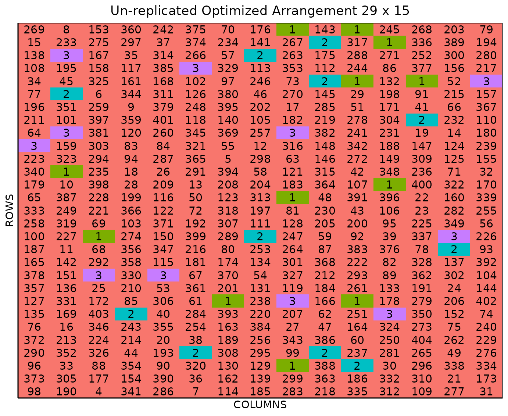
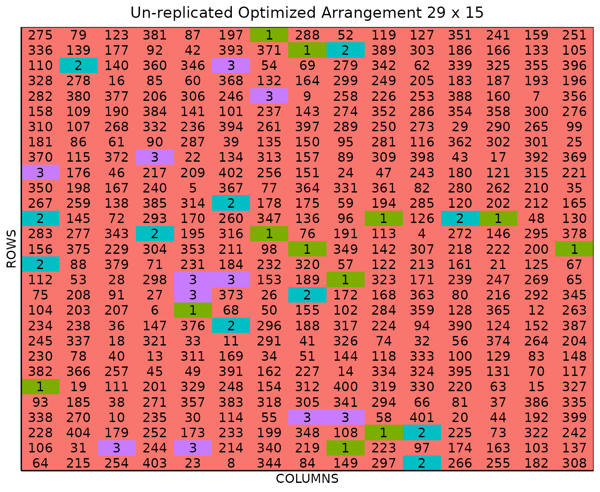

# Un-replicated Optimized Arrangement Design

This vignette shows how to generate an **un-replicated optimized
arrangement design** using both the FielDHub Shiny App and the scripting
function
[`optimized_arrangement()`](https://didiermurillof.github.io/FielDHub/reference/optimized_arrangement.md)
from the `FielDHub` R package.

### Overview

One un-replicated design you can use in FielDHub is the optimized
arrangement. Unlike the diagonal design, the optimized arrangement
completely randomizes the positions for the checks instead of putting
them in a systematic diagonal pattern(Clarke and Stefanova 2011).
Randomization is subject to some restrictions. These restrictions seek
to optimize the distribution of control plots in the field and ensure
they are spread while keeping a minimum distance between them.

`FielDHub` includes a function to run such experimental designs,
features include options to set the number of entries and the number of
checks for the experiment. Users can also choose to run the same
experiment over multiple locations.

### Use case

An early generation plant breeding project needs to test 401 genotypes
of winter wheat. It is planned to carry out this experiment on a field
containing 29 rows and 15 columns of plots. In this project, these 401
genotypes are allocated into one experiment and tested over three
locations. In addition, three checks are randomly included across field
to fill 34 plots representing 7.8% of the total number of experimental
plots.

### Running the Shiny App

To launch the app you need to run either,

``` r
FielDHub::run_app()
```

or

``` r
library(FielDHub)
run_app()
```

### 1. Using the FielDHub Shiny App

Once the app is running, go to **un-replicated Designs** \> **Optimized
Arrangement**

Then, follow the following steps where we will show how to generate an
un-replicated optimized arrangement design.

### Inputs

1.  **Import entries’ list?** Choose whether to import a list with entry
    numbers and names for genotypes or treatments.
    - If the selection is `No`, that means the app is going to generate
      synthetic data for entries and names of the treatment/genotypes
      based on the user inputs.

    - If the selection is `Yes`, the entries list must fulfill a
      specific format and must be a `.csv` file. The file must have the
      columns `ENTRY`, `NAME`, and `REPS`. The `ENTRY` column must have
      a unique entry integer number for each treatment/genotype. The
      column `NAME` must have a unique name that identifies each
      treatment/genotype. The `REPS` column must have an integer entry
      for the replications of the checks and other entries. Both ENTRY
      and NAME must be unique, duplicates are not allowed. In the
      following table, we show an example of the entries list format.
      This example has an entry list with three checks and nine
      treatments/genotypes. It is crucial to allocate the checks in the
      top part of the file.

| ENTRY | NAME   | REPS |
|------:|:-------|-----:|
|     1 | CHECK1 |   10 |
|     2 | CHECK2 |   10 |
|     3 | CHECK3 |   10 |
|     4 | G-4    |    1 |
|     5 | G-5    |    1 |
|     6 | G-6    |    1 |
|     7 | G-7    |    1 |
|     8 | G-8    |    1 |
|     9 | G-9    |    1 |
|    10 | G-10   |    1 |
|    11 | G-11   |    1 |
|    12 | G-12   |    1 |

2.  Enter the number of checks in the **Input \# of Checks** box, which
    is `3` in our case.

3.  Enter the number of replications of the checks in a comma separated
    list containing a number for each check in the **Input \# Check’s
    Reps** box. For our example experiment, we will enter `12,11,11`.

4.  Enter the number of entries/treatments in the **Input \# of
    Entries** box, which is `401` in our case.

5.  Select `serpentine` or `cartesian` in the **Plot Order Layout**. For
    this example we will set the `serpentine` layout.

6.  Since we want to run this experiment over 3 locations, set **Input
    \# of Locations** to `3`.

7.  To ensure that randomizations are consistent across sessions, we can
    set a random seed in the box labeled **random seed**. For instance,
    we will set it to `130`.

8.  Enter the name for the experiment in the **Input Experiment Name**
    box. For example, `PYT_WHEAT_22`.

9.  Enter the starting plot number in the **Starting Plot Number** box.
    If the experiment has multiple locations, you must enter a comma
    separated list of numbers the length of the number of locations for
    the input to be valid. Since we have 3 locations in this experiment,
    we will enter `1001,2001,3001`.

10. Enter the name of the site/location in the **Input the Location**
    box. In our case we will run the experiment in three locations, the
    name for each location must be enter separate by comma, for example:
    `FARGO, CASSELTON, MINOT`.

11. Once we have entered the information for our experiment on the left
    side panel, click the **Run!** button to run the design.

12. You will then be prompted to select the dimensions of the field from
    the list of options in the drop down in the middle of the screen
    with the box labeled **Select dimensions of field**. In our case, we
    will select `15 x 29`.

13. Click the **Randomize!** button to randomize the experiment with the
    set field dimensions and to see the output plots. If you change the
    dimensions again, you must re-randomize.

If you change any of the inputs on the left side panel after running an
experiment initially, you have to click the Run and Randomize buttons
again, to re-run with the new inputs.

### Outputs

After you run an un-replicated optimized arrangement design in FielDHub
and set the dimensions of the field, there are several ways to display
the information contained in the field book. The first tab, **Get
Random**, shows the option to change the dimensions of the field and
re-randomize, as well as a reference guide for experiment design.

#### Data Input

On the second tab, **Data Input**, you can see all the entries in the
randomization in a list, as well as a table of the checks with the
number of times they appear in the field. In the list of entries, the
reps for each check is included as well.

#### Randomized Field

The **Randomized Field** tab displays a graphical representation of the
randomization of the entries in a field of the specified dimensions. The
checks are all colored uniquely, showing the number of times they are
distributed throughout the field. The display includes numbered labels
for the rows and columns. You can copy the field as a table or save it
directly as an Excel file with the *Copy* and *Excel* buttons at the
top.

#### Plot Number Field

On the **Plot Number Field** tab, there is a table display of the field
with the plots numbered according to the Plot Order Layout specified,
either *serpentine* or *cartesian*. You can see the corresponding
entries for each plot number in the field book. Like the Randomized
Field tab, you can copy the table or save it as an Excel file with the
*Copy* and *Excel* buttons.

#### Field Book

The **Field Book** displays all the information on the experimental
design in a table format. It contains the specific plot number and the
row and column address of each entry, as well as the corresponding
treatment on that plot. This table is searchable, and we can filter the
data in relevant columns.  

### 2. Using the `FielDHub` function: `optimized_arrangement()`.

You can run the same design with the function
[`optimized_arrangement()`](https://didiermurillof.github.io/FielDHub/reference/optimized_arrangement.md)
in the `FielDHub` package.

First, you need to load the `FielDHub` package typing,

``` r
library(FielDHub)
```

Then, you can enter the information describing the above design like
this:

``` r
optim_expt <- optimized_arrangement(
  nrows = 29,
  ncols = 15,
  lines = 401, 
  amountChecks = c(12,11,11),
  checks = 3, 
  l = 3,
  plotNumber = c(1001,2001,3001),
  exptName = "WINTER_WHEAT_22", 
  locationNames = c("FARGO", "CASSELTON", "MINOT"),
  seed = 130
)
```

##### Details on the inputs entered in `optimized_arrangement()` above

The description for the inputs that we used to generate the design,

- `nrows = 29` is the number of rows in the field.
- `ncols = 15` is the number of columns in the field.
- `lines = 401` is the number of entries
- `amountChecks = c(12,11,11)` are the values for representing
  respective replicates of each check, or an integer total number of
  checks.
- `checks = 3` is the number of checks.
- `l = 3` is the number of locations.
- `plotNumber = c(1001,2001,3001)` are the starting plot number for each
  location respectively, or a single number for 1 location.
- `exptName = "WINTER_WHEAT_22"` is an optional name for experiment.
- `locationNames = c("FARGO", "CASSELTON", "MINOT")` are the values for
  representing respective name for each location.
- `seed = 130` is the random seed to replicate identical randomizations.

#### Print `optim_expt` object

To print a summary of the information that is in the object
`optim_expt`, we can use the generic function
[`print()`](https://rdrr.io/r/base/print.html).

``` r
print(optim_expt)
```

    Un-replicated Optimized Arrangement Design 

    Information on the design parameters: 
    List of 10
     $ rows        : num 29
     $ columns     : num 15
     $ min_distance: num [1:3] 1.41 1 1
     $ treatments  : num 401
     $ checks      : int 3
     $ entry_checks: int [1:3] 1 2 3
     $ rep_checks  : num [1:3] 12 11 11
     $ locations   : num 3
     $ planter     : chr "serpentine"
     $ seed        : num 130

     10 First observations of the data frame with the optimized_arrangement field book: 
       ID            EXPT LOCATION YEAR PLOT ROW COLUMN CHECKS ENTRY TREATMENT
    1   1 WINTER_WHEAT_22    FARGO 2026 1001   1      1      0    98       G98
    2   2 WINTER_WHEAT_22    FARGO 2026 1002   1      2      0   190      G190
    3   3 WINTER_WHEAT_22    FARGO 2026 1003   1      3      0     4        G4
    4   4 WINTER_WHEAT_22    FARGO 2026 1004   1      4      0   341      G341
    5   5 WINTER_WHEAT_22    FARGO 2026 1005   1      5      0   286      G286
    6   6 WINTER_WHEAT_22    FARGO 2026 1006   1      6      0     7        G7
    7   7 WINTER_WHEAT_22    FARGO 2026 1007   1      7      0   114      G114
    8   8 WINTER_WHEAT_22    FARGO 2026 1008   1      8      0   185      G185
    9   9 WINTER_WHEAT_22    FARGO 2026 1009   1      9      0   283      G283
    10 10 WINTER_WHEAT_22    FARGO 2026 1010   1     10      0   218      G218

#### Access to `optim_expt` object

The
[`optimized_arrangement()`](https://didiermurillof.github.io/FielDHub/reference/optimized_arrangement.md)
function returns a list consisting of all the information displayed in
the output tabs in the FielDHub app: design information, plot layout,
plot numbering, entries list, and field book. These are Accessible by
the `$` operator, i.e. `optim_expt$layoutRandom` or
`optim_expt$fieldBook`.

`optim_expt$fieldBook` is a data frame containing information about
every plot in the field, with information about the location of the plot
and the treatment in each plot. As seen in the output below, the field
book has columns for `ID`, `EXPT`, `LOCATION`, `YEAR`, `PLOT`, `ROW`,
`COLUMN`, `CHECKS`, `ENTRY`, and `TREATMENT`.

Let us see the first 10 rows of the field book for this experiment.

``` r
field_book <- optim_expt$fieldBook
head(field_book, 10)
```

       ID            EXPT LOCATION YEAR PLOT ROW COLUMN CHECKS ENTRY TREATMENT
    1   1 WINTER_WHEAT_22    FARGO 2026 1001   1      1      0    98       G98
    2   2 WINTER_WHEAT_22    FARGO 2026 1002   1      2      0   190      G190
    3   3 WINTER_WHEAT_22    FARGO 2026 1003   1      3      0     4        G4
    4   4 WINTER_WHEAT_22    FARGO 2026 1004   1      4      0   341      G341
    5   5 WINTER_WHEAT_22    FARGO 2026 1005   1      5      0   286      G286
    6   6 WINTER_WHEAT_22    FARGO 2026 1006   1      6      0     7        G7
    7   7 WINTER_WHEAT_22    FARGO 2026 1007   1      7      0   114      G114
    8   8 WINTER_WHEAT_22    FARGO 2026 1008   1      8      0   185      G185
    9   9 WINTER_WHEAT_22    FARGO 2026 1009   1      9      0   283      G283
    10 10 WINTER_WHEAT_22    FARGO 2026 1010   1     10      0   218      G218

#### Plot the field layout

For plotting the layout in function of the coordinates `ROW` and
`COLUMN` in the field book object we can use the generic function
[`plot()`](https://rdrr.io/r/graphics/plot.default.html) as follow,

``` r
plot(optim_expt)
```



The figure above shows a map of an experiment randomized as an
un-replicated optimized arrangement design. Gray plots represent the
un-replicated treatments, while distinctively colored check plots are
randomly replicated throughout the field.

It is possible to pass more arguments to
[`plot()`](https://rdrr.io/r/graphics/plot.default.html) such as the
specific location. For example, you can plot specifically the layout for
location 2.

``` r
plot(optim_expt, l = 2)
```



## References

Clarke, G. Peter Y., and Katia T. Stefanova. 2011. “Optimal Design for
Early-Generation Plant-Breeding Trials with Unreplicated or Partially
Replicated Test Lines.” *Australian & New Zealand Journal of Statistics*
53 (4): 461–80. <https://doi.org/10.1111/j.1467-842X.2011.00642.x>.
