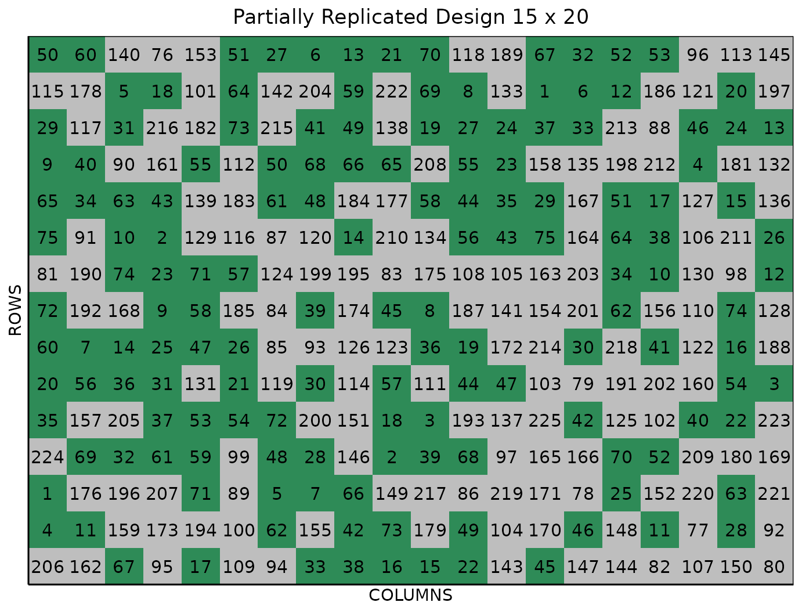

# Partially Replicated (p-rep) Design

This vignette shows how to generate a **partially replicated (p-rep)
design** using both the FielDHub Shiny App and the scripting function
[`partially_replicated()`](https://didiermurillof.github.io/FielDHub/reference/partially_replicated.md)
from the `FielDHub` R package.

### Overview

Partially replicated designs are commonly employed in early generation
field trials. This type of design is characterized by replication of a
portion of the entries, with the remaining entries only appearing once
in the experiment. Commonly, the part of treatments with reps is due to
an arbitrary decision by the research, also in some cases, it is due to
technical reasons. The replication ratio is typically 1:4 (Cullis 2006),
which means that the portion of treatment repeated twice is p = 25%.
However, the design can be adapted to meet specific needs by adjusting
the values of $`p`$ and the level of replication. For example, standard
varieties (checks) may be included with higher levels of replication
than test lines.

In `FielDHub`, users can set the number of entries that will have reps,
as well as the number of entries that will only appear once. You can
also choose to run the same experiment over multiple locations.

### Optimization

Each partially replicated (p-rep) design location undergoes an
optimization process that involves the following procedure:

Given a matrix $`X`$ of integers (p-rep design within location), we want
to ensure that the distance between any two occurrences of the same
treatment is at least a distance $`d`$. More specifically, we want to
modify $`X`$ to ensure that no treatments appear twice within a distance
less than $`d`$ in the resulting matrix.

The goal of the optimization process is to find a modified matrix that
satisfies this constraint while maximizing some measure of deviation
from the original matrix $`X`$. In this case, the measure of deviation
is the pairwise Euclidean distance between occurrences of the same
treatment. The process is done by the function
[`swap_pairs()`](https://didiermurillof.github.io/FielDHub/reference/swap_pairs.md)
that uses a heuristic algorithm that starts with a distance of $`d = 3`$
between pairs of occurrences of the same treatment, and increases this
distance by $`1`$ and repeats the process until either the algorithm no
longer converges or the maximum number of iterations is reached.

The algorithm works by first identifying all pairs of occurrences of the
same treatment that are closer than $`d`$. For each such pair, the
function selects a random occurrence of a different integer that is at
least $`d`$ away, and swaps the two occurrences. This process is
repeated until no further swaps can be made that increase the pairwise
Euclidean distances between occurrences of the same treatment.

##### Toy Example

Consider a p-rep design where ten treatments are replicated twice and
forty only once. The matrix (field layout) for this experiment has 6
rows and 10 columns.

$`X =`$

         [,1] [,2] [,3] [,4] [,5] [,6] [,7] [,8] [,9] [,10]
    [1,]   21   40   17   25   26    3   11   31   36     6
    [2,]    5    5   33    8   48   29   43   23    1    45
    [3,]   41   27   38   39    7   28   14   22   24     4
    [4,]    4   47   18    7    2   35    6   20   12    46
    [5,]    3   15    9   34   49   50    2   10   42     8
    [6,]   32   16   19    9   10   13   37    1   44    30

In this initial p-rep design, we notice that the two instances of
treatment **5** are positioned next to each other. Additionally,
treatments **7** and **9** are also situated in adjacent cells. These
suboptimal allocations could lead to issues or inaccurate results when
analyzing the data from this experiment due to the short distance
between replicated treatments and the likely spatial correlation between
them.

The following table shows the pairwise distances for the replicated
treatments

       geno Pos1 Pos2     DIST rA cA rB cB
    1     5    2    8 1.000000  2  1  2  2
    2     7   22   27 1.414214  4  4  3  5
    3     9   17   24 1.414214  5  3  6  4
    4     2   28   41 2.236068  4  5  5  7
    5    10   30   47 3.162278  6  5  5  8
    6     1   48   50 4.123106  6  8  2  9
    7     6   40   55 4.242641  4  7  1 10
    8     3    5   31 6.403124  5  1  1  6
    9     8   20   59 6.708204  2  4  5 10
    10    4    4   57 9.055385  4  1  3 10

##### Swap pairs

We can improve the efficiency of the design by swapping the treatments
that are close and next to each other by using the function
[`swap_pairs()`](https://didiermurillof.github.io/FielDHub/reference/swap_pairs.md)
from `FielDHub` R package.

``` r

library(FielDHub)
B <- swap_pairs(X, starting_dist = 3)
```

The new matrix or the optimized p-rep design is,

``` r
print(B$optim_design)
     [,1] [,2] [,3] [,4] [,5] [,6] [,7] [,8] [,9] [,10]
[1,]   21   40   17    2    5    3   11   31   36     6
[2,]    8   43   33   34   48   29    7   23    1    45
[3,]   41   27    9   39   10   28   14    9   24     4
[4,]    4   47   18   26   25   35    6   20   12    46
[5,]    3   15   22    2   49   50    5    7   42     8
[6,]   32   16   19   38   10   13   37    1   44    30
```

The distances for each pairwise of treatments are,

``` r
print(B$pairwise_distance)
   geno Pos1 Pos2     DIST rA cA rB cB
1    10   27   30 3.000000  3  5  6  5
2     7   38   47 3.162278  2  7  5  8
3     2   19   23 4.000000  1  4  5  4
4     1   48   50 4.123106  6  8  2  9
5     6   40   55 4.242641  4  7  1 10
6     5   25   41 4.472136  1  5  5  7
7     9   15   45 5.000000  3  3  3  8
8     3    5   31 6.403124  5  1  1  6
9     4    4   57 9.055385  4  1  3 10
10    8    2   59 9.486833  2  1  5 10
```

As we can see, the minimum distance that the algorithm reached is 3.
This means no treatments appear twice within a distance less than 3 in
the resulting prep design. It is a considerable improvement from the
first version of the p-rep design

The `FielDHub` function
[`partially_replicated()`](https://didiermurillof.github.io/FielDHub/reference/partially_replicated.md)
does internally all the optimization process and uses the function
[`swap_pairs()`](https://didiermurillof.github.io/FielDHub/reference/swap_pairs.md)
to maximize the distance between replicated treatments.

#### Acknowledge

We would like to acknowledge Mr. Jean-Marc Montpetit for contributing
code and ideas for the
[`swap_pairs()`](https://didiermurillof.github.io/FielDHub/reference/swap_pairs.md)
and `pairs_distance()` functions. His contributions have had a
significant impact on improving the partially replicated (p-rep) design
in the R package `FielDHub`. We thank him for his valuable
contributions.

### Use case

Consider a plant breeding field trial with 300 plots containing 75
entries appearing two times each, and 150 entries only appearing once.
This field trial is arranged in a field of 15 rows by 20 columns. In
this case, the breeder decided to replicate the genotypes that do not
share significant generic information with each other (75), as well as
leave with just one copy the genotypes that are siblings (150).

### Running the Shiny App

To launch the app you need to run either

``` r

FielDHub::run_app()
```

or

``` r

library(FielDHub)
run_app()
```

### 1. Using the FielDHub Shiny App

Once the app is running, click the tab **Partially Replicated Design**
and select **Single and Multi-Location p-rep** from the dropdown.

Then, follow the following steps where we will show how to generate a
partially replicated design.

### Inputs

1.  **Import entries’ list?** Choose whether to import a list with entry
    numbers and names for genotypes or treatments.
    - If the selection is `No`, that means the app is going to generate
      synthetic data for entries and names of the treatment/genotypes
      based on the user inputs.

    - If the selection is `Yes`, the entries list must fulfill a
      specific format and must be a `.csv` file. The file must have the
      columns `ENTRY`, `NAME`, and `REPS`. The `ENTRY` column must have
      a unique entry integer number for each treatment/genotype. The
      column `NAME` must have a unique name that identifies each
      treatment/genotype. The `REPS` column must have an integer number
      for the replications of the groups. Both ENTRY and NAME must be
      unique, duplicates are not allowed. In the following table, we
      show an example of the entries list format. This example has an
      entry list with four treatments/genotypes that will appear twice
      and 8 that appear just once.

| ENTRY | NAME      | REPS |
|------:|:----------|-----:|
|     1 | GenotypeA |    2 |
|     2 | GenotypeB |    2 |
|     3 | GenotypeC |    2 |
|     4 | GenotypeD |    2 |
|     5 | GenotypeE |    1 |
|     6 | GenotypeF |    1 |
|     7 | GenotypeG |    1 |
|     8 | GenotypeH |    1 |
|     9 | GenotypeI |    1 |
|    10 | GenotypeJ |    1 |
|    11 | GenotypeK |    1 |
|    12 | GenotypeL |    1 |

2.  Enter the number of entries per replicate group in the **\# of
    Entries per Rep Group** box as a comma separated list. In our
    example we will have 2 groups with 85 and 130 entries. So, we enter
    `75, 150` in the box for our sample experiment.

3.  Enter the number of replications per group in the **\# of Rep per
    Group** box. In our example we will have 2 and 1 replications for
    the 2 groups, so we enter `2, 1` in this box.

4.  Enter the number of locations in **Input \# of Locations**. We will
    run this experiment over a single location, so set **Input \# of
    Locations** to `1`.

5.  Select `serpentine` or `cartesian` in the **Plot Order Layout**. For
    this example we will use the default `serpentine` layout.

6.  To ensure that randomizations are consistent across sessions, we can
    set a random seed in the box labeled **random seed**. In this
    example, we will set it to `1245`.

7.  Enter the starting plot number in the **Starting Plot Number** box.
    If the experiment has multiple locations, you must enter a comma
    separated list of numbers the length of the number of locations for
    the input to be valid.

8.  Once we have entered the information for our experiment on the left
    side panel, click the **Run!** button to run the design.

9.  You will then be prompted to select the dimensions of the field from
    the list of options in the drop down in the middle of the screen
    with the box labeled **Select dimensions of field**. In our case, we
    will select `15 x 20`.

10. Click the **Randomize!** button to randomize the experiment with the
    set field dimensions and to see the output plots. If you change the
    dimensions again, you must re-randomize.

If you change any of the inputs on the left side panel after running an
experiment initially, you have to click the Run and Randomize buttons
again, to re-run with the new inputs.

### Outputs

After you run a single diagonal arrangement in FielDHub and set the
dimensions of the field, there are several ways to display the
information contained in the field book. The first tab, **Get Random**,
shows the option to change the dimensions of the field and re-randomize,
as well as a reference guide for experiment design.

#### Data Input

On the second tab, **Data Input**, you can see all the entries in the
randomization in a list, as well as a table of the checks with the
number of times they appear in the field. In the list of entries, the
reps for each check is included as well.

#### Randomized Field

The **Randomized Field** tab displays a graphical representation of the
randomization of the entries in a field of the specified dimensions. The
checks are the green colored cells, with the The display includes
numbered labels for the rows and columns. You can copy the field as a
table or save it directly as an Excel file with the *Copy* and *Excel*
buttons at the top.

#### Plot Number Field

On the **Plot Number Field** tab, there is a table display of the field
with the plots numbered according to the Plot Order Layout specified,
either *serpentine* or *cartesian*. You can see the corresponding
entries for each plot number in the field book. Like the Randomized
Field tab, you can copy the table or save it as an Excel file with the
*Copy* and *Excel* buttons.

#### Field Book

The **Field Book** displays all the information on the experimental
design in a table format. It contains the specific plot number and the
row and column address of each entry, as well as the corresponding
treatment on that plot. This table is searchable, and we can filter the
data in relevant columns.

### 2. Using the `FielDHub` function: `partially_replicated()`.

You can run the same design with the function
[`partially_replicated()`](https://didiermurillof.github.io/FielDHub/reference/partially_replicated.md)
in the `FielDHub` package.

First, you need to load the `FielDHub` package typing,

``` r

library(FielDHub)
```

Then, you can enter the information describing the above design like
this:

``` r

prep <- partially_replicated(
  nrows = 15,
  ncols = 20, 
  repGens = c(75,150),
  repUnits = c(2,1), 
  planter = "serpentine", 
  plotNumber = 101,
  l = 1, 
  exptName = "Expt1",
  locationNames = "PALMIRA",
  seed = 1245, 
)
```

##### Details on the inputs entered in `optimized_arrangement()` above

The description for the inputs that we used to generate the design,

- `nrows = 15` is the number of rows in the field.
- `ncols = 20` is the number of columns in the field.
- `repGens = c(75,150)` are the values for the groups to replicate
- `repUnits = c(2,1)` are the values for representing respective
  replicates of each group.
- `planter = "serpentine"` is the layout order.
- `plotNumber = 101` is the starting plot number for the experiment.
- `l = 1` is the number of locations.
- `exptName = "Expt1"` is an optional name for experiment.
- `locationNames = "PALMIRA"` is the optional name for the locations.
- `seed = 1245` is the random seed to replicate identical
  randomizations.

#### Print `prep` object

To print a summary of the information that is in the object `prep`, we
can use the generic function
[`print()`](https://rdrr.io/r/base/print.html).

``` r

print(prep)
```

    Partially Replicated Design 

    Replications within location: 
      LOCATION Replicated Unreplicated
    1  PALMIRA         75          150

     Information on the design parameters: 
    List of 7
     $ rows             : num 15
     $ columns          : num 20
     $ min_distance     : num 5
     $ incidence_in_rows: num 4
     $ locations        : num 1
     $ planter          : chr "serpentine"
     $ seed             : num 1245

     10 First observations of the data frame with the partially_replicated field book: 
    
[38;5;246m# A tibble: 10 × 11
[39m
          ID EXPT  LOCATION YEAR   PLOT   ROW COLUMN   REP CHECKS ENTRY TREATMENT
       
[3m
[38;5;246m<int>
[39m
[23m 
[3m
[38;5;246m<chr>
[39m
[23m 
[3m
[38;5;246m<chr>
[39m
[23m    
[3m
[38;5;246m<chr>
[39m
[23m 
[3m
[38;5;246m<dbl>
[39m
[23m 
[3m
[38;5;246m<int>
[39m
[23m  
[3m
[38;5;246m<int>
[39m
[23m 
[3m
[38;5;246m<int>
[39m
[23m  
[3m
[38;5;246m<dbl>
[39m
[23m 
[3m
[38;5;246m<dbl>
[39m
[23m 
[3m
[38;5;246m<chr>
[39m
[23m    
    
[38;5;250m 1
[39m     1 Expt1 PALMIRA  2026    101     1      1     1      0   206 G206     
    
[38;5;250m 2
[39m     2 Expt1 PALMIRA  2026    102     1      2     1      0   162 G162     
    
[38;5;250m 3
[39m     3 Expt1 PALMIRA  2026    103     1      3     1     67    67 G67      
    
[38;5;250m 4
[39m     4 Expt1 PALMIRA  2026    104     1      4     1      0    95 G95      
    
[38;5;250m 5
[39m     5 Expt1 PALMIRA  2026    105     1      5     1     17    17 G17      
    
[38;5;250m 6
[39m     6 Expt1 PALMIRA  2026    106     1      6     1      0   109 G109     
    
[38;5;250m 7
[39m     7 Expt1 PALMIRA  2026    107     1      7     1      0    94 G94      
    
[38;5;250m 8
[39m     8 Expt1 PALMIRA  2026    108     1      8     1     33    33 G33      
    
[38;5;250m 9
[39m     9 Expt1 PALMIRA  2026    109     1      9     1     38    38 G38      
    
[38;5;250m10
[39m    10 Expt1 PALMIRA  2026    110     1     10     1     16    16 G16      

#### Access to `prep` output

The
[`partially_replicated()`](https://didiermurillof.github.io/FielDHub/reference/partially_replicated.md)
function returns a list consisting of all the information displayed in
the output tabs in the FielDHub app: design information, plot layout,
plot numbering, entries list, and field book. These are Accessible by
the `$` operator, i.e. `prep$layoutRandom` or `prep$fieldBook`.

`prep$fieldBook` is a list containing information about every plot in
the field, with information about the location of the plot and the
treatment in each plot. As seen in the output below, the field book has
columns for `ID`, `EXPT`, `LOCATION`, `YEAR`, `PLOT`, `ROW`, `COLUMN`,
`CHECKS`, `ENTRY`, and `TREATMENT`.

Let us see the first 10 rows of the field book for this experiment.

``` r

field_book <- prep$fieldBook
head(field_book, 10)
```

    
[38;5;246m# A tibble: 10 × 11
[39m
          ID EXPT  LOCATION YEAR   PLOT   ROW COLUMN   REP CHECKS ENTRY TREATMENT
       
[3m
[38;5;246m<int>
[39m
[23m 
[3m
[38;5;246m<chr>
[39m
[23m 
[3m
[38;5;246m<chr>
[39m
[23m    
[3m
[38;5;246m<chr>
[39m
[23m 
[3m
[38;5;246m<dbl>
[39m
[23m 
[3m
[38;5;246m<int>
[39m
[23m  
[3m
[38;5;246m<int>
[39m
[23m 
[3m
[38;5;246m<int>
[39m
[23m  
[3m
[38;5;246m<dbl>
[39m
[23m 
[3m
[38;5;246m<dbl>
[39m
[23m 
[3m
[38;5;246m<chr>
[39m
[23m    
    
[38;5;250m 1
[39m     1 Expt1 PALMIRA  2026    101     1      1     1      0   206 G206     
    
[38;5;250m 2
[39m     2 Expt1 PALMIRA  2026    102     1      2     1      0   162 G162     
    
[38;5;250m 3
[39m     3 Expt1 PALMIRA  2026    103     1      3     1     67    67 G67      
    
[38;5;250m 4
[39m     4 Expt1 PALMIRA  2026    104     1      4     1      0    95 G95      
    
[38;5;250m 5
[39m     5 Expt1 PALMIRA  2026    105     1      5     1     17    17 G17      
    
[38;5;250m 6
[39m     6 Expt1 PALMIRA  2026    106     1      6     1      0   109 G109     
    
[38;5;250m 7
[39m     7 Expt1 PALMIRA  2026    107     1      7     1      0    94 G94      
    
[38;5;250m 8
[39m     8 Expt1 PALMIRA  2026    108     1      8     1     33    33 G33      
    
[38;5;250m 9
[39m     9 Expt1 PALMIRA  2026    109     1      9     1     38    38 G38      
    
[38;5;250m10
[39m    10 Expt1 PALMIRA  2026    110     1     10     1     16    16 G16      

#### Plot field layout

For plotting the layout in function of the coordinates `ROW` and
`COLUMN` in the field book object we can use the generic function
[`plot()`](https://rdrr.io/r/graphics/plot.default.html) as follow,

``` r

plot(prep)
```



In the figure above, green plots contain replicated entries, and gray
plots contain entries that only appear once.

## References

Cullis, et al., B. R. 2006. “On the Design of Early Generation Variety
Trials with Correlated Data.” *Journal of Agricultural, Biological, and
Environmental Statistics* 11 (4): 381–93.
