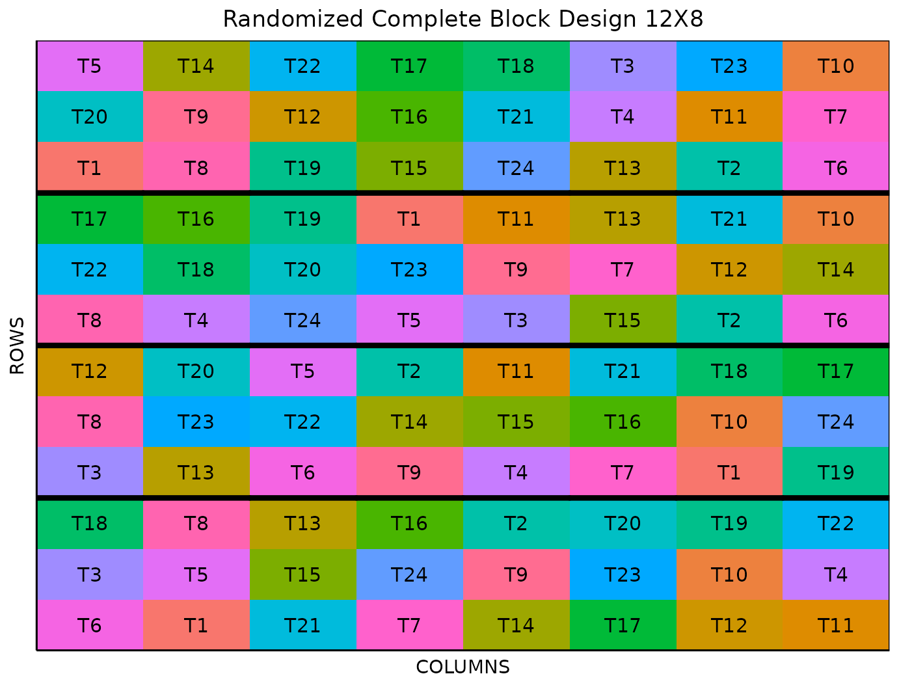

# Randomized Complete Block Design

This vignette shows how to generate a **randomized complete block
design** using both the FielDHub Shiny App and the scripting function
[`RCBD()`](https://didiermurillof.github.io/FielDHub/reference/RCBD.md)
from the `FielDHub` package.

## 1. Using the FielDHub Shiny App

To launch the app you need to run either

``` r

FielDHub::run_app()
```

or

``` r

library(FielDHub)
run_app()
```

Once the app is running, go to **Other Designs** \> **Randomized
Complete Block Designs (RCBD)**

Then, follow the following steps where we show how to generate this kind
of design by an example with 24 treatments and 4 reps. We will run this
experiment in just one location.

## Inputs

1.  **Import entries’ list?** Choose whether to import a list with entry
    numbers and names for genotypes or treatments.
    - If the selection is `No`, that means the app is going to generate
      synthetic data for entries and names of the treatment/genotypes
      based on the user inputs.

    - If the selection is `Yes`, the entries list must fulfill a
      specific format and must be a `.csv` file. The file must have the
      single column `TREATMENT`, containing a list of unique names that
      identify each treatment/genotype. Duplicate values are not
      allowed, all entries must be unique. In the following, we show an
      example of the entries list format. This example has an entry list
      with 10 treatments.

| TREATMENT |
|:----------|
| TRT_A     |
| TRT_B     |
| TRT_C     |
| TRT_D     |
| TRT_E     |
| TRT_F     |
| TRT_G     |
| TRT_H     |
| TRT_I     |
| TRT_J     |

2.  Input the number of treatments in the **Input \# of Treatments**
    box. Set it to `24`.

3.  Select the number of replications of these treatments with the
    **Input \# of Full Reps** box. The number of treatments and the
    number of full reps set the dimensions of the field. Set it to `4`.

4.  Enter the number of locations in **Input \# of Locations**. We will
    run this experiment over a single location, so set it to `1`.

5.  Select `serpentine` or `cartesian` in the **Plot Order Layout**. For
    this example we will use the default `serpentine` layout.

6.  Enter the starting plot number in the **Starting Plot Number** box.
    If the experiment has multiple locations, you must enter a comma
    separated list of numbers the length of the number of locations for
    the input to be valid. For this case, set it to `101`.

7.  Enter a name for the location of the experiment in the **Input
    Location** box. If there are multiple locations, each name must be
    in a comma separated list. Set it to `"FARGO"`.

8.  To ensure that randomizations are consistent across sessions, we can
    set a random seed in the box labeled **random seed**. In this
    example, we will set it to `1237`.

9.  Once we have entered the information for our experiment on the left
    side panel, click the **Run!** button to run the design.

## Outputs

After you run a randomized complete block design in FielDHub, there are
several ways to display the information contained in the field book.

### Field Layout

When you first click the run button on a randomized complete block
design, FielDHub displays the Field Layout tab, which shows the entries
and their arrangement in the field. In the box below the display, you
can change the layout of the field or change the location displayed. You
can also display a heatmap over the field by changing **Type of Plot**
to `Heatmap`. To view a heatmap, you must first simulate an experiment
over the described field with the **Simulate!** button. A pop-up window
will appear where you can enter what variable you want to simulate along
with minimum and maximum values.

### Field Book

The **Field Book** displays all the information on the experimental
design in a table format. It contains the specific plot number and the
row and column address of each entry, as well as the corresponding
treatment on that plot. This table is searchable, and we can filter the
data in relevant columns. If we have simulated data for a heatmap, an
additional column for that variable appears in the field book.

## 2. Using the `FielDHub` function: `RCBD()`

You can run the same design with a function in the FielDHub package,
[`RCBD()`](https://didiermurillof.github.io/FielDHub/reference/RCBD.md).

First, you need to load the `FielDHub` package typing,

``` r

library(FielDHub)
```

Then, you can enter the information describing the above design like
this:

``` r

rcbd <- RCBD(
  t = 24, 
  reps = 4,
  l = 1,
  plotNumber = 101,
  locationNames = "FARGO",
  seed = 1237
)
```

#### Details on the inputs entered in `RCBD()` above

The description for the inputs that we used to generate the design,

- `t = 24` is the number of treatments.
- `reps = 4` is the number of replications for each treatment.
- `l = 1` is the number of locations.
- `plotNumber = 101` is the starting plot number.
- `locationNames = "FARGO"` is an optional name for each location.
- `seed = 1234` is the random seed to replicate identical
  randomizations.

### Print `rcbd` object

``` r

print(rcbd)
```

    Randomized Complete Block Design (RCBD): 

    Information on the design parameters: 
    List of 7
     $ blocks              : num 4
     $ number.of.treatments: num 24
     $ treatments          : chr [1:24] "T1" "T2" "T3" "T4" ...
     $ locations           : num 1
     $ plotNumber          : num [1:4] 101 201 301 401
     $ locationNames       : chr "FARGO"
     $ seed                : num 1237

     10 First observations of the data frame with the RCBD field book: 
       ID LOCATION PLOT REP TREATMENT
    1   1    FARGO  101   1        T6
    2   2    FARGO  102   1        T1
    3   3    FARGO  103   1       T21
    4   4    FARGO  104   1        T7
    5   5    FARGO  105   1       T14
    6   6    FARGO  106   1       T17
    7   7    FARGO  107   1       T12
    8   8    FARGO  108   1       T11
    9   9    FARGO  109   1        T3
    10 10    FARGO  110   1        T5

### Access to `RCBD` object

The function `RCBD` returns a list consisting of all the information
displayed in the output tabs in the FielDHub app: design information,
plot layout, plot numbering, entries list, and field book. These are
accessible by the `$` operator, i.e. `rcbd$layoutRandom` or
`rcbd$fieldBook`.

`rcbd$fieldBook` is a list containing information about every plot in
the field, with information about the location of the plot and the
treatment in each plot. As seen in the output below, the field book has
columns for `ID`, `LOCATION`, `PLOT`, `REP`, `IBLOCK`, `UNIT`, `ENTRY`,
and `TREATMENT`.

``` r

field_book <- rcbd$fieldBook
head(rcbd$fieldBook, 10)
```

       ID LOCATION PLOT REP TREATMENT
    1   1    FARGO  101   1        T6
    2   2    FARGO  102   1        T1
    3   3    FARGO  103   1       T21
    4   4    FARGO  104   1        T7
    5   5    FARGO  105   1       T14
    6   6    FARGO  106   1       T17
    7   7    FARGO  107   1       T12
    8   8    FARGO  108   1       T11
    9   9    FARGO  109   1        T3
    10 10    FARGO  110   1        T5

### Plot the field layout

For plotting the layout in function of the coordinates `ROW` and
`COLUMN`, you can use the the generic function
[`plot()`](https://rdrr.io/r/graphics/plot.default.html) as follows,

``` r

plot(rcbd)
```



  
  
