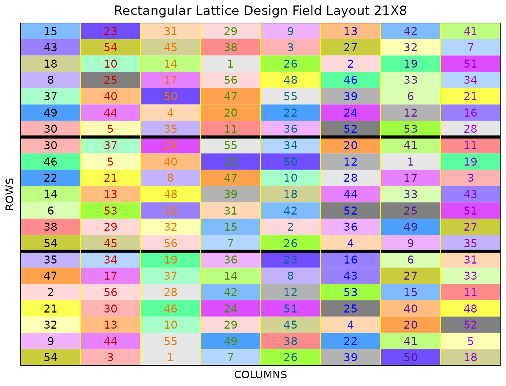

# Rectangular Lattice Design

This vignette shows how to generate a **rectangular lattice design**
using both the `FielDHub` Shiny App and the scripting function
[`rectangular_lattice()`](https://didiermurillof.github.io/FielDHub/reference/rectangular_lattice.md)
from the `FielDHub` package.

## 1. Using the FielDHub Shiny App

To generate a rectangular lattice design using the FielDHub app:

First, go to **Lattice Designs** \> **Rectangular Lattice**

Then, follow the following steps where we will show how to generate a
rectangular lattice design with 56 treatments and 3 reps.

## Inputs

1.  **Import entries’ list?** Choose whether to import a list with entry
    numbers and names for genotypes or treatments.
    - If the selection is `No`, that means the app is going to generate
      synthetic data for entries and names of the treatment based on the
      user inputs.

    - If the selection is `Yes`, the entries list must fulfill a
      specific format and must be a `.csv` file. The file must have the
      columns `ENTRY` and `NAME`. The `ENTRY` column must have a unique
      entry integer number for each treatment. The column `NAME` must
      have a unique name that identifies each treatment. Both `ENTRY`
      and `NAME` must be unique, duplicates are not allowed. In the
      following table, we show an example of the entries list format.
      This example has an entry list with 12 treatments.

| ENTRY | NAME      |
|------:|:----------|
|     1 | GenotypeA |
|     2 | GenotypeB |
|     3 | GenotypeC |
|     4 | GenotypeD |
|     5 | GenotypeE |
|     6 | GenotypeF |
|     7 | GenotypeG |
|     8 | GenotypeH |
|     9 | GenotypeI |
|    10 | GenotypeJ |
|    11 | GenotypeK |
|    12 | GenotypeL |

2.  Input the number of treatments in the **Input \# of Treatments**
    box. In a rectangular lattice design, the number of treatments must
    be a *rectangular number*, the product of two consecutive integers.
    For example, `7 x 8 = 56` is a valid entry, which we will use in
    this example.

3.  Select the number of replications of these treatments with the
    **Input \# of Full Reps** box, which is `3`.

4.  Set the number of plots in each incomplete block in the **Input \#
    of Plots per IBlock** box, which is `7`.

5.  Enter the number of locations in **Input \# of Locations**. We will
    run this experiment over a single location, so set it to `1`.

6.  Select `serpentine` or `cartesian` in the **Plot Order Layout**. For
    this example we will use the default `cartesian` layout.

7.  Enter the starting plot number in the **Starting Plot Number** box.
    If the experiment has multiple locations, you must enter a comma
    separated list of numbers the length of the number of locations for
    the input to be valid. Set it to `101`.

8.  Enter a name for the location of the experiment in the **Input
    Location** box. If there are multiple locations, each name must be
    in a comma separated list. Set it to `"FARGO"`.

9.  To ensure that randomizations are consistent across sessions, we can
    set a random seed in the box labeled **random seed**. In this
    example, we will set it to `1235`.

10. Once we have entered the information for our experiment on the left
    side panel, click the **Run!** button to run the design.

## Outputs

After you run a rectangular lattice design in FielDHub, there are
several ways to display the information contained in the field book.

### Field Layout

When you first click the run button on a rectangular lattice design,
FielDHub displays the Field Layout tab, which shows the entries and
their arrangement in the field. In the box below the display, you can
change the layout of the field or change the location displayed. You can
also display a heatmap over the field by changing **Type of Plot** to
`Heatmap`. To view a heatmap, you must first simulate an experiment over
the described field with the **Simulate!** button. A pop-up window will
appear where you can enter what variable you want to simulate along with
minimum and maximum values.

### Field Book

The **Field Book** displays all the information on the experimental
design in a table format. It contains the specific plot number and the
row and column address of each entry, as well as the corresponding
treatment on that plot. This table is searchable, and we can filter the
data in relevant columns. If we have simulated data for a heatmap, an
additional column for that variable appears in the field book.

## 2. Using the `FielDHub` function: `rectangular_lattice()`

You can run the same design with a function in the FielDHub package,
[`rectangular_lattice()`](https://didiermurillof.github.io/FielDHub/reference/rectangular_lattice.md).

First, you need to load the `FielDHub` package typing,

``` r

library(FielDHub)
```

Then, you can enter the information describing the above design like
this:

``` r

rect <- rectangular_lattice(
  t = 56,
  r = 3, 
  k = 7, 
  l = 1, 
  plotNumber = 101,
  locationNames = "FARGO", 
  seed = 1235
)
```

#### Details on the inputs entered in `rectangular_lattice()` above

- `t = 56` is the number of treatments.
- `r=3` is the number of replicates.
- `k = 7` is the number of plots per incomplete block.
- `l = 1` is the number of locations.
- `plotNumber = 101` is the starting plot number.
- `locationNames = "FARGO"` is an optional name for each location
- `seed = 1235` is the random seed to replicate identical
  randomizations.

### Print `rect` object

``` r

print(rect)
```

    Rectangular Lattice Design 

    Efficiency of design: 
      Level Blocks D-Efficiency A-Efficiency   A-Bound
    1     1      3    1.0000000    1.0000000 1.0000000
    2     2     24    0.8549751    0.8358296 0.8358296

    Information on the design parameters: 
    List of 7
     $ Reps            : num 3
     $ iBlocks         : num 8
     $ NumberTreatments: num 56
     $ NumberLocations : num 1
     $ Locations       : chr "FARGO"
     $ seed            : num 1235
     $ lambda          : num 0.327

     10 First observations of the data frame with the rectangular_lattice field book: 
       ID LOCATION PLOT REP IBLOCK UNIT ENTRY TREATMENT
    1   1    FARGO  101   1      1    1    38      G-38
    2   2    FARGO  102   1      1    2    43      G-43
    3   3    FARGO  103   1      1    3     2       G-2
    4   4    FARGO  104   1      1    4     5       G-5
    5   5    FARGO  105   1      1    5    22      G-22
    6   6    FARGO  106   1      1    6    18      G-18
    7   7    FARGO  107   1      1    7    15      G-15
    8   8    FARGO  108   1      2    1     7       G-7
    9   9    FARGO  109   1      2    2    33      G-33
    10 10    FARGO  110   1      2    3    56      G-56

### Access to `rect` object

The function
[`rectangular_lattice()`](https://didiermurillof.github.io/FielDHub/reference/rectangular_lattice.md)
returns a list consisting of all the information displayed in the output
tabs in the FielDHub app: design information, plot layout, plot
numbering, entries list, and field book. These are accessible by the `$`
operator, i.e. `rect$layoutRandom` or `rect$fieldBook`.

`rect$fieldBook` is a list containing information about every plot in
the field, with information about the location of the plot and the
treatment in each plot. As seen in the output below, the field book has
columns for `ID`, `LOCATION`, `PLOT`, `REP`, `IBLOCK`, `UNIT`, `ENTRY`,
and `TREATMENT`.

``` r

field_book <- rect$fieldBook
head(rect$fieldBook, 10)
```

       ID LOCATION PLOT REP IBLOCK UNIT ENTRY TREATMENT
    1   1    FARGO  101   1      1    1    38      G-38
    2   2    FARGO  102   1      1    2    43      G-43
    3   3    FARGO  103   1      1    3     2       G-2
    4   4    FARGO  104   1      1    4     5       G-5
    5   5    FARGO  105   1      1    5    22      G-22
    6   6    FARGO  106   1      1    6    18      G-18
    7   7    FARGO  107   1      1    7    15      G-15
    8   8    FARGO  108   1      2    1     7       G-7
    9   9    FARGO  109   1      2    2    33      G-33
    10 10    FARGO  110   1      2    3    56      G-56

### Plot the field layout

For plotting the layout in function of the coordinates `ROW` and
`COLUMN`, you can use the the generic function
[`plot()`](https://rdrr.io/r/graphics/plot.default.html) as follows,

``` r

plot(rect)
```



  
  
