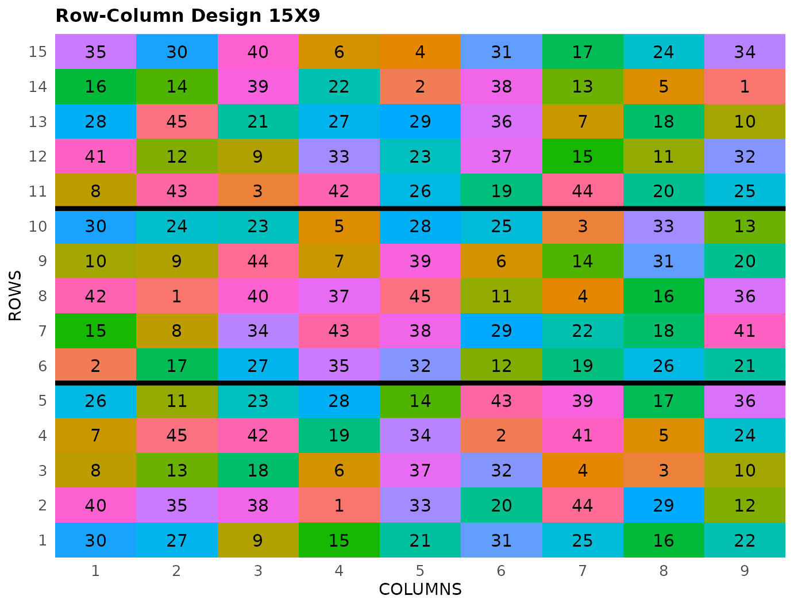

# Row-Column Design

This vignette shows how to generate a **row-column Design** using both
the FielDHub Shiny App and the scripting function
[`row_column()`](https://didiermurillof.github.io/FielDHub/reference/row_column.md)
from the `FielDHub` package.

## Resolvable Row-Column Design

It randomly generates a resolvable row-column design.The design is
optimized in both rows and columns blocking factors. The randomization
can be done across multiple locations.

## Overview

[`row_column()`](https://didiermurillof.github.io/FielDHub/reference/row_column.md)
optimizes both the row and the column blocking factors, and the strategy
is selected with the `method` argument. By default
(`method = "onestage"`) the rows and columns are optimized *jointly* in
a single step with
[`blocksdesign::design()`](https://rdrr.io/pkg/blocksdesign/man/design.html).
The historical alternative, `method = "twostage"`, reproduces the
designs generated by earlier versions of FielDHub: the first step
constructs the blocking factor `Columns` using Incomplete Block Units
from an incomplete block design that sets the number of incomplete
blocks as the number of `Columns` in the design, each of which has a
dimension equal to the number of `Rows`. Once this design is generated,
the `Rows` are used as the `Row` blocking factor that is optimized for
A-Efficiency, but levels within the original `Columns` are fixed. To
optimize the `Rows` while maintaining the current optimized `Columns`, a
heuristic algorithm swaps at random treatment positions within a given
`Column (Block)` also selected at random, keeping a swap only when it
does not decrease the A-Efficiency; this iterative process is repeated,
by default, 1000 times.

## 1. Using the FielDHub Shiny App

To generate a Row-Column Design using the FielDHub app:

First, go to **Other Designs** \> **Resolvable Row-Column Design
(RRCD)**

Then, follow the following steps where we will show how to generate a
Row-Column Design with 45 treatments, 5 rows and 3 reps.

## Inputs

1.  **Import entries’ list?** Choose whether to import a list with entry
    numbers and names for genotypes or treatments.
    - If the selection is `No`, that means the app is going to generate
      synthetic data for entries and names of the treatment based on the
      user inputs.

    - If the selection is `Yes`, the entries list must fulfill a
      specific format and must be a `.csv` file. The file must have the
      columns `ENTRY` and `NAME`. The `ENTRY` column must have a unique
      entry integer number for each treatment. The column `NAME` must
      have a unique name that identifies each treatment. Both `ENTRY`
      and `NAME` must be unique, duplicates are not allowed. In the
      following table, we show an example of the entries list format.
      This example has an entry list with 12 treatments.

| ENTRY | NAME      |
|------:|:----------|
|     1 | GenotypeA |
|     2 | GenotypeB |
|     3 | GenotypeC |
|     4 | GenotypeD |
|     5 | GenotypeE |
|     6 | GenotypeF |
|     7 | GenotypeG |
|     8 | GenotypeH |
|     9 | GenotypeI |
|    10 | GenotypeJ |
|    11 | GenotypeK |
|    12 | GenotypeL |

2.  Input the number of treatments in the **Input \# of Treatments**
    box. We will enter `45` for our sample experiment.

3.  Set the number of plots in each incomplete block with the **Input \#
    of Plots per IBlock** box. In this examples, set it to `5`.

4.  Select the number of replications of these treatments with the
    **Input \# of Full Reps** box. In this examples, set it to `3`.

5.  Enter the number of locations in **Input \# of Locations**. We will
    run this experiment over a single location, so set it to `1`.

6.  Select `serpentine` or `cartesian` in the **Plot Order Layout**. For
    this example we will use the default `serpentine` layout.

7.  Enter the starting plot number in the **Starting Plot Number** box.
    If the experiment has multiple locations, you must enter a comma
    separated list of numbers the length of the number of locations for
    the input to be valid. Set it to `101`.

8.  Enter a name for the location of the experiment in the **Input
    Location** box. If there are multiple locations, each name must be
    in a comma separated list. For this example, set it to `"FARGO"`.

9.  To ensure that randomizations are consistent across sessions, we can
    set a random seed in the box labeled **random seed**. In this
    example, we will set it to `1244`.

10. Once we have entered the information for our experiment on the left
    side panel, click the **Run!** button to run the design.

## Outputs

After you run a row-column design in FielDHub, there are several ways to
display the information contained in the field book.

### Field Layout

When you first click the run button on a row-column design, FielDHub
displays the Field Layout tab, which shows the entries and their
arrangement in the field. In the box below the display, you can change
the layout of the field. You can also display a heatmap over the field
by changing **Type of Plot** to `Heatmap`. To view a heatmap, you must
first simulate an experiment over the described field with the
**Simulate!** button. A pop-up window will appear where you can enter
what variable you want to simulate along with minimum and maximum
values.

### Field Book

The **Field Book** displays all the information on the experimental
design in a table format. It contains the specific plot number and the
row and column address of each entry, as well as the corresponding
treatment on that plot. This table is searchable, and we can filter the
data in relevant columns. If we have simulated data for a heatmap, an
additional column for that variable appears in the field book.

## 2. Using the `FielDHub` function: `row_column()`

You can run the same design with a function in the FielDHub package,
[`row_column()`](https://didiermurillof.github.io/FielDHub/reference/row_column.md).

First, you need to load the `FielDHub` package by typing

``` r

library(FielDHub)
```

Then, you can enter the information describing the above design like
this:

``` r

rcd <- row_column(
  t = 45,
  nrows = 5,
  r = 3,
  l = 1, 
  plotNumber = 101, 
  locationNames = "FARGO",
  iterations = 20,
  seed = 1244
)
```

#### Details on the inputs entered in `row_column()` above

The description for the inputs that we used to generate the design,

- `t = 45` is the number of treatments.
- `nrows = 5` is the number of rows.
- `r=3` is the number of reps
- `l = 1` is the number of locations.
- `plotNumber = 101` is the starting plot number.
- `locationNames = "FARGO"` is an optional name for each location.
- `seed = 1244` is the random seed to replicate identical
  randomizations.

### Print `rcd` object

To print a summary of the information that is in the object `rcd`, we
can use the generic function
[`print()`](https://rdrr.io/r/base/print.html).

``` r

print(rcd)
```

    Resolvable Row-Column Design (One-Step Optimization) 

    Efficiency of design: 
              Level Blocks D-Efficiency A-Efficiency   A-Bound
    1           Rep      3    1.0000000    1.0000000 1.0000000
    2           Row     15    0.8945848    0.8781404 0.8842892
    3        Column     27    0.7903339    0.7593720 0.7674419
    4 Row-by-Column     NA    0.6987567    0.6695097        NA

    Information on the design parameters: 
    List of 8
     $ rows          : num 5
     $ columns       : num 9
     $ reps          : num 3
     $ treatments    : num 45
     $ locations     : num 1
     $ location_names: chr "FARGO"
     $ seed          : num 1244
     $ optimization  : chr "onestage"

     10 First observations of the data frame with the row_column field book: 
       ID LOCATION PLOT REP ROW COLUMN ENTRY TREATMENT
    1   1    FARGO  101   1   1      1    30      G-30
    2   2    FARGO  102   1   1      2    27      G-27
    3   3    FARGO  103   1   1      3     9       G-9
    4   4    FARGO  104   1   1      4    15      G-15
    5   5    FARGO  105   1   1      5    21      G-21
    6   6    FARGO  106   1   1      6    31      G-31
    7   7    FARGO  107   1   1      7    25      G-25
    8   8    FARGO  108   1   1      8    16      G-16
    9   9    FARGO  109   1   1      9    22      G-22
    10 10    FARGO  110   1   2      1    40      G-40

### Access to `rcd` object

The
[`row_column()`](https://didiermurillof.github.io/FielDHub/reference/row_column.md)
function returns a list consisting of all the information displayed in
the output tabs in the FielDHub app: design information, plot layout,
plot numbering, entries list, and field book. These are accessible by
the `$` operator, i.e. `rcd$layoutRandom` or `rcd$fieldBook`.

`rcd$fieldBook` is a list containing information about every plot in the
field, with information about the location of the plot and the treatment
in each plot. As seen in the output below, the field book has columns
for `ID`, `LOCATION`, `PLOT`, `REP`, `ROW`, `COLUMN`, `ENTRY`, and
`TREATMENT`.

``` r

field_book <- rcd$fieldBook
head(rcd$fieldBook, 10)
```

       ID LOCATION PLOT REP ROW COLUMN ENTRY TREATMENT
    1   1    FARGO  101   1   1      1    30      G-30
    2   2    FARGO  102   1   1      2    27      G-27
    3   3    FARGO  103   1   1      3     9       G-9
    4   4    FARGO  104   1   1      4    15      G-15
    5   5    FARGO  105   1   1      5    21      G-21
    6   6    FARGO  106   1   1      6    31      G-31
    7   7    FARGO  107   1   1      7    25      G-25
    8   8    FARGO  108   1   1      8    16      G-16
    9   9    FARGO  109   1   1      9    22      G-22
    10 10    FARGO  110   1   2      1    40      G-40

### Plot the field layout

For plotting the layout in function of the coordinates `ROW` and
`COLUMN`, you can use the the generic function
[`plot()`](https://rdrr.io/r/graphics/plot.default.html) as follows,

``` r

plot(rcd)
```



## Optimization method and latinization

By default,
[`row_column()`](https://didiermurillof.github.io/FielDHub/reference/row_column.md)
optimizes the rows and columns *jointly* in a single step using
[`blocksdesign::design()`](https://rdrr.io/pkg/blocksdesign/man/design.html)
(`method = "onestage"`); the `iterations` argument is then passed to
[`blocksdesign::design()`](https://rdrr.io/pkg/blocksdesign/man/design.html)
as its number of `searches`, and a small value already captures most of
the gain. The historical alternative `method = "twostage"` constructs
the columns first and then improves the rows with a greedy search while
the columns are kept fixed, reproducing the designs generated by earlier
versions of FielDHub.

The per-factor (marginal) `Row` and `Column` A-Efficiencies reported by
both methods are usually already close to optimal and change little
between the methods. The advantage of `method = "onestage"` shows up in
the *joint* row-by-column A-Efficiency of the standard resolvable
row-column analysis model, which the efficiency report now includes as
the `Row-by-Column` row of `blocksModel`. The default one-stage design
above reports:

``` r
rcd$blocksModel[[1]]
          Level Blocks D-Efficiency A-Efficiency   A-Bound
1           Rep      3    1.0000000    1.0000000 1.0000000
2           Row     15    0.8945848    0.8781404 0.8842892
3        Column     27    0.7903339    0.7593720 0.7674419
4 Row-by-Column     NA    0.6987567    0.6695097        NA
```

while the historical two-stage method typically reports a lower joint
`Row-by-Column` A-Efficiency:

``` r
rcd_twostage <- row_column(
  t = 45,
  nrows = 5,
  r = 3,
  l = 1,
  plotNumber = 101,
  locationNames = "FARGO",
  iterations = 100,
  method = "twostage",
  seed = 1244
)
rcd_twostage$blocksModel[[1]]
          Level Blocks D-Efficiency A-Efficiency   A-Bound
1           Rep      3    1.0000000    1.0000000 1.0000000
2           Row     15    0.8933189    0.8748190 0.8842892
3        Column     27    0.7912269    0.7624155 0.7674419
4 Row-by-Column     NA    0.6836307    0.6347911        NA
```

Setting `latinize = TRUE` (only available with `method = "onestage"`)
optimizes the rows and columns as crossed factors that are shared across
the replicates, so that a treatment tends to occupy different rows and
different columns in the different replicates. This is useful when a
field trend runs along the rows or columns across the whole trial rather
than within individual replicates.

``` r
rcd_latinized <- row_column(
  t = 45,
  nrows = 5,
  r = 3,
  l = 1,
  plotNumber = 101,
  locationNames = "FARGO",
  iterations = 20,
  method = "onestage",
  latinize = TRUE,
  seed = 1244
)
rcd_latinized$blocksModel[[1]]
          Level Blocks D-Efficiency A-Efficiency   A-Bound
1           Rep      3    1.0000000    1.0000000 1.0000000
2           Row      5    0.9835497    0.9821140 0.9821140
3        Column      9    0.9488372    0.9423564 0.9425511
4 Row-by-Column     NA    0.9330012    0.9259216        NA
```

Because a latinized design optimizes the rows and columns as crossed
factors shared across the replicates, its `Row-by-Column` efficiency is
computed on that crossed model and is therefore not directly comparable
with the nested-model efficiencies reported above.

  
  
  
