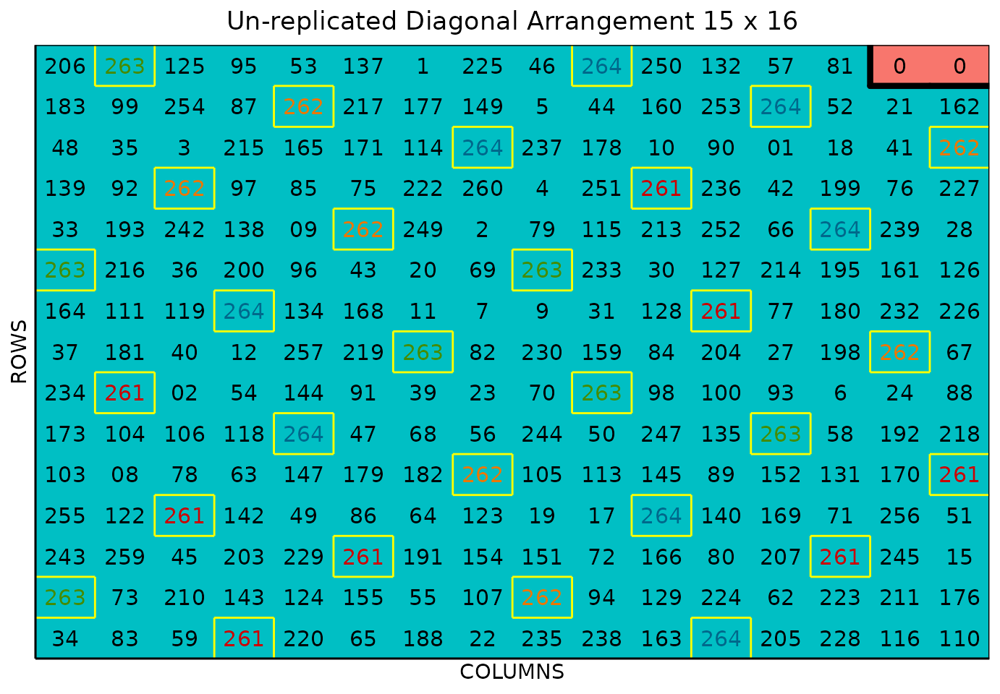
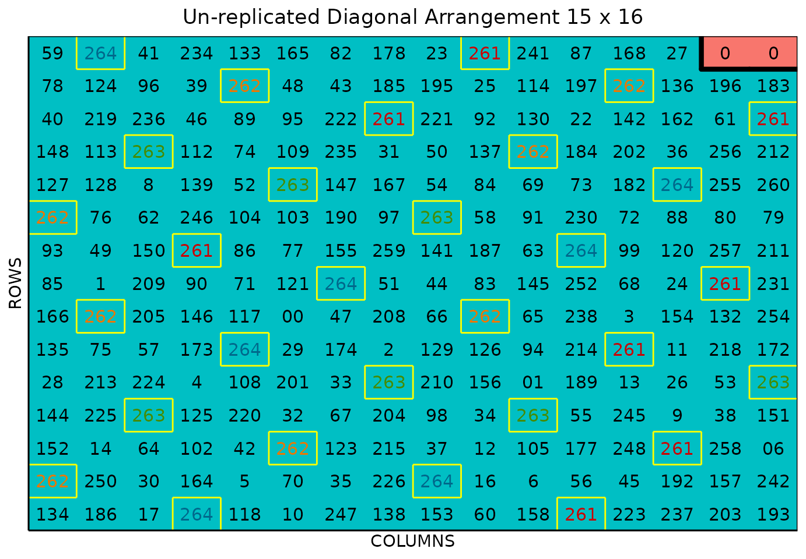

# Sparse Allocation

### Sparse Allocation/Testing

This vignette shows how to generate un-replicated designs leveraging the
**sparse allocation method** by using the FielDHub Shiny App and the
scripting function
[`sparse_allocation()`](https://didiermurillof.github.io/FielDHub/reference/sparse_allocation.md)
from the `FielDHub` R package.

### Overview

Sparse allocation is a valuable strategy in plant breeding experiments,
as it allows researchers to evaluate a large number of treatments over
multiple locations in a single experiment. Sparse allocation can
increase efficiency and reduce the number of experimental units
required, making it a cost-effective option. One standard method for
implementing sparse allocation in plant breeding experiments is
incomplete block designs (IBD) (Edmondson 2020).

The following key points summarize the advantages and disadvantages of
sparse allocation (Montesinos-Lopez et al. 2022):

**Increased efficiency**: By using sparse allocation, breeders can
evaluate a large number of genotypes or treatments in a single
experiment across multiple environments, which can accelerate the
breeding program and reduce the time and resources needed for
evaluation.

**Selection intensity**: The large number of genotypes or treatments
evaluated in sparse allocation experiments can increase the genetic
diversity in the breeding program and increase the chances of
identifying superior genotypes or treatments.

**Cost-effective**: Sparse allocation experiments are generally less
expensive compared to fully replicated experiments since fewer
experimental units are needed.

**Less accurate predictions**: The limited number of experimental units
means that the estimates of treatment effects are less precise compared
to fully replicated designs. However, an increase in selection intensity
may compensate for the loss of accuracy (Trade off problem).

FielDHub includes a function to run the sparse allocation strategy and
the multi-location randomization, as well as an interface for creating a
sparse allocation design on the FielDHub app.

### Use Case

The plant breeding project aims to test 260 entries across five
environments, but due to limited seed availability, only four
replications for each genotype can be created across all five locations.
As a result, not all genotypes will be present in all environments.
Additionally, the project includes four checks that will be replicated
in all environments. To address the seed shortage, the sparse allocation
strategy will be used.

The table below illustrates the allocation of the first ten genotypes
across the five environments.

|        | ENV1 | ENV2 | ENV3 | ENV4 | ENV5 |
|:-------|-----:|-----:|-----:|-----:|-----:|
| Gen-1  |    1 |    1 |    1 |    1 |    0 |
| Gen-2  |    0 |    1 |    1 |    1 |    1 |
| Gen-3  |    1 |    1 |    0 |    1 |    1 |
| Gen-4  |    1 |    1 |    1 |    1 |    0 |
| Gen-5  |    1 |    1 |    1 |    1 |    0 |
| Gen-6  |    1 |    1 |    0 |    1 |    1 |
| Gen-7  |    1 |    0 |    1 |    1 |    1 |
| Gen-8  |    0 |    1 |    1 |    1 |    1 |
| Gen-9  |    1 |    1 |    1 |    0 |    1 |
| Gen-10 |    1 |    1 |    1 |    0 |    1 |

The table illustrates the allocation of genotypes across different
environments, with genotypes listed in rows and environments in columns.
Specifically, it indicates that Genotype 1 (Gen-1) has been assigned to
locations 1, 2, 3, and 4, but not to environment 5. The process of
allocating genotypes to locations is achieved through an optimization
process that employs IBD principles.

### Running the Shiny App

To launch the app you need to run either

``` r

FielDHub::run_app()
```

or

``` r

library(FielDHub)
run_app()
```

### 1. Using the FielDHub Shiny App

Once the app is running, go to **Unreplicated Designs** \> **Sparse
Allocation**

Then, follow the following steps where we will show how to generate a
sparse allocation experiment.

### Inputs

1.  **Import entries’ list?** Choose whether to import a list with entry
    numbers and names for genotypes  
    or treatments.

    - If the selection is `No`, the app will generate synthetic data for
      entries and names of the treatment/genotypes based on the user
      inputs.

    - If the selection is `Yes`, the entries list must fulfill a
      specific format and must be a `.csv` file. The file must have the
      columns `ENTRY` and `NAME`. The `ENTRY` column must have a unique
      integer number entry for each treatment/genotype. The column
      `NAME` must have a unique name that identifies each
      treatment/genotype. Both `ENTRY` and `NAME` must be unique,
      duplicates are not allowed. The following table shows an example
      of the entries list format. Any checks must appear in the first
      rows of the `.csv` file.

| ENTRY | NAME      |
|------:|:----------|
|     1 | CHECK1    |
|     2 | CHECK2    |
|     3 | CHECK3    |
|     4 | GenotypeA |
|     5 | GenotypeB |
|     6 | GenotypeC |
|     7 | GenotypeD |
|     8 | GenotypeE |
|     9 | GenotypeF |

2.  Enter the number of entries/treatments in the **Input \# of
    Entries** box, which is 260 in our case.

3.  Select 4 from the drop-down on the **Input \# of Checks** box.

4.  Since we want to run this experiment over 5 locations, set **Input
    \# of Locations** to 5.

5.  Set the number of copies of each treatment in the **\# of Copies Per
    Entry** dropdown box to 4.

6.  Select `serpentine` or `cartesian` in the **Plot Order Layout**. For
    this example we will use the `serpentine` layout.

7.  To ensure that randomizations are consistent across sessions, we can
    set a seed number in the box labeled **Random Seed**. For instance,
    we will set it to `16`.

8.  Enter the name for the experiment in the **Input Experiment Name**
    box. For example, `SparseTest2023`.

9.  Enter the starting plot number in the **Starting Plot Number** box.
    In this experiment we want the plot start at
    `1, 1001, 2001, 3001, 4001` for each location.

10. Enter the name of the site/location in the **Input the Location**
    box. For this experiment we will set the sites as
    `FARGO, CASSELTON, MINOT, PROSPER, WILLISTON`.

11. Once we have entered all the information for our experiment on the
    left side panel, click the **Run!** button to run the design.

12. You will then be prompted to select the dimensions of the field from
    the list of options in the drop-down in the middle of the screen
    with the box labeled **Select dimensions of field**. In our case, we
    will select `16 x 15`. We also can see the table with the sparse
    allocation.

13. Click the **Randomize!** button to randomize the experiment with the
    set field dimensions and to see the output plots.

If you change any of the inputs on the left side panel after running an
experiment initially, you have to click the Run and Randomize buttons
again, to re-run with the new inputs.

### Outputs

After you run a sparse allocation design in FielDHub and set the
dimensions of the field, there are several ways to display the
information about the sparse process and the randomization.

#### Expt Design Info

On the first tab, **Expt Design Info**, you can see all the entries in
the randomization displayed in a binary matrix with a column for each
location, with a 1 indicating that the respective genotype is in the
respective location, and a 0 indicating that it is not. This is the
sparse genotype allocation characteristic of this method. There are
buttons to copy, print, and save the table to an Excel file.

#### Randomized Field

The **Randomized Field** tab displays a graphical representation of the
randomization of the entries in a field of the specified dimensions. The
checks are each colored uniquely, showing the number of times they are
distributed throughout the field. The display includes numbered labels
for the rows and columns. You can copy the field as a table or save it
directly as an Excel file with the *Copy* and *Excel* buttons at the
top.

In the **Choose % of Checks:** drop-down box, users can play with
different options for the total amount of checks in the field.

#### Plot Number Field

On the **Plot Number Field** tab, there is a table display of the field
with the plots numbered according to the Plot Order Layout specified,
either *serpentine* or *cartesian*. You can see the corresponding
entries for each plot number in the field book. Like the Randomized
Field tab, you can copy the table or save it as an Excel file with the
*Copy* and *Excel* buttons.

#### Field Book

The **Field Book** displays all the information on the experimental
design in a table format. It contains the specific plot number and the
row and column address of each entry, as well as the corresponding
treatment on that plot. This table is searchable, and we can filter the
data in relevant columns.

  

### 2. Using the `FielDHub` function: `sparse_allocation()`

You can run the same design with a function in the FielDHub package,
[`sparse_allocation()`](https://didiermurillof.github.io/FielDHub/reference/sparse_allocation.md).

First, you need to load the `FielDHub` package typing,

``` r

library(FielDHub)
```

Then, you can enter the information describing the above design like
this:

``` r

sparse_example <- sparse_allocation(
   lines = 260, 
   l = 5, 
   copies_per_entry = 4, 
   checks = 4, 
   plotNumber = c(1, 1001, 2001, 3001, 4001),
   locationNames = c("FARGO", "CASSELTON", "MINOT", "PROSPER", "WILLISTON"), 
   exptName = "SparseTest2023",
   seed = 16
)
```

##### Details on the inputs entered in `sparse_allocation()` above:

- `lines = 260` is the number of genotypes.
- `l = 5` is the number of locations.
- `copies_per_entry = 4` is the number of copies of each entry.
- `checks = 4` is the number of checks.
- `plotNumber = c(1, 1001, 2001, 3001, 4001)` are optional starting plot
  numbers
- `locationNames = c("FARGO", "CASSELTON", "MINOT", "PROSPER", "WILLISTON")`
  are optional names for each location.
- `exptName = "SparseTest2023"` is an optional name of the experiment
- `seed = 16` is the random seed number to replicate identical
  randomizations.

#### Print `sparse_example` object

To print a summary of the information that is in the object
`sparse_example`, we can use the generic function
[`print()`](https://rdrr.io/r/base/print.html).

The
[`sparse_allocation()`](https://didiermurillof.github.io/FielDHub/reference/sparse_allocation.md)
function returns a list of objects, includes all the outputs from the
function diagonal_arrangement() and in addition `list_locs`,
`allocation`, and `size_locations`. The `list_locs` object is a list of
data frames. Each data frame has two columns; `ENTRY` and `NAME` with
the information to randomize to each environment. The object
`allocation` is the binary allocation matrix of genotypes to locations,
and `size_locations` is a data frame with a column for each location and
a row indicating the size of the location (number of field plots).

For example, we can display the `allocation` object. Let us print the
first ten genotypes allocation.

``` r

print(head(sparse_example$allocation, 10))
```

       LOC1 LOC2 LOC3 LOC4 LOC5
    1     1    1    0    1    1
    2     1    1    1    0    1
    3     1    1    0    1    1
    4     1    1    1    1    0
    5     1    1    1    0    1
    6     1    1    0    1    1
    7     1    0    1    1    1
    8     0    1    1    1    1
    9     1    1    1    1    0
    10    1    1    1    0    1

We can manipulate the sparse_allocation object as any other list in R.
For example, we can print the design information as following:

``` r

print(sparse_example)
```

which outputs:

    Sparse Allocation: Un-replicated Diagonal Arrangement Design 

    Information on the design parameters: 
    List of 11
     $ rows          : num 15
     $ columns       : num 16
     $ treatments    : int 208
     $ checks        : int 4
     $ entry_checks  :List of 5
      ..$ : num [1:4] 261 262 263 264
      ..$ : num [1:4] 261 262 263 264
      ..$ : num [1:4] 261 262 263 264
      ..$ : num [1:4] 261 262 263 264
      ..$ : num [1:4] 261 262 263 264
     $ rep_checks    :List of 5
      ..$ : num [1:4] 8 7 7 8
      ..$ : num [1:4] 8 8 7 7
      ..$ : num [1:4] 7 7 8 8
      ..$ : num [1:4] 7 8 7 8
      ..$ : num [1:4] 8 7 7 8
     $ locations     : num 5
     $ planter       : chr "serpentine"
     $ percent_checks: chr [1:5] "12.5%" "12.5%" "12.5%" "12.5%" ...
     $ fillers       : int 2
     $ seed          : num 16

     10 First observations of the data frame with the diagonal_arrangement field book: 
       ID           EXPT LOCATION YEAR PLOT ROW COLUMN CHECKS ENTRY TREATMENT
    1   1 SparseTest2023    FARGO 2026    1   1      1      0    34      G-34
    2   2 SparseTest2023    FARGO 2026    2   1      2      0    83      G-83
    3   3 SparseTest2023    FARGO 2026    3   1      3      0    59      G-59
    4   4 SparseTest2023    FARGO 2026    4   1      4    261   261    CH-261
    5   5 SparseTest2023    FARGO 2026    5   1      5      0   220     G-220
    6   6 SparseTest2023    FARGO 2026    6   1      6      0    65      G-65
    7   7 SparseTest2023    FARGO 2026    7   1      7      0   188     G-188
    8   8 SparseTest2023    FARGO 2026    8   1      8      0    22      G-22
    9   9 SparseTest2023    FARGO 2026    9   1      9      0   235     G-235
    10 10 SparseTest2023    FARGO 2026   10   1     10      0   238     G-238

#### Access to `sparse_example` object

The object `sparse_example` is a list consisting of all the information
displayed in the output tabs in the FielDHub app: design information,
plot layout, plot numbering, entries list, and field book, indexed by
each location in the experiment. These are accessible by the `$`
operator, i.e. `designs$layoutRandom[[1]]` for `LOC1` or
`designs$fieldBook` for the whole field book.

`designs$fieldBook` is a data frame containing information about every
plot in the field, with information about the location of the plot and
the treatment in each plot. As seen in the output below, the field book
has columns for `ID`, `EXPT`, `LOCATION`, `YEAR`, `PLOT`, `ROW`,
`COLUMN`, `CHECKS`, `ENTRY`, and `TREATMENT`.

Let us see the first 10 rows of the field book for the first location in
this experiment.

``` r

field_book <- sparse_example$fieldBook
head(field_book, 10)
```

       ID           EXPT LOCATION YEAR PLOT ROW COLUMN CHECKS ENTRY TREATMENT
    1   1 SparseTest2023    FARGO 2026    1   1      1      0    34      G-34
    2   2 SparseTest2023    FARGO 2026    2   1      2      0    83      G-83
    3   3 SparseTest2023    FARGO 2026    3   1      3      0    59      G-59
    4   4 SparseTest2023    FARGO 2026    4   1      4    261   261    CH-261
    5   5 SparseTest2023    FARGO 2026    5   1      5      0   220     G-220
    6   6 SparseTest2023    FARGO 2026    6   1      6      0    65      G-65
    7   7 SparseTest2023    FARGO 2026    7   1      7      0   188     G-188
    8   8 SparseTest2023    FARGO 2026    8   1      8      0    22      G-22
    9   9 SparseTest2023    FARGO 2026    9   1      9      0   235     G-235
    10 10 SparseTest2023    FARGO 2026   10   1     10      0   238     G-238

#### Plot field layout

##### Plot field layout Location 1

For plotting the layout in function of the coordinates `ROW` and
`COLUMN` in the field book object we can use the generic function
[`plot()`](https://rdrr.io/r/graphics/plot.default.html) as follows,

``` r

plot(sparse_example, l = 1)
```



The above plot is for `LOC1`. We can plot any location in the
experiment, like location 2 in this example:

##### Plot field layout Location 2

``` r

plot(sparse_example, l = 2)
```



The figure above shows a map of an experiment randomized as an
unreplicated arrangement design. The blue plots represent the
unreplicated treatments, while the yellow-boxed colored check plots are
replicated throughout the field in a systematic diagonal arrangement.
The red plots with 0s are are fillers.

## References

Edmondson, Rodney N. 2020. “Multi-level Block Designs for Comparative
Experiments.” *Journal of Agricultural, Biological and Environmental
Statistics* 91 (25): 500–522.
<https://doi.org/10.1007/s13253-020-00416-0>.

Montesinos-Lopez, Osval Antonio, Abelardo Montesinos-Lopez, Ricardo
Acosta, Rajeev K. Varshney, Alison Bentley, and Jose Crossa. 2022.
“Using an incomplete block design to allocate lines to environments
improves sparse genome-based prediction in plant breeding.” *The Plant
Genome* 15 (1): e20194. <https://doi.org/10.1002/tpg2.20194>.
