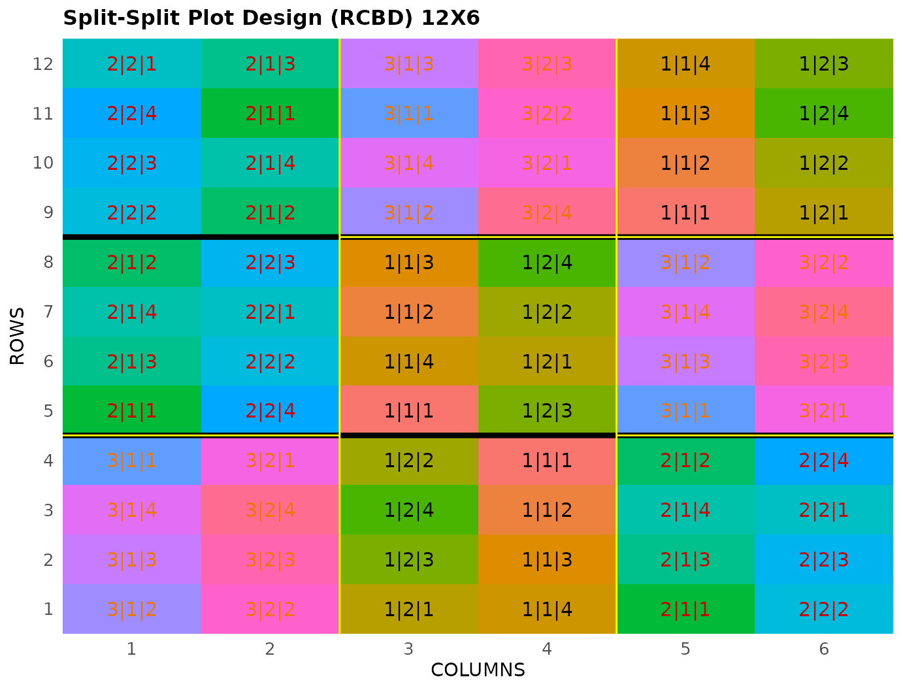

# Split-Split Plot Design

This vignette shows how to generate a **split-split plot design** using
both the FielDHub Shiny App and the scripting function
[`split_plot()`](https://didiermurillof.github.io/FielDHub/reference/split_plot.md)
from the `FielDHub` package.

### 1. Using the FielDHub Shiny App

To launch the app you need to run either

``` r
FielDHub::run_app()
```

or

``` r
library(FielDHub)
run_app()
```

Once the app is running, go to **Other Designs** \> **Split-Split Plot
Design**

Then, follow the following steps where we show how to generate this kind
of design by an example with 3 whole plots, 2 sub-plots, 4 sub-sub plots
and 3 reps. We will run this experiment in just one location.

## Inputs

1.  **Import entries’ list?** Choose whether to import a list with entry
    numbers and names for treatments.
    - If the selection is `No`, that means the app is going to generate
      synthetic data for entries and names of the treatment based on the
      user inputs.

    - If the selection is `Yes`, the entries list must fulfill a
      specific format and must be a `.csv` file. The file must have the
      single column `TREATMENT`, containing a list of unique names that
      identify each treatment. Duplicate values are not allowed, all
      entries must be unique. In the following, we show an example of
      the entries list format. This example has an entry list with 10
      treatments.

| WHOLEPLOT | SUBPLOT | SUB_SUB_PLOT |
|----------:|:--------|:-------------|
|         0 | 0       | 0            |
|         1 | 1       | 1            |
|         2 | 2       | 2            |
|         3 |         | 3            |
|         4 |         |              |

2.  Choose whether to use the split-plot design in a RCBD or CRD with
    the **Select SPD Type** box.

3.  Set the number of whole-plots in the design with the **Whole-plots**
    box. Set it to `3`.

4.  Set the number of sub-plots contained with the **Sub-plots Within
    Whole-plots** box. Set it to `2`.

5.  Set the number of sub-sub plots contained with the **Sub-Sub-plots
    within Sub-plots** box. Set it to `4`.

6.  Select the number of replications of these treatments with the
    **Input \# of Full Reps** box. Set it to `3`.

7.  Enter the number of locations in **Input \# of Locations**. We will
    run this experiment over a single location, so set it to `1`.

8.  Select `serpentine` or `cartesian` in the **Plot Order Layout**. For
    this example we will use the default `serpentine` layout.

9.  Enter the starting plot number in the **Starting Plot Number** box.
    If the experiment has multiple locations, you must enter a comma
    separated list of numbers the length of the number of locations for
    the input to be valid. For this case, set it to `101`.

10. Enter a name for the location of the experiment in the **Input
    Location** box. If there are multiple locations, each name must be
    in a comma separated list. Set it to `"FARGO"`.

11. To ensure that randomizations are consistent across sessions, we can
    set a random seed in the box labeled **random seed**. In this
    example, we will set it to `1238`.

12. Once we have entered the information for our experiment on the left
    side panel, click the **Run!** button to run the design.

### Outputs

After you run a split-split-plot design in FielDHub, there are several
ways to display the information contained in the field book.

#### Field Layout

When you first click the run button on a split-split-plot design,
FielDHub displays the Field Layout tab, which shows the entries and
their arrangement in the field. In the box below the display, you can
change the layout of the field. You can also display a heatmap over the
field by changing **Type of Plot** to `Heatmap`. To view a heatmap, you
must first simulate an experiment over the described field with the
**Simulate!** button. A pop-up window will appear where you can enter
what variable you want to simulate along with minimum and maximum
values.

#### Field Book

The **Field Book** displays all the information on the experimental
design in a table format. It contains the specific plot number and the
row and column address of each entry, as well as the corresponding
treatment on that plot. This table is searchable, and we can filter the
data in relevant columns. If we have simulated data for a heatmap, an
additional column for that variable appears in the field book.

### 2. Using the `FielDHub` function: `split_split_plot()`

You can run the same design with a function in the FielDHub package,
[`split_split_plot()`](https://didiermurillof.github.io/FielDHub/reference/split_split_plot.md).

First, you need to load the `FielDHub` package typing,

``` r
library(FielDHub)
```

Then, you can enter the information describing the above design like
this:

``` r
sspd <- split_split_plot(
  wp = 3, 
  sp = 2,  
  ssp = 4,  
  reps = 3,  
  type = 2,   
  l = 1, 
  plotNumber = 101,
  locationNames = "FARGO",
  seed = 123
)
```

##### Details on the inputs entered in `split_split_plot()` above

The description for the inputs that we used to generate the design,

- `wp = 3` is the number of whole-plots.
- `sp = 2` is the number of sub-plots.
- `ssp = 4` is the number of sub-sub-plots.
- `reps = 3` is the number of reps
- `type = 2` CRD or RCBD, 1 or 2 respectively
- `l = 1` is the number of locations.
- `plotNumber = 101` is the starting plot number.
- `locationNames = "FARGO"` is an optional name for each location.
- `seed = 1240` is the random seed to replicate identical
  randomizations.

#### Print `sspd` object

``` r
print(sspd)
```

    Split-Split Plot Design 

    Information on the design parameters: 
    List of 6
     $ Whole.Plots  : int [1:3] 1 2 3
     $ Sub.Plots    : int [1:2] 1 2
     $ Sub.Sub.Plots: int [1:4] 1 2 3 4
     $ Locations    : num 1
     $ typeDesign   : chr "RCBD"
     $ seed         : num 123

     10 First observations of the data frame with the split_split_plot field book: 
       ID LOCATION PLOT REP WHOLE_PLOT SUB_PLOT SUB_SUB_PLOT TRT_COMB
    1   1    FARGO  101   1          3        1            2    3|1|2
    2   2    FARGO  101   1          3        1            3    3|1|3
    3   3    FARGO  101   1          3        1            4    3|1|4
    4   4    FARGO  101   1          3        1            1    3|1|1
    5   5    FARGO  101   1          3        2            2    3|2|2
    6   6    FARGO  101   1          3        2            3    3|2|3
    7   7    FARGO  101   1          3        2            4    3|2|4
    8   8    FARGO  101   1          3        2            1    3|2|1
    9   9    FARGO  102   1          1        2            1    1|2|1
    10 10    FARGO  102   1          1        2            3    1|2|3

#### Access to `sspd` object

The
[`split_split_plot()`](https://didiermurillof.github.io/FielDHub/reference/split_split_plot.md)
function returns a list consisting of all the information displayed in
the output tabs in the FielDHub app: design information, plot layout,
plot numbering, entries list, and field book. These are accessible by
the `$` operator, i.e. `sspd$layoutRandom` or `sspd$fieldBook`.

`sspd$fieldBook` is a list containing information about every plot in
the field, with information about the location of the plot and the
treatment in each plot. As seen in the output below, the field book has
columns for `ID`, `LOCATION`, `PLOT`, `REP`, `WHOLE_PLOT`, `SUB_PLOT`,
`SUB_SUB_PLOT`, and `TRT_COMB`.

``` r
field_book <- sspd$fieldBook
head(field_book,10)
```

       ID LOCATION PLOT REP WHOLE_PLOT SUB_PLOT SUB_SUB_PLOT TRT_COMB
    1   1    FARGO  101   1          3        1            2    3|1|2
    2   2    FARGO  101   1          3        1            3    3|1|3
    3   3    FARGO  101   1          3        1            4    3|1|4
    4   4    FARGO  101   1          3        1            1    3|1|1
    5   5    FARGO  101   1          3        2            2    3|2|2
    6   6    FARGO  101   1          3        2            3    3|2|3
    7   7    FARGO  101   1          3        2            4    3|2|4
    8   8    FARGO  101   1          3        2            1    3|2|1
    9   9    FARGO  102   1          1        2            1    1|2|1
    10 10    FARGO  102   1          1        2            3    1|2|3

#### Plot the field layout

For plotting the layout in function of the coordinates `ROW` and
`COLUMN`, you can use the the generic function
[`plot()`](https://rdrr.io/r/graphics/plot.default.html) as follows,

``` r
plot(sspd)
```



  
  
  
