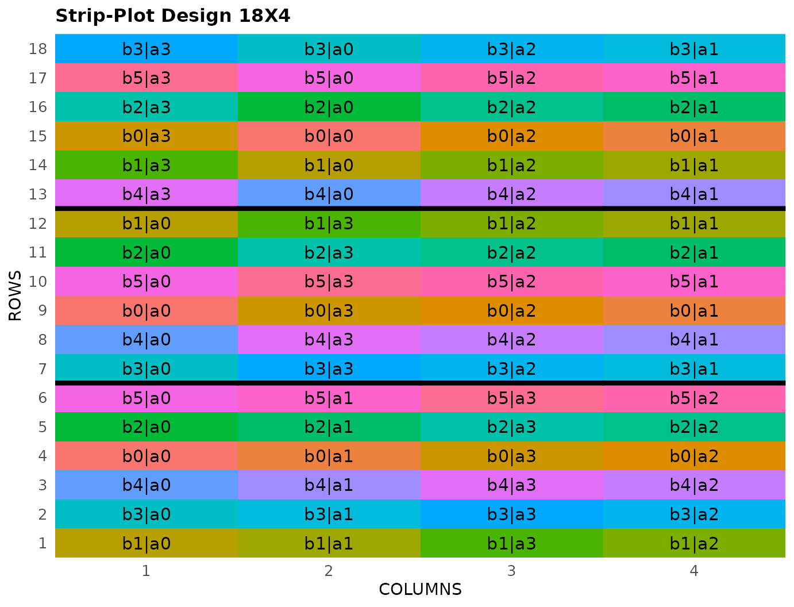

# Strip-Plot Design

This vignette shows how to generate a **Strip-Plot Design** using both
the FielDHub Shiny App and the scripting function `srip_plot()` from the
`FielDHub` package.

## 1. Using the FielDHub Shiny App

To launch the app you need to run either

``` r
FielDHub::run_app()
```

or

``` r
library(FielDHub)
run_app()
```

Once the app is running, go to **Other Designs** \> **Strip-Plot
Design**

Then, follow the following steps where we show how to generate this kind
of design by an example with 6 factors for the horizontal strips, 4
factors for the vertical strips and 3 reps. We will run this experiment
in just one location.

## Inputs

1.  **Import entries’ list?** Choose whether to import a list with entry
    numbers and names for treatments.
    - If the selection is `No`, that means the app is going to generate
      synthetic data for entries and names of the treatment based on the
      user inputs.

    - If the selection is `Yes`, the entries list must fulfill a
      specific format and must be a `.csv` file. The file must have the
      single column `TREATMENT`, containing a list of unique names that
      identify each treatment. Duplicate values are not allowed, all
      entries must be unique. In the following, we show an example of
      the entries list format. This example has an entry list with 10
      treatments.

| HPLOTS | VPLOTS |
|:-------|:-------|
| A0     | B0     |
| A1     | B1     |
| A2     | B2     |
| A3     | B3     |
| A4     | B4     |

2.  Input the number of factors for horizontal strips in the **Input \#
    of Horizontal Strips** box. Set it to `6`.

3.  Input the number of factors for vertical strips in the **Input \# of
    Vertical Strips** box. Set it to `4`.

4.  Select the number of replications of this experiment with the
    **Input \# of Full Reps** box. Set it to `3`.

5.  Enter the number of locations in **Input \# of Locations**. We will
    run this experiment over a single location, so set it to `1`.

6.  Select `serpentine` or `cartesian` in the **Plot Order Layout**. For
    this example we will use the default `serpentine` layout.

7.  Enter the starting plot number in the **Starting Plot Number** box.
    If the experiment has multiple locations, you must enter a comma
    separated list of numbers the length of the number of locations for
    the input to be valid. For this case, set it to `101`.

8.  Enter a name for the location of the experiment in the **Input
    Location** box. If there are multiple locations, each name must be
    in a comma separated list. Set it to `"FARGO"`.

9.  To ensure that randomizations are consistent across sessions, we can
    set a random seed in the box labeled **random seed**. In this
    example, we will set it to `1237`.

10. Once we have entered the information for our experiment on the left
    side panel, click the **Run!** button to run the design.

## Outputs

After you run a strip-plot design in FielDHub, there are several ways to
display the information contained in the field book.

### Field Layout

When you first click the run button on a strip-plot design, FielDHub
displays the Field Layout tab, which shows the entries and their
arrangement in the field. In the box below the display, you can change
the layout of the field. You can also display a heatmap over the field
by changing **Type of Plot** to `Heatmap`. To view a heatmap, you must
first simulate an experiment over the described field with the
**Simulate!** button. A pop-up window will appear where you can enter
what variable you want to simulate along with minimum and maximum
values.

### Field Book

The **Field Book** displays all the information on the experimental
design in a table format. It contains the specific plot number and the
row and column address of each entry, as well as the corresponding
treatment on that plot. This table is searchable, and we can filter the
data in relevant columns. If we have simulated data for a heatmap, an
additional column for that variable appears in the Field Book.

## 2. Using the `FielDHub` function: `strip_plot()`

You can run the same design with a function in the FielDHub package,
[`strip_plot()`](https://didiermurillof.github.io/FielDHub/reference/strip_plot.md).
We can enter the information describing the above design like this:

You can run the same design with a function in the FielDHub package,
[`strip_plot()`](https://didiermurillof.github.io/FielDHub/reference/strip_plot.md).

First, you need to load the `FielDHub` package typing,

``` r
library(FielDHub)
```

Then, you can enter the information describing the above design like
this:

``` r
strip <- strip_plot(
  Hplots = 6,
  Vplots = 4, 
  b = 3,
  l = 1,  
  plotNumber = 101, 
  planter = "serpentine",
  locationNames = "FARGO",
  seed = 1240
)
```

#### Details on the inputs entered in `strip_plot()` above

The description for the inputs that we used to generate the design,

- `Hplots = 6` is the number of horizontal strips
- `Vplots = 4` is the number of vertical strips
- `b = 3` is the number of reps
- `l = 1` is the number of locations.
- `plotNumber = 101` is the starting plot number.
- `planter = "cartesian"` is the order layout.
- `locationNames = "FARGO"` is an optional name for each location.
- `seed = 1240` is the random seed to replicate identical
  randomizations.

### Print `strip` object

``` r
print(strip)
```

    Strip Plot Design 

    Information on the design parameters: 
    List of 6
     $ Hplots         : int 6
     $ Vplots         : int 4
     $ blocks         : num 3
     $ numberLocations: num 1
     $ nameLocations  : chr "FARGO"
     $ seed           : num 1240

     10 First observations of the data frame with the strip_plot field book: 
       ID LOCATION PLOT REP HSTRIP VSTRIP TRT_COMB
    1   1    FARGO  101   1     b0     a1    b0|a1
    2   2    FARGO  102   1     b0     a0    b0|a0
    3   3    FARGO  103   1     b0     a2    b0|a2
    4   4    FARGO  104   1     b0     a3    b0|a3
    5   5    FARGO  108   1     b1     a1    b1|a1
    6   6    FARGO  107   1     b1     a0    b1|a0
    7   7    FARGO  106   1     b1     a2    b1|a2
    8   8    FARGO  105   1     b1     a3    b1|a3
    9   9    FARGO  109   1     b2     a1    b2|a1
    10 10    FARGO  110   1     b2     a0    b2|a0

### Access to `strip` object

The
[`strip_plot()`](https://didiermurillof.github.io/FielDHub/reference/strip_plot.md)
function returns a list consisting of all the information displayed in
the output tabs in the FielDHub app: design information, plot layout,
plot numbering, entries list, and field book. These are accessible by
the `$` operator, i.e. `strip$layoutRandom` or `strip$fieldBook`.

`strip$fieldBook` is a list containing information about every plot in
the field, with information about the location of the plot and the
treatment in each plot. As seen in the output below, the field book has
columns for `ID`, `LOCATION`, `PLOT`, `REP`, `HSTRIP`, `VSTRIP`, and
`TRT_COMB`.

``` r
field_book <- strip$fieldBook
head(strip$fieldBook, 10)
```

       ID LOCATION PLOT REP HSTRIP VSTRIP TRT_COMB
    1   1    FARGO  101   1     b0     a1    b0|a1
    2   2    FARGO  102   1     b0     a0    b0|a0
    3   3    FARGO  103   1     b0     a2    b0|a2
    4   4    FARGO  104   1     b0     a3    b0|a3
    5   5    FARGO  108   1     b1     a1    b1|a1
    6   6    FARGO  107   1     b1     a0    b1|a0
    7   7    FARGO  106   1     b1     a2    b1|a2
    8   8    FARGO  105   1     b1     a3    b1|a3
    9   9    FARGO  109   1     b2     a1    b2|a1
    10 10    FARGO  110   1     b2     a0    b2|a0

### Plot the field layout

For plotting the layout in function of the coordinates `ROW` and
`COLUMN`, you can use the the generic function
[`plot()`](https://rdrr.io/r/graphics/plot.default.html) as follow,

``` r
plot(strip)
```



  
  
